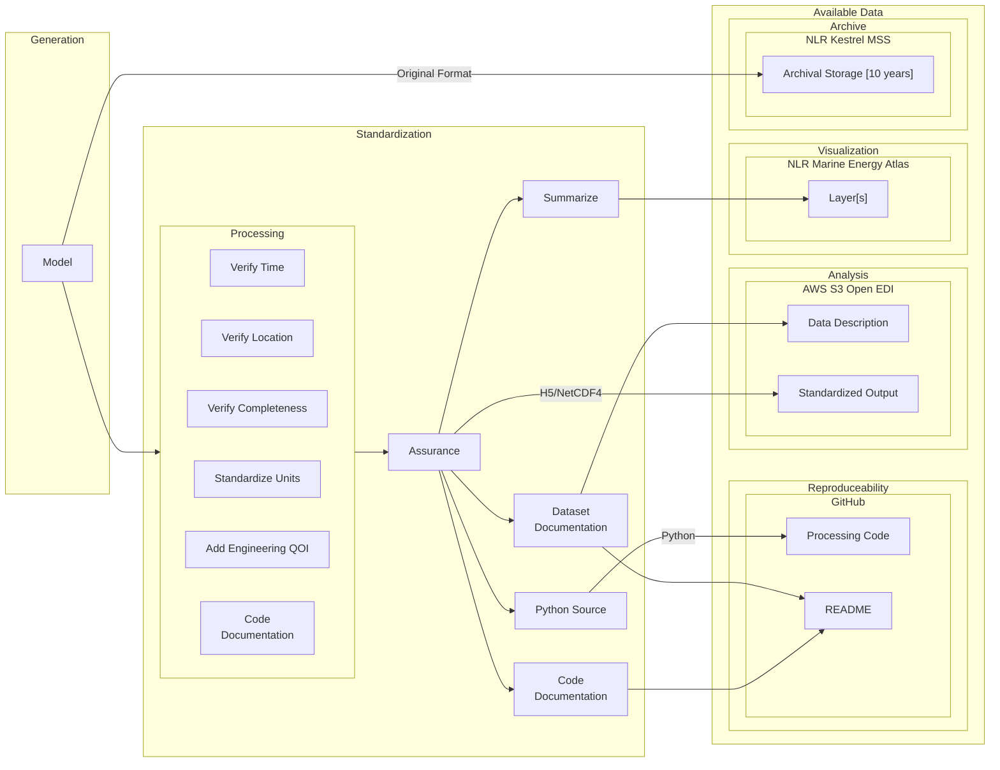
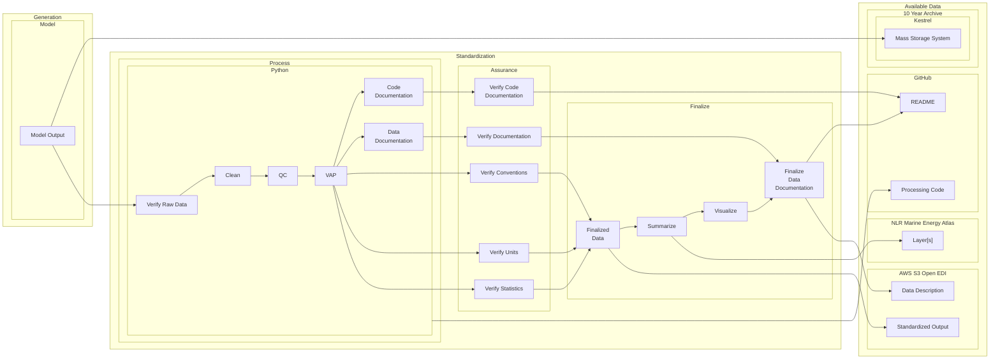

# Marine Energy Resource Characterization

Software to standardize wave and tidal energy model outputs for public access, supporting marine energy research, design, and deployment.

## Overview

This repository contains software that standardizes marine energy model data for public use. Developed
collaboratively by [National Laboratory of the Rockies (NLR)](https://www.nlr.gov), [Sandia National
Laboratories](https://www.sandia.gov), and [Pacific Northwest National
Laboratory](https://www.pnnl.gov), our software converts complex ocean simulation outputs into
standardized datasets that follow industry conventions
([IEC][IEC-TC114] and [CF
standards](https://cfconventions.org)).

The project processes both wave energy ([SWAN](https://swanmodel.sourceforge.io)) and tidal energy ([FVCOM](http://fvcom.smast.umassd.edu/fvcom)) model outputs, making this valuable data accessible to researchers, developers, and policymakers.

## Overview

The Marine Energy Resource Characterization project is a collaboration between the [National
Laboratory of the Rockies][NLR] (NLR), [Sandia National Laboratories][SNL] (SNL), and [Pacific Northwest
National Laboratory][PNNL] (PNNL). This multi-laboratory initiative leverages high-performance computing to
build computational fluid dynamics models of ocean conditions. The resulting simulations, combined
with field measurements, aim to create a comprehensive understanding of the marine energy resource
in the United States. The data produced through this collaboration helps de-risk deployments and
provides a foundation for device design decisions.

This repository contains tools and workflows that process, standardize, and disseminate model
outputs to guide marine energy deployments. The software converts model outputs into documented
datasets that follow industry conventions, including [IEC][IEC-TC114] and [CF (Climate Forecast)
standards][CF-Conventions] where practical and possible. The processing workflows handle wave energy
([SWAN][SWAN]) and tidal energy ([FVCOM][FVCOM]) model outputs.

## Applications

The standardized datasets support:

- Analysis of operational and extreme conditions at potential deployment sites
- Integration of modeled site-specific hydrodynamic forces into device design
- Public access to marine energy resource data through [OpenEI][OpenEI]
- Visualization of summarized data on the [Marine Energy Atlas][Marine Energy Atlas]

Quality control processes, standardized formatting, and documentation ensure the datasets are
reliable and reproducible.

# Repository Information

This repository contains the software that runs on the [NLR HPC][Kestrel] (currently Kestrel) that
processes the original model outputs and generates the standardized datasets. The software is
organized into two main directories that contain processing code for the original model output. The
intent of this repository is to provide transparency into the processing workflow and allow users to
understand the data generation process. The software is not intended to be used as a library, but
rather provide a open source, transparent view of the processing workflow.

## Repository Structure

```
- wave/ (Coming Soon)
- tidal/
  - fvcom/ (Coming Soon)
```

## Documentation Previews

Maintainers can deploy a live preview of any PR's documentation changes before merging. Only users with write access to the repository can trigger this.

**Steps:**

1. Review the PR code to confirm it is safe to run
2. Go to Actions > **Manual Docs Preview** > Run workflow
3. Enter the PR number and click Run workflow

The workflow resolves the PR branch and fork automatically, builds the docs, deploys to `gh-pages`, and posts a comment on the PR with the preview URL:

```
https://natlabrockies.github.io/Marine_Energy_Resource_Characterization/pr-preview/pr-<N>/
```

**One-time repo setup:** Settings > Actions > General > Workflow permissions > **Read and write permissions** must be enabled.

# Typical Resource Characterization Data Processing Workflow

## High Level Overview



## Detailed Process Flow



## Data Types and Storage

The project manages two primary classes of data:

| Type         | Format                                 | Size                       | Availability | Common Units | Ease of Use |
| ------------ | -------------------------------------- | -------------------------- | ------------ | ------------ | ----------- |
| Original     | [NetCDF][NetCDF], txt, csv, H5, custom | Varies, Typically Multi TB | On Request   | No           | Low         |
| Standardized | [H5][HDF5] or [NetCDF]                 | 300GB or smaller           | Public - AWS | Yes          | High        |

### Data Locations

- [NLR Kestrel HPC][Kestrel]
  - Original data: `/projects/hindcastra/`
  - Versioned public data: `/datasets/US_wave`
- [AWS S3 Open EDI][WPTOHindcast]
  - Standardized datasets are accessible through [AWS S3 Open EDI][WPTOHindcast]
- [NLR Marine Energy Atlas][Marine Energy Atlas]
  - Summarized datasets are visualized as layers in the [Marine Energy Atlas][Marine Energy Atlas]
  - Select datasets can be downloaded by point using the point query tool

## License

This software is licensed under the BSD 3-Clause License. See the [LICENSE](LICENSE) file for details.

Copyright 2025 Alliance for Sustainable Energy, LLC

NOTICE: This software was developed at least in part by Alliance for Sustainable Energy, LLC
("Alliance") under Contract No. DE-AC36-08GO28308 with the U.S. Department of Energy and the U.S.
Government retains for itself and others acting on its behalf a nonexclusive, paid-up, irrevocable
worldwide license in the software to reproduce, prepare derivative works, distribute copies to the
public, perform publicly and display publicly, and to permit others to do so.

## Contact

Please use GitHub issues for bug reports and feature requests. For other inquiries, contact the [NLR Marine Energy Resource Characterization Team][NLR_RC].

<!-- National Labs -->

[NLR]: https://www.nlr.gov
[NLR_RC]: mailto:marineresource@nlr.gov
[SNL]: https://www.sandia.gov
[PNNL]: https://www.pnnl.gov
[DOE]: https://www.energy.gov

<!-- Project Resources -->

[Marine Energy Atlas]: https://maps.nlr.gov/marine-energy-atlas
[OpenEI]: https://openei.org/wiki/Marine_and_Hydrokinetic_Technology_Database
[H2O]: https://www.energy.gov/cmei/water/hydropower-and-hydrokinetic-office
[WPTOHindcast]: https://registry.opendata.aws/wpto-pds-us-wave/

<!-- High Performance Computing -->

[Kestrel]: https://www.nlr.gov/hpc/kestrel-computing-system.html
[Eagle]: https://www.nlr.gov/hpc/eagle-system.html

<!-- Models -->

[SWAN]: https://swanmodel.sourceforge.io
[WaveWatch]: https://github.com/NOAA-EMC/WW3
[FVCOM]: http://fvcom.smast.umassd.edu/fvcom

<!-- Standards -->

[IEC-TC114]: https://www.iec.ch/dyn/www/f?p=103:7:::::FSP_ORG_ID:1316
[CF-Conventions]: https://cfconventions.org

<!-- Data Formats -->

[NetCDF]: https://www.unidata.ucar.edu/software/netcdf
[HDF5]: https://www.hdfgroup.org/solutions/hdf5

<!-- Additional Resources -->

[MHKiT]: https://github.com/MHKiT-Software/MHKiT
[PRIMRE]: https://primre.org
[IEA-OES]: https://www.ocean-energy-systems.org
