# ME Atlas High Resolution Tidal Data QOI Visualization Specification

The following sections provide the specification for visualizing selected high resolution tidal hindcast variables on the [NLR Marine Energy Atlas](https://maps.nlr.gov/marine-energy-atlas/data-viewer/data-library/layers?vL=WavePowerMerged)


## Available Data File Details

Atlas summary parquet files are located at:

```
/projects/hindcastra/Tidal/datasets/high_resolution_tidal_hindcast/<location>/v1.0.0/b5_vap_atlas_summary_parquet/
```

| Location Name | `<location>` |
| --- | --- |
| Aleutian Islands, Alaska | `AK_aleutian_islands` |
| Cook Inlet, Alaska | `AK_cook_inlet` |
| Western Passage, Maine | `ME_western_passage` |
| Piscataqua River, New Hampshire | `NH_piscataqua_river` |
| Puget Sound, Washington | `WA_puget_sound` |

### GeoPackage (GPKG) Files

GeoPackage files for each location are located at:

**Aleutian Islands, Alaska**

```
/projects/hindcastra/Tidal/datasets/high_resolution_tidal_hindcast/AK_aleutian_islands/v1.0.0/b5_vap_atlas_summary_parquet/gis/gpkg/
```

**Cook Inlet, Alaska**

```
/projects/hindcastra/Tidal/datasets/high_resolution_tidal_hindcast/AK_cook_inlet/v1.0.0/b5_vap_atlas_summary_parquet/gis/gpkg/
```

**Western Passage, Maine**

```
/projects/hindcastra/Tidal/datasets/high_resolution_tidal_hindcast/ME_western_passage/v1.0.0/b5_vap_atlas_summary_parquet/gis/gpkg/
```

**Piscataqua River, New Hampshire**

```
/projects/hindcastra/Tidal/datasets/high_resolution_tidal_hindcast/NH_piscataqua_river/v1.0.0/b5_vap_atlas_summary_parquet/gis/gpkg/
```

**Puget Sound, Washington**

```
/projects/hindcastra/Tidal/datasets/high_resolution_tidal_hindcast/WA_puget_sound/v1.0.0/b5_vap_atlas_summary_parquet/gis/gpkg/
```

**All locations (combined)**

```
/projects/hindcastra/Tidal/datasets/high_resolution_tidal_hindcast/AK_aleutian_islands/v1.0.0/b5_vap_atlas_summary_parquet/gis/gpkg/
/projects/hindcastra/Tidal/datasets/high_resolution_tidal_hindcast/AK_cook_inlet/v1.0.0/b5_vap_atlas_summary_parquet/gis/gpkg/
/projects/hindcastra/Tidal/datasets/high_resolution_tidal_hindcast/ME_western_passage/v1.0.0/b5_vap_atlas_summary_parquet/gis/gpkg/
/projects/hindcastra/Tidal/datasets/high_resolution_tidal_hindcast/NH_piscataqua_river/v1.0.0/b5_vap_atlas_summary_parquet/gis/gpkg/
/projects/hindcastra/Tidal/datasets/high_resolution_tidal_hindcast/WA_puget_sound/v1.0.0/b5_vap_atlas_summary_parquet/gis/gpkg/
```


## Location Details

| Location Name | Face Count | Averaging Dates [UTC] | Averaging Temporal Resolution
| --- | --- | --- | --- |
| Aleutian Islands, Alaska | 797,978 | 2010-06-03 00:00:00 to 2011-06-02 23:00:00 | hourly |
| Cook Inlet, Alaska | 392,002 | 2005-01-01 00:00:00 to 2005-12-31 23:00:00 | hourly |
| Western Passage, Maine | 231,208 | 2017-01-01 00:00:00 to 2017-12-31 23:30:00 | half-hourly |
| Piscataqua River, New Hampshire | 292,927 | 2007-01-01 00:00:00 to 2007-12-31 23:30:00 | half-hourly |
| Puget Sound, Washington | 1,734,765 | 2015-01-01 00:00:00 to 2015-12-30 23:30:00 | half-hourly |

## Color Layer Details

Specification for each color-coded Marine Energy Atlas layer, including the exact **Details** popup text.

### Mean Current Speed

- **Data Column:** `vap_water_column_mean_sea_water_speed`
- **Description:** Annual average of depth-averaged current speed [m/s]
- **Documentation:** [https://us-marine-energy-resource.github.io/tidal/high-resolution-hindcast/mean-current-speed](https://us-marine-energy-resource.github.io/tidal/high-resolution-hindcast/mean-current-speed)

**Rendered Preview**

Mean Current Speed [m/s] is the annual average of depth-averaged current speed. For more detail, see [complete mean current speed documentation](https://us-marine-energy-resource.github.io/tidal/high-resolution-hindcast/mean-current-speed). Source: [High Resolution Tidal Hindcast Data Repository](https://mhkdr.openei.org/submissions/632), funded by [U.S. Department of Energy](https://www.energy.gov/) [Hydropower and Hydrokinetic Office](https://www.energy.gov/cmei/water/hydropower-and-hydrokinetic-office). Modeled by [Pacific Northwest National Laboratory Ocean Dynamics and Modeling Group](https://www.pnnl.gov/projects/ocean-dynamics-modeling); standardized and released by [National Laboratory of the Rockies Marine Energy Resource Characterization Team](https://www.nlr.gov/water/resource-characterization). See [Tidal Hindcast Dataset Documentation](https://us-marine-energy-resource.github.io) for methodology, citations, and full dataset access. Contact [marineresource@nlr.gov](mailto:marineresource@nlr.gov) with questions.

**HTML**

```html
<div><p>Mean Current Speed [m/s] is the annual average of depth-averaged current speed. For more detail, see <a href='https://us-marine-energy-resource.github.io/tidal/high-resolution-hindcast/mean-current-speed' target='_blank' rel='noopener noreferrer'>complete mean current speed documentation</a>.<br/></p><p>Source: <a href='https://mhkdr.openei.org/submissions/632' target='_blank' rel='noopener noreferrer'>High Resolution Tidal Hindcast Data Repository</a>, funded by <a href='https://www.energy.gov/' target='_blank' rel='noopener noreferrer'>U.S. Department of Energy</a> <a href='https://www.energy.gov/cmei/water/hydropower-and-hydrokinetic-office' target='_blank' rel='noopener noreferrer'>Hydropower and Hydrokinetic Office</a>. Modeled by <a href='https://www.pnnl.gov/projects/ocean-dynamics-modeling' target='_blank' rel='noopener noreferrer'>Pacific Northwest National Laboratory Ocean Dynamics and Modeling Group</a>; standardized and released by <a href='https://www.nlr.gov/water/resource-characterization' target='_blank' rel='noopener noreferrer'>National Laboratory of the Rockies Marine Energy Resource Characterization Team</a>. See <a href='https://us-marine-energy-resource.github.io' target='_blank' rel='noopener noreferrer'>Tidal Hindcast Dataset Documentation</a> for methodology, citations, and full dataset access. Contact <a href='mailto:marineresource@nlr.gov'>marineresource@nlr.gov</a> with questions.</p></div>
```

**JSON**

```json
{
  "vap_water_column_mean_sea_water_speed": {
    "display_name": "Mean Current Speed",
    "text": "Mean Current Speed [m/s] is the annual average of depth-averaged current speed. For more detail, see complete mean current speed documentation. Source: High Resolution Tidal Hindcast Data Repository, funded by U.S. Department of Energy Hydropower and Hydrokinetic Office. Modeled by Pacific Northwest National Laboratory Ocean Dynamics and Modeling Group; standardized and released by National Laboratory of the Rockies Marine Energy Resource Characterization Team. See Tidal Hindcast Dataset Documentation for methodology, citations, and full dataset access. Contact marineresource@nlr.gov with questions.",
    "markdown": "Mean Current Speed [m/s] is the annual average of depth-averaged current speed. For more detail, see [complete mean current speed documentation](https://us-marine-energy-resource.github.io/tidal/high-resolution-hindcast/mean-current-speed). Source: [High Resolution Tidal Hindcast Data Repository](https://mhkdr.openei.org/submissions/632), funded by [U.S. Department of Energy](https://www.energy.gov/) [Hydropower and Hydrokinetic Office](https://www.energy.gov/cmei/water/hydropower-and-hydrokinetic-office). Modeled by [Pacific Northwest National Laboratory Ocean Dynamics and Modeling Group](https://www.pnnl.gov/projects/ocean-dynamics-modeling); standardized and released by [National Laboratory of the Rockies Marine Energy Resource Characterization Team](https://www.nlr.gov/water/resource-characterization). See [Tidal Hindcast Dataset Documentation](https://us-marine-energy-resource.github.io) for methodology, citations, and full dataset access. Contact [marineresource@nlr.gov](mailto:marineresource@nlr.gov) with questions.",
    "html": "<div><p>Mean Current Speed [m/s] is the annual average of depth-averaged current speed. For more detail, see <a href='https://us-marine-energy-resource.github.io/tidal/high-resolution-hindcast/mean-current-speed' target='_blank' rel='noopener noreferrer'>complete mean current speed documentation</a>.<br/></p><p>Source: <a href='https://mhkdr.openei.org/submissions/632' target='_blank' rel='noopener noreferrer'>High Resolution Tidal Hindcast Data Repository</a>, funded by <a href='https://www.energy.gov/' target='_blank' rel='noopener noreferrer'>U.S. Department of Energy</a> <a href='https://www.energy.gov/cmei/water/hydropower-and-hydrokinetic-office' target='_blank' rel='noopener noreferrer'>Hydropower and Hydrokinetic Office</a>. Modeled by <a href='https://www.pnnl.gov/projects/ocean-dynamics-modeling' target='_blank' rel='noopener noreferrer'>Pacific Northwest National Laboratory Ocean Dynamics and Modeling Group</a>; standardized and released by <a href='https://www.nlr.gov/water/resource-characterization' target='_blank' rel='noopener noreferrer'>National Laboratory of the Rockies Marine Energy Resource Characterization Team</a>. See <a href='https://us-marine-energy-resource.github.io' target='_blank' rel='noopener noreferrer'>Tidal Hindcast Dataset Documentation</a> for methodology, citations, and full dataset access. Contact <a href='mailto:marineresource@nlr.gov'>marineresource@nlr.gov</a> with questions.</p></div>",
    "color_spec": {
      "display_name": "Mean Current Speed",
      "column_name": "vap_water_column_mean_sea_water_speed",
      "units": "m/s",
      "style_type": "continuous",
      "range_min": 0,
      "range_max": 1.5,
      "colormap_name": "cmo.thermal",
      "n_levels": 10,
      "levels": [
        {
          "bin_min": 0.0,
          "bin_max": 0.15,
          "color": "#032333"
        },
        {
          "bin_min": 0.15,
          "bin_max": 0.3,
          "color": "#0f3169"
        },
        {
          "bin_min": 0.3,
          "bin_max": 0.44999999999999996,
          "color": "#3f339f"
        },
        {
          "bin_min": 0.44999999999999996,
          "bin_max": 0.6,
          "color": "#674396"
        },
        {
          "bin_min": 0.6,
          "bin_max": 0.75,
          "color": "#8a528c"
        },
        {
          "bin_min": 0.75,
          "bin_max": 0.8999999999999999,
          "color": "#b05f81"
        },
        {
          "bin_min": 0.8999999999999999,
          "bin_max": 1.05,
          "color": "#d56b6c"
        },
        {
          "bin_min": 1.05,
          "bin_max": 1.2,
          "color": "#f2824c"
        },
        {
          "bin_min": 1.2,
          "bin_max": 1.3499999999999999,
          "color": "#fba53c"
        },
        {
          "bin_min": 1.3499999999999999,
          "bin_max": 1.5,
          "color": "#f6d045"
        },
        {
          "bin_min": 1.5,
          "bin_max": null,
          "color": "#e7fa5a"
        }
      ]
    }
  }
}
```

### 95th Percentile Current Speed

- **Data Column:** `vap_water_column_95th_percentile_sea_water_speed`
- **Description:** Estimated extreme current speed, outlier-tolerant and comparable across sites for reconnaissance-level assessment [m/s]
- **Documentation:** [https://us-marine-energy-resource.github.io/tidal/high-resolution-hindcast/95th-percentile-current-speed](https://us-marine-energy-resource.github.io/tidal/high-resolution-hindcast/95th-percentile-current-speed)

**Rendered Preview**

95th Percentile Current Speed [m/s] is the estimated extreme current speed, outlier-tolerant and comparable across sites for reconnaissance-level assessment. For more detail, see [complete 95th percentile current speed documentation](https://us-marine-energy-resource.github.io/tidal/high-resolution-hindcast/95th-percentile-current-speed). Source: [High Resolution Tidal Hindcast Data Repository](https://mhkdr.openei.org/submissions/632), funded by [U.S. Department of Energy](https://www.energy.gov/) [Hydropower and Hydrokinetic Office](https://www.energy.gov/cmei/water/hydropower-and-hydrokinetic-office). Modeled by [Pacific Northwest National Laboratory Ocean Dynamics and Modeling Group](https://www.pnnl.gov/projects/ocean-dynamics-modeling); standardized and released by [National Laboratory of the Rockies Marine Energy Resource Characterization Team](https://www.nlr.gov/water/resource-characterization). See [Tidal Hindcast Dataset Documentation](https://us-marine-energy-resource.github.io) for methodology, citations, and full dataset access. Contact [marineresource@nlr.gov](mailto:marineresource@nlr.gov) with questions.

**HTML**

```html
<div><p>95th Percentile Current Speed [m/s] is the estimated extreme current speed, outlier-tolerant and comparable across sites for reconnaissance-level assessment. For more detail, see <a href='https://us-marine-energy-resource.github.io/tidal/high-resolution-hindcast/95th-percentile-current-speed' target='_blank' rel='noopener noreferrer'>complete 95th percentile current speed documentation</a>.<br/></p><p>Source: <a href='https://mhkdr.openei.org/submissions/632' target='_blank' rel='noopener noreferrer'>High Resolution Tidal Hindcast Data Repository</a>, funded by <a href='https://www.energy.gov/' target='_blank' rel='noopener noreferrer'>U.S. Department of Energy</a> <a href='https://www.energy.gov/cmei/water/hydropower-and-hydrokinetic-office' target='_blank' rel='noopener noreferrer'>Hydropower and Hydrokinetic Office</a>. Modeled by <a href='https://www.pnnl.gov/projects/ocean-dynamics-modeling' target='_blank' rel='noopener noreferrer'>Pacific Northwest National Laboratory Ocean Dynamics and Modeling Group</a>; standardized and released by <a href='https://www.nlr.gov/water/resource-characterization' target='_blank' rel='noopener noreferrer'>National Laboratory of the Rockies Marine Energy Resource Characterization Team</a>. See <a href='https://us-marine-energy-resource.github.io' target='_blank' rel='noopener noreferrer'>Tidal Hindcast Dataset Documentation</a> for methodology, citations, and full dataset access. Contact <a href='mailto:marineresource@nlr.gov'>marineresource@nlr.gov</a> with questions.</p></div>
```

**JSON**

```json
{
  "vap_water_column_95th_percentile_sea_water_speed": {
    "display_name": "95th Percentile Current Speed",
    "text": "95th Percentile Current Speed [m/s] is the estimated extreme current speed, outlier-tolerant and comparable across sites for reconnaissance-level assessment. For more detail, see complete 95th percentile current speed documentation. Source: High Resolution Tidal Hindcast Data Repository, funded by U.S. Department of Energy Hydropower and Hydrokinetic Office. Modeled by Pacific Northwest National Laboratory Ocean Dynamics and Modeling Group; standardized and released by National Laboratory of the Rockies Marine Energy Resource Characterization Team. See Tidal Hindcast Dataset Documentation for methodology, citations, and full dataset access. Contact marineresource@nlr.gov with questions.",
    "markdown": "95th Percentile Current Speed [m/s] is the estimated extreme current speed, outlier-tolerant and comparable across sites for reconnaissance-level assessment. For more detail, see [complete 95th percentile current speed documentation](https://us-marine-energy-resource.github.io/tidal/high-resolution-hindcast/95th-percentile-current-speed). Source: [High Resolution Tidal Hindcast Data Repository](https://mhkdr.openei.org/submissions/632), funded by [U.S. Department of Energy](https://www.energy.gov/) [Hydropower and Hydrokinetic Office](https://www.energy.gov/cmei/water/hydropower-and-hydrokinetic-office). Modeled by [Pacific Northwest National Laboratory Ocean Dynamics and Modeling Group](https://www.pnnl.gov/projects/ocean-dynamics-modeling); standardized and released by [National Laboratory of the Rockies Marine Energy Resource Characterization Team](https://www.nlr.gov/water/resource-characterization). See [Tidal Hindcast Dataset Documentation](https://us-marine-energy-resource.github.io) for methodology, citations, and full dataset access. Contact [marineresource@nlr.gov](mailto:marineresource@nlr.gov) with questions.",
    "html": "<div><p>95th Percentile Current Speed [m/s] is the estimated extreme current speed, outlier-tolerant and comparable across sites for reconnaissance-level assessment. For more detail, see <a href='https://us-marine-energy-resource.github.io/tidal/high-resolution-hindcast/95th-percentile-current-speed' target='_blank' rel='noopener noreferrer'>complete 95th percentile current speed documentation</a>.<br/></p><p>Source: <a href='https://mhkdr.openei.org/submissions/632' target='_blank' rel='noopener noreferrer'>High Resolution Tidal Hindcast Data Repository</a>, funded by <a href='https://www.energy.gov/' target='_blank' rel='noopener noreferrer'>U.S. Department of Energy</a> <a href='https://www.energy.gov/cmei/water/hydropower-and-hydrokinetic-office' target='_blank' rel='noopener noreferrer'>Hydropower and Hydrokinetic Office</a>. Modeled by <a href='https://www.pnnl.gov/projects/ocean-dynamics-modeling' target='_blank' rel='noopener noreferrer'>Pacific Northwest National Laboratory Ocean Dynamics and Modeling Group</a>; standardized and released by <a href='https://www.nlr.gov/water/resource-characterization' target='_blank' rel='noopener noreferrer'>National Laboratory of the Rockies Marine Energy Resource Characterization Team</a>. See <a href='https://us-marine-energy-resource.github.io' target='_blank' rel='noopener noreferrer'>Tidal Hindcast Dataset Documentation</a> for methodology, citations, and full dataset access. Contact <a href='mailto:marineresource@nlr.gov'>marineresource@nlr.gov</a> with questions.</p></div>",
    "color_spec": {
      "display_name": "95th Percentile Current Speed",
      "column_name": "vap_water_column_95th_percentile_sea_water_speed",
      "units": "m/s",
      "style_type": "continuous",
      "range_min": 0,
      "range_max": 5.0,
      "colormap_name": "cmo.matter",
      "n_levels": 10,
      "levels": [
        {
          "bin_min": 0.0,
          "bin_max": 0.5,
          "color": "#fdedb0"
        },
        {
          "bin_min": 0.5,
          "bin_max": 1.0,
          "color": "#faca8f"
        },
        {
          "bin_min": 1.0,
          "bin_max": 1.5,
          "color": "#f5a672"
        },
        {
          "bin_min": 1.5,
          "bin_max": 2.0,
          "color": "#ee845d"
        },
        {
          "bin_min": 2.0,
          "bin_max": 2.5,
          "color": "#e26152"
        },
        {
          "bin_min": 2.5,
          "bin_max": 3.0,
          "color": "#ce4356"
        },
        {
          "bin_min": 3.0,
          "bin_max": 3.5,
          "color": "#b32e5e"
        },
        {
          "bin_min": 3.5,
          "bin_max": 4.0,
          "color": "#931f63"
        },
        {
          "bin_min": 4.0,
          "bin_max": 4.5,
          "color": "#72195f"
        },
        {
          "bin_min": 4.5,
          "bin_max": 5.0,
          "color": "#4f1552"
        },
        {
          "bin_min": 5.0,
          "bin_max": null,
          "color": "#2f0f3d"
        }
      ]
    }
  }
}
```

### Mean Power Density

- **Data Column:** `vap_water_column_mean_sea_water_power_density`
- **Description:** Annual average of depth-averaged kinetic energy flux [W/m²]
- **Documentation:** [https://us-marine-energy-resource.github.io/tidal/high-resolution-hindcast/mean-power-density](https://us-marine-energy-resource.github.io/tidal/high-resolution-hindcast/mean-power-density)

**Rendered Preview**

Mean Power Density [W/m²] is the annual average of depth-averaged kinetic energy flux. For more detail, see [complete mean power density documentation](https://us-marine-energy-resource.github.io/tidal/high-resolution-hindcast/mean-power-density). Source: [High Resolution Tidal Hindcast Data Repository](https://mhkdr.openei.org/submissions/632), funded by [U.S. Department of Energy](https://www.energy.gov/) [Hydropower and Hydrokinetic Office](https://www.energy.gov/cmei/water/hydropower-and-hydrokinetic-office). Modeled by [Pacific Northwest National Laboratory Ocean Dynamics and Modeling Group](https://www.pnnl.gov/projects/ocean-dynamics-modeling); standardized and released by [National Laboratory of the Rockies Marine Energy Resource Characterization Team](https://www.nlr.gov/water/resource-characterization). See [Tidal Hindcast Dataset Documentation](https://us-marine-energy-resource.github.io) for methodology, citations, and full dataset access. Contact [marineresource@nlr.gov](mailto:marineresource@nlr.gov) with questions.

**HTML**

```html
<div><p>Mean Power Density [W/m²] is the annual average of depth-averaged kinetic energy flux. For more detail, see <a href='https://us-marine-energy-resource.github.io/tidal/high-resolution-hindcast/mean-power-density' target='_blank' rel='noopener noreferrer'>complete mean power density documentation</a>.<br/></p><p>Source: <a href='https://mhkdr.openei.org/submissions/632' target='_blank' rel='noopener noreferrer'>High Resolution Tidal Hindcast Data Repository</a>, funded by <a href='https://www.energy.gov/' target='_blank' rel='noopener noreferrer'>U.S. Department of Energy</a> <a href='https://www.energy.gov/cmei/water/hydropower-and-hydrokinetic-office' target='_blank' rel='noopener noreferrer'>Hydropower and Hydrokinetic Office</a>. Modeled by <a href='https://www.pnnl.gov/projects/ocean-dynamics-modeling' target='_blank' rel='noopener noreferrer'>Pacific Northwest National Laboratory Ocean Dynamics and Modeling Group</a>; standardized and released by <a href='https://www.nlr.gov/water/resource-characterization' target='_blank' rel='noopener noreferrer'>National Laboratory of the Rockies Marine Energy Resource Characterization Team</a>. See <a href='https://us-marine-energy-resource.github.io' target='_blank' rel='noopener noreferrer'>Tidal Hindcast Dataset Documentation</a> for methodology, citations, and full dataset access. Contact <a href='mailto:marineresource@nlr.gov'>marineresource@nlr.gov</a> with questions.</p></div>
```

**JSON**

```json
{
  "vap_water_column_mean_sea_water_power_density": {
    "display_name": "Mean Power Density",
    "text": "Mean Power Density [W/m\u00b2] is the annual average of depth-averaged kinetic energy flux. For more detail, see complete mean power density documentation. Source: High Resolution Tidal Hindcast Data Repository, funded by U.S. Department of Energy Hydropower and Hydrokinetic Office. Modeled by Pacific Northwest National Laboratory Ocean Dynamics and Modeling Group; standardized and released by National Laboratory of the Rockies Marine Energy Resource Characterization Team. See Tidal Hindcast Dataset Documentation for methodology, citations, and full dataset access. Contact marineresource@nlr.gov with questions.",
    "markdown": "Mean Power Density [W/m\u00b2] is the annual average of depth-averaged kinetic energy flux. For more detail, see [complete mean power density documentation](https://us-marine-energy-resource.github.io/tidal/high-resolution-hindcast/mean-power-density). Source: [High Resolution Tidal Hindcast Data Repository](https://mhkdr.openei.org/submissions/632), funded by [U.S. Department of Energy](https://www.energy.gov/) [Hydropower and Hydrokinetic Office](https://www.energy.gov/cmei/water/hydropower-and-hydrokinetic-office). Modeled by [Pacific Northwest National Laboratory Ocean Dynamics and Modeling Group](https://www.pnnl.gov/projects/ocean-dynamics-modeling); standardized and released by [National Laboratory of the Rockies Marine Energy Resource Characterization Team](https://www.nlr.gov/water/resource-characterization). See [Tidal Hindcast Dataset Documentation](https://us-marine-energy-resource.github.io) for methodology, citations, and full dataset access. Contact [marineresource@nlr.gov](mailto:marineresource@nlr.gov) with questions.",
    "html": "<div><p>Mean Power Density [W/m\u00b2] is the annual average of depth-averaged kinetic energy flux. For more detail, see <a href='https://us-marine-energy-resource.github.io/tidal/high-resolution-hindcast/mean-power-density' target='_blank' rel='noopener noreferrer'>complete mean power density documentation</a>.<br/></p><p>Source: <a href='https://mhkdr.openei.org/submissions/632' target='_blank' rel='noopener noreferrer'>High Resolution Tidal Hindcast Data Repository</a>, funded by <a href='https://www.energy.gov/' target='_blank' rel='noopener noreferrer'>U.S. Department of Energy</a> <a href='https://www.energy.gov/cmei/water/hydropower-and-hydrokinetic-office' target='_blank' rel='noopener noreferrer'>Hydropower and Hydrokinetic Office</a>. Modeled by <a href='https://www.pnnl.gov/projects/ocean-dynamics-modeling' target='_blank' rel='noopener noreferrer'>Pacific Northwest National Laboratory Ocean Dynamics and Modeling Group</a>; standardized and released by <a href='https://www.nlr.gov/water/resource-characterization' target='_blank' rel='noopener noreferrer'>National Laboratory of the Rockies Marine Energy Resource Characterization Team</a>. See <a href='https://us-marine-energy-resource.github.io' target='_blank' rel='noopener noreferrer'>Tidal Hindcast Dataset Documentation</a> for methodology, citations, and full dataset access. Contact <a href='mailto:marineresource@nlr.gov'>marineresource@nlr.gov</a> with questions.</p></div>",
    "color_spec": {
      "display_name": "Mean Power Density",
      "column_name": "vap_water_column_mean_sea_water_power_density",
      "units": "W/m\u00b2",
      "style_type": "continuous",
      "range_min": 0,
      "range_max": 1750,
      "colormap_name": "cmo.dense",
      "n_levels": 7,
      "levels": [
        {
          "bin_min": 0.0,
          "bin_max": 250.0,
          "color": "#e6f0f0"
        },
        {
          "bin_min": 250.0,
          "bin_max": 500.0,
          "color": "#aad2e2"
        },
        {
          "bin_min": 500.0,
          "bin_max": 750.0,
          "color": "#7db0e3"
        },
        {
          "bin_min": 750.0,
          "bin_max": 1000.0,
          "color": "#7487e0"
        },
        {
          "bin_min": 1000.0,
          "bin_max": 1250.0,
          "color": "#795cc3"
        },
        {
          "bin_min": 1250.0,
          "bin_max": 1500.0,
          "color": "#723693"
        },
        {
          "bin_min": 1500.0,
          "bin_max": 1750.0,
          "color": "#5c1957"
        },
        {
          "bin_min": 1750.0,
          "bin_max": null,
          "color": "#360e24"
        }
      ]
    }
  }
}
```

### Minimum Water Depth

- **Data Column:** `vap_water_column_height_min`
- **Description:** Minimum water depth calculated over the 1-year hindcast period [m]
- **Documentation:** [https://us-marine-energy-resource.github.io/tidal/high-resolution-hindcast/minimum-water-depth](https://us-marine-energy-resource.github.io/tidal/high-resolution-hindcast/minimum-water-depth)

**Rendered Preview**

Minimum Water Depth [m] is the minimum water depth calculated over the 1-year hindcast period. For more detail, see [complete minimum water depth documentation](https://us-marine-energy-resource.github.io/tidal/high-resolution-hindcast/minimum-water-depth). Source: [High Resolution Tidal Hindcast Data Repository](https://mhkdr.openei.org/submissions/632), funded by [U.S. Department of Energy](https://www.energy.gov/) [Hydropower and Hydrokinetic Office](https://www.energy.gov/cmei/water/hydropower-and-hydrokinetic-office). Modeled by [Pacific Northwest National Laboratory Ocean Dynamics and Modeling Group](https://www.pnnl.gov/projects/ocean-dynamics-modeling); standardized and released by [National Laboratory of the Rockies Marine Energy Resource Characterization Team](https://www.nlr.gov/water/resource-characterization). See [Tidal Hindcast Dataset Documentation](https://us-marine-energy-resource.github.io) for methodology, citations, and full dataset access. Contact [marineresource@nlr.gov](mailto:marineresource@nlr.gov) with questions.

**HTML**

```html
<div><p>Minimum Water Depth [m] is the minimum water depth calculated over the 1-year hindcast period. For more detail, see <a href='https://us-marine-energy-resource.github.io/tidal/high-resolution-hindcast/minimum-water-depth' target='_blank' rel='noopener noreferrer'>complete minimum water depth documentation</a>.<br/></p><p>Source: <a href='https://mhkdr.openei.org/submissions/632' target='_blank' rel='noopener noreferrer'>High Resolution Tidal Hindcast Data Repository</a>, funded by <a href='https://www.energy.gov/' target='_blank' rel='noopener noreferrer'>U.S. Department of Energy</a> <a href='https://www.energy.gov/cmei/water/hydropower-and-hydrokinetic-office' target='_blank' rel='noopener noreferrer'>Hydropower and Hydrokinetic Office</a>. Modeled by <a href='https://www.pnnl.gov/projects/ocean-dynamics-modeling' target='_blank' rel='noopener noreferrer'>Pacific Northwest National Laboratory Ocean Dynamics and Modeling Group</a>; standardized and released by <a href='https://www.nlr.gov/water/resource-characterization' target='_blank' rel='noopener noreferrer'>National Laboratory of the Rockies Marine Energy Resource Characterization Team</a>. See <a href='https://us-marine-energy-resource.github.io' target='_blank' rel='noopener noreferrer'>Tidal Hindcast Dataset Documentation</a> for methodology, citations, and full dataset access. Contact <a href='mailto:marineresource@nlr.gov'>marineresource@nlr.gov</a> with questions.</p></div>
```

**JSON**

```json
{
  "vap_water_column_height_min": {
    "display_name": "Minimum Water Depth",
    "text": "Minimum Water Depth [m] is the minimum water depth calculated over the 1-year hindcast period. For more detail, see complete minimum water depth documentation. Source: High Resolution Tidal Hindcast Data Repository, funded by U.S. Department of Energy Hydropower and Hydrokinetic Office. Modeled by Pacific Northwest National Laboratory Ocean Dynamics and Modeling Group; standardized and released by National Laboratory of the Rockies Marine Energy Resource Characterization Team. See Tidal Hindcast Dataset Documentation for methodology, citations, and full dataset access. Contact marineresource@nlr.gov with questions.",
    "markdown": "Minimum Water Depth [m] is the minimum water depth calculated over the 1-year hindcast period. For more detail, see [complete minimum water depth documentation](https://us-marine-energy-resource.github.io/tidal/high-resolution-hindcast/minimum-water-depth). Source: [High Resolution Tidal Hindcast Data Repository](https://mhkdr.openei.org/submissions/632), funded by [U.S. Department of Energy](https://www.energy.gov/) [Hydropower and Hydrokinetic Office](https://www.energy.gov/cmei/water/hydropower-and-hydrokinetic-office). Modeled by [Pacific Northwest National Laboratory Ocean Dynamics and Modeling Group](https://www.pnnl.gov/projects/ocean-dynamics-modeling); standardized and released by [National Laboratory of the Rockies Marine Energy Resource Characterization Team](https://www.nlr.gov/water/resource-characterization). See [Tidal Hindcast Dataset Documentation](https://us-marine-energy-resource.github.io) for methodology, citations, and full dataset access. Contact [marineresource@nlr.gov](mailto:marineresource@nlr.gov) with questions.",
    "html": "<div><p>Minimum Water Depth [m] is the minimum water depth calculated over the 1-year hindcast period. For more detail, see <a href='https://us-marine-energy-resource.github.io/tidal/high-resolution-hindcast/minimum-water-depth' target='_blank' rel='noopener noreferrer'>complete minimum water depth documentation</a>.<br/></p><p>Source: <a href='https://mhkdr.openei.org/submissions/632' target='_blank' rel='noopener noreferrer'>High Resolution Tidal Hindcast Data Repository</a>, funded by <a href='https://www.energy.gov/' target='_blank' rel='noopener noreferrer'>U.S. Department of Energy</a> <a href='https://www.energy.gov/cmei/water/hydropower-and-hydrokinetic-office' target='_blank' rel='noopener noreferrer'>Hydropower and Hydrokinetic Office</a>. Modeled by <a href='https://www.pnnl.gov/projects/ocean-dynamics-modeling' target='_blank' rel='noopener noreferrer'>Pacific Northwest National Laboratory Ocean Dynamics and Modeling Group</a>; standardized and released by <a href='https://www.nlr.gov/water/resource-characterization' target='_blank' rel='noopener noreferrer'>National Laboratory of the Rockies Marine Energy Resource Characterization Team</a>. See <a href='https://us-marine-energy-resource.github.io' target='_blank' rel='noopener noreferrer'>Tidal Hindcast Dataset Documentation</a> for methodology, citations, and full dataset access. Contact <a href='mailto:marineresource@nlr.gov'>marineresource@nlr.gov</a> with questions.</p></div>",
    "color_spec": {
      "display_name": "Minimum Water Depth",
      "column_name": "vap_water_column_height_min",
      "units": "m",
      "style_type": "continuous",
      "range_min": 0,
      "range_max": 200,
      "colormap_name": "cmo.deep",
      "n_levels": 10,
      "levels": [
        {
          "bin_min": 0.0,
          "bin_max": 20.0,
          "color": "#fdfdcc"
        },
        {
          "bin_min": 20.0,
          "bin_max": 40.0,
          "color": "#c9ebb1"
        },
        {
          "bin_min": 40.0,
          "bin_max": 60.0,
          "color": "#91d8a3"
        },
        {
          "bin_min": 60.0,
          "bin_max": 80.0,
          "color": "#66c2a3"
        },
        {
          "bin_min": 80.0,
          "bin_max": 100.0,
          "color": "#51a8a2"
        },
        {
          "bin_min": 100.0,
          "bin_max": 120.0,
          "color": "#488d9d"
        },
        {
          "bin_min": 120.0,
          "bin_max": 140.0,
          "color": "#407598"
        },
        {
          "bin_min": 140.0,
          "bin_max": 160.0,
          "color": "#3d5a92"
        },
        {
          "bin_min": 160.0,
          "bin_max": 180.0,
          "color": "#41407b"
        },
        {
          "bin_min": 180.0,
          "bin_max": 200.0,
          "color": "#372c50"
        },
        {
          "bin_min": 200.0,
          "bin_max": null,
          "color": "#271a2c"
        }
      ]
    }
  }
}
```

### Maximum Water Depth

- **Data Column:** `vap_water_column_height_max`
- **Description:** Maximum water depth calculated over the 1-year hindcast period [m]
- **Documentation:** [https://us-marine-energy-resource.github.io/tidal/high-resolution-hindcast/maximum-water-depth](https://us-marine-energy-resource.github.io/tidal/high-resolution-hindcast/maximum-water-depth)

**Rendered Preview**

Maximum Water Depth [m] is the maximum water depth calculated over the 1-year hindcast period. For more detail, see [complete maximum water depth documentation](https://us-marine-energy-resource.github.io/tidal/high-resolution-hindcast/maximum-water-depth). Source: [High Resolution Tidal Hindcast Data Repository](https://mhkdr.openei.org/submissions/632), funded by [U.S. Department of Energy](https://www.energy.gov/) [Hydropower and Hydrokinetic Office](https://www.energy.gov/cmei/water/hydropower-and-hydrokinetic-office). Modeled by [Pacific Northwest National Laboratory Ocean Dynamics and Modeling Group](https://www.pnnl.gov/projects/ocean-dynamics-modeling); standardized and released by [National Laboratory of the Rockies Marine Energy Resource Characterization Team](https://www.nlr.gov/water/resource-characterization). See [Tidal Hindcast Dataset Documentation](https://us-marine-energy-resource.github.io) for methodology, citations, and full dataset access. Contact [marineresource@nlr.gov](mailto:marineresource@nlr.gov) with questions.

**HTML**

```html
<div><p>Maximum Water Depth [m] is the maximum water depth calculated over the 1-year hindcast period. For more detail, see <a href='https://us-marine-energy-resource.github.io/tidal/high-resolution-hindcast/maximum-water-depth' target='_blank' rel='noopener noreferrer'>complete maximum water depth documentation</a>.<br/></p><p>Source: <a href='https://mhkdr.openei.org/submissions/632' target='_blank' rel='noopener noreferrer'>High Resolution Tidal Hindcast Data Repository</a>, funded by <a href='https://www.energy.gov/' target='_blank' rel='noopener noreferrer'>U.S. Department of Energy</a> <a href='https://www.energy.gov/cmei/water/hydropower-and-hydrokinetic-office' target='_blank' rel='noopener noreferrer'>Hydropower and Hydrokinetic Office</a>. Modeled by <a href='https://www.pnnl.gov/projects/ocean-dynamics-modeling' target='_blank' rel='noopener noreferrer'>Pacific Northwest National Laboratory Ocean Dynamics and Modeling Group</a>; standardized and released by <a href='https://www.nlr.gov/water/resource-characterization' target='_blank' rel='noopener noreferrer'>National Laboratory of the Rockies Marine Energy Resource Characterization Team</a>. See <a href='https://us-marine-energy-resource.github.io' target='_blank' rel='noopener noreferrer'>Tidal Hindcast Dataset Documentation</a> for methodology, citations, and full dataset access. Contact <a href='mailto:marineresource@nlr.gov'>marineresource@nlr.gov</a> with questions.</p></div>
```

**JSON**

```json
{
  "vap_water_column_height_max": {
    "display_name": "Maximum Water Depth",
    "text": "Maximum Water Depth [m] is the maximum water depth calculated over the 1-year hindcast period. For more detail, see complete maximum water depth documentation. Source: High Resolution Tidal Hindcast Data Repository, funded by U.S. Department of Energy Hydropower and Hydrokinetic Office. Modeled by Pacific Northwest National Laboratory Ocean Dynamics and Modeling Group; standardized and released by National Laboratory of the Rockies Marine Energy Resource Characterization Team. See Tidal Hindcast Dataset Documentation for methodology, citations, and full dataset access. Contact marineresource@nlr.gov with questions.",
    "markdown": "Maximum Water Depth [m] is the maximum water depth calculated over the 1-year hindcast period. For more detail, see [complete maximum water depth documentation](https://us-marine-energy-resource.github.io/tidal/high-resolution-hindcast/maximum-water-depth). Source: [High Resolution Tidal Hindcast Data Repository](https://mhkdr.openei.org/submissions/632), funded by [U.S. Department of Energy](https://www.energy.gov/) [Hydropower and Hydrokinetic Office](https://www.energy.gov/cmei/water/hydropower-and-hydrokinetic-office). Modeled by [Pacific Northwest National Laboratory Ocean Dynamics and Modeling Group](https://www.pnnl.gov/projects/ocean-dynamics-modeling); standardized and released by [National Laboratory of the Rockies Marine Energy Resource Characterization Team](https://www.nlr.gov/water/resource-characterization). See [Tidal Hindcast Dataset Documentation](https://us-marine-energy-resource.github.io) for methodology, citations, and full dataset access. Contact [marineresource@nlr.gov](mailto:marineresource@nlr.gov) with questions.",
    "html": "<div><p>Maximum Water Depth [m] is the maximum water depth calculated over the 1-year hindcast period. For more detail, see <a href='https://us-marine-energy-resource.github.io/tidal/high-resolution-hindcast/maximum-water-depth' target='_blank' rel='noopener noreferrer'>complete maximum water depth documentation</a>.<br/></p><p>Source: <a href='https://mhkdr.openei.org/submissions/632' target='_blank' rel='noopener noreferrer'>High Resolution Tidal Hindcast Data Repository</a>, funded by <a href='https://www.energy.gov/' target='_blank' rel='noopener noreferrer'>U.S. Department of Energy</a> <a href='https://www.energy.gov/cmei/water/hydropower-and-hydrokinetic-office' target='_blank' rel='noopener noreferrer'>Hydropower and Hydrokinetic Office</a>. Modeled by <a href='https://www.pnnl.gov/projects/ocean-dynamics-modeling' target='_blank' rel='noopener noreferrer'>Pacific Northwest National Laboratory Ocean Dynamics and Modeling Group</a>; standardized and released by <a href='https://www.nlr.gov/water/resource-characterization' target='_blank' rel='noopener noreferrer'>National Laboratory of the Rockies Marine Energy Resource Characterization Team</a>. See <a href='https://us-marine-energy-resource.github.io' target='_blank' rel='noopener noreferrer'>Tidal Hindcast Dataset Documentation</a> for methodology, citations, and full dataset access. Contact <a href='mailto:marineresource@nlr.gov'>marineresource@nlr.gov</a> with questions.</p></div>",
    "color_spec": {
      "display_name": "Maximum Water Depth",
      "column_name": "vap_water_column_height_max",
      "units": "m",
      "style_type": "continuous",
      "range_min": 0,
      "range_max": 200,
      "colormap_name": "cmo.deep",
      "n_levels": 10,
      "levels": [
        {
          "bin_min": 0.0,
          "bin_max": 20.0,
          "color": "#fdfdcc"
        },
        {
          "bin_min": 20.0,
          "bin_max": 40.0,
          "color": "#c9ebb1"
        },
        {
          "bin_min": 40.0,
          "bin_max": 60.0,
          "color": "#91d8a3"
        },
        {
          "bin_min": 60.0,
          "bin_max": 80.0,
          "color": "#66c2a3"
        },
        {
          "bin_min": 80.0,
          "bin_max": 100.0,
          "color": "#51a8a2"
        },
        {
          "bin_min": 100.0,
          "bin_max": 120.0,
          "color": "#488d9d"
        },
        {
          "bin_min": 120.0,
          "bin_max": 140.0,
          "color": "#407598"
        },
        {
          "bin_min": 140.0,
          "bin_max": 160.0,
          "color": "#3d5a92"
        },
        {
          "bin_min": 160.0,
          "bin_max": 180.0,
          "color": "#41407b"
        },
        {
          "bin_min": 180.0,
          "bin_max": 200.0,
          "color": "#372c50"
        },
        {
          "bin_min": 200.0,
          "bin_max": null,
          "color": "#271a2c"
        }
      ]
    }
  }
}
```

### Grid Resolution

- **Data Column:** `vap_grid_resolution`
- **Description:** Average edge length of triangular model grid cells [m]
- **Documentation:** [https://us-marine-energy-resource.github.io/tidal/high-resolution-hindcast/grid-resolution](https://us-marine-energy-resource.github.io/tidal/high-resolution-hindcast/grid-resolution)

**Rendered Preview**

Grid Resolution [m] is the average edge length of triangular model grid cells. For more detail, see [complete grid resolution documentation](https://us-marine-energy-resource.github.io/tidal/high-resolution-hindcast/grid-resolution). Source: [High Resolution Tidal Hindcast Data Repository](https://mhkdr.openei.org/submissions/632), funded by [U.S. Department of Energy](https://www.energy.gov/) [Hydropower and Hydrokinetic Office](https://www.energy.gov/cmei/water/hydropower-and-hydrokinetic-office). Modeled by [Pacific Northwest National Laboratory Ocean Dynamics and Modeling Group](https://www.pnnl.gov/projects/ocean-dynamics-modeling); standardized and released by [National Laboratory of the Rockies Marine Energy Resource Characterization Team](https://www.nlr.gov/water/resource-characterization). See [Tidal Hindcast Dataset Documentation](https://us-marine-energy-resource.github.io) for methodology, citations, and full dataset access. Contact [marineresource@nlr.gov](mailto:marineresource@nlr.gov) with questions.

**HTML**

```html
<div><p>Grid Resolution [m] is the average edge length of triangular model grid cells. For more detail, see <a href='https://us-marine-energy-resource.github.io/tidal/high-resolution-hindcast/grid-resolution' target='_blank' rel='noopener noreferrer'>complete grid resolution documentation</a>.<br/></p><p>Source: <a href='https://mhkdr.openei.org/submissions/632' target='_blank' rel='noopener noreferrer'>High Resolution Tidal Hindcast Data Repository</a>, funded by <a href='https://www.energy.gov/' target='_blank' rel='noopener noreferrer'>U.S. Department of Energy</a> <a href='https://www.energy.gov/cmei/water/hydropower-and-hydrokinetic-office' target='_blank' rel='noopener noreferrer'>Hydropower and Hydrokinetic Office</a>. Modeled by <a href='https://www.pnnl.gov/projects/ocean-dynamics-modeling' target='_blank' rel='noopener noreferrer'>Pacific Northwest National Laboratory Ocean Dynamics and Modeling Group</a>; standardized and released by <a href='https://www.nlr.gov/water/resource-characterization' target='_blank' rel='noopener noreferrer'>National Laboratory of the Rockies Marine Energy Resource Characterization Team</a>. See <a href='https://us-marine-energy-resource.github.io' target='_blank' rel='noopener noreferrer'>Tidal Hindcast Dataset Documentation</a> for methodology, citations, and full dataset access. Contact <a href='mailto:marineresource@nlr.gov'>marineresource@nlr.gov</a> with questions.</p></div>
```

**JSON**

```json
{
  "vap_grid_resolution": {
    "display_name": "Grid Resolution",
    "text": "Grid Resolution [m] is the average edge length of triangular model grid cells. For more detail, see complete grid resolution documentation. Source: High Resolution Tidal Hindcast Data Repository, funded by U.S. Department of Energy Hydropower and Hydrokinetic Office. Modeled by Pacific Northwest National Laboratory Ocean Dynamics and Modeling Group; standardized and released by National Laboratory of the Rockies Marine Energy Resource Characterization Team. See Tidal Hindcast Dataset Documentation for methodology, citations, and full dataset access. Contact marineresource@nlr.gov with questions.",
    "markdown": "Grid Resolution [m] is the average edge length of triangular model grid cells. For more detail, see [complete grid resolution documentation](https://us-marine-energy-resource.github.io/tidal/high-resolution-hindcast/grid-resolution). Source: [High Resolution Tidal Hindcast Data Repository](https://mhkdr.openei.org/submissions/632), funded by [U.S. Department of Energy](https://www.energy.gov/) [Hydropower and Hydrokinetic Office](https://www.energy.gov/cmei/water/hydropower-and-hydrokinetic-office). Modeled by [Pacific Northwest National Laboratory Ocean Dynamics and Modeling Group](https://www.pnnl.gov/projects/ocean-dynamics-modeling); standardized and released by [National Laboratory of the Rockies Marine Energy Resource Characterization Team](https://www.nlr.gov/water/resource-characterization). See [Tidal Hindcast Dataset Documentation](https://us-marine-energy-resource.github.io) for methodology, citations, and full dataset access. Contact [marineresource@nlr.gov](mailto:marineresource@nlr.gov) with questions.",
    "html": "<div><p>Grid Resolution [m] is the average edge length of triangular model grid cells. For more detail, see <a href='https://us-marine-energy-resource.github.io/tidal/high-resolution-hindcast/grid-resolution' target='_blank' rel='noopener noreferrer'>complete grid resolution documentation</a>.<br/></p><p>Source: <a href='https://mhkdr.openei.org/submissions/632' target='_blank' rel='noopener noreferrer'>High Resolution Tidal Hindcast Data Repository</a>, funded by <a href='https://www.energy.gov/' target='_blank' rel='noopener noreferrer'>U.S. Department of Energy</a> <a href='https://www.energy.gov/cmei/water/hydropower-and-hydrokinetic-office' target='_blank' rel='noopener noreferrer'>Hydropower and Hydrokinetic Office</a>. Modeled by <a href='https://www.pnnl.gov/projects/ocean-dynamics-modeling' target='_blank' rel='noopener noreferrer'>Pacific Northwest National Laboratory Ocean Dynamics and Modeling Group</a>; standardized and released by <a href='https://www.nlr.gov/water/resource-characterization' target='_blank' rel='noopener noreferrer'>National Laboratory of the Rockies Marine Energy Resource Characterization Team</a>. See <a href='https://us-marine-energy-resource.github.io' target='_blank' rel='noopener noreferrer'>Tidal Hindcast Dataset Documentation</a> for methodology, citations, and full dataset access. Contact <a href='mailto:marineresource@nlr.gov'>marineresource@nlr.gov</a> with questions.</p></div>",
    "color_spec": {
      "display_name": "Grid Resolution",
      "column_name": "vap_grid_resolution",
      "units": "m",
      "style_type": "discrete",
      "range_min": 0,
      "range_max": 500,
      "n_levels": 3,
      "categories": {
        "stage_2": {
          "max": 50,
          "label": "Stage 2 (\u226450m)",
          "color": "#1f77b4"
        },
        "stage_1": {
          "max": 500,
          "label": "Stage 1 (\u2264500m)",
          "color": "#ff7f0e"
        },
        "non_compliant": {
          "max": 100000,
          "label": "Non-compliant (>500m)",
          "color": "#DC143C"
        }
      }
    }
  }
}
```

### Combined Color Layer JSON

```json
{
  "vap_water_column_mean_sea_water_speed": {
    "display_name": "Mean Current Speed",
    "text": "Mean Current Speed [m/s] is the annual average of depth-averaged current speed. For more detail, see complete mean current speed documentation. Source: High Resolution Tidal Hindcast Data Repository, funded by U.S. Department of Energy Hydropower and Hydrokinetic Office. Modeled by Pacific Northwest National Laboratory Ocean Dynamics and Modeling Group; standardized and released by National Laboratory of the Rockies Marine Energy Resource Characterization Team. See Tidal Hindcast Dataset Documentation for methodology, citations, and full dataset access. Contact marineresource@nlr.gov with questions.",
    "markdown": "Mean Current Speed [m/s] is the annual average of depth-averaged current speed. For more detail, see [complete mean current speed documentation](https://us-marine-energy-resource.github.io/tidal/high-resolution-hindcast/mean-current-speed). Source: [High Resolution Tidal Hindcast Data Repository](https://mhkdr.openei.org/submissions/632), funded by [U.S. Department of Energy](https://www.energy.gov/) [Hydropower and Hydrokinetic Office](https://www.energy.gov/cmei/water/hydropower-and-hydrokinetic-office). Modeled by [Pacific Northwest National Laboratory Ocean Dynamics and Modeling Group](https://www.pnnl.gov/projects/ocean-dynamics-modeling); standardized and released by [National Laboratory of the Rockies Marine Energy Resource Characterization Team](https://www.nlr.gov/water/resource-characterization). See [Tidal Hindcast Dataset Documentation](https://us-marine-energy-resource.github.io) for methodology, citations, and full dataset access. Contact [marineresource@nlr.gov](mailto:marineresource@nlr.gov) with questions.",
    "html": "<div><p>Mean Current Speed [m/s] is the annual average of depth-averaged current speed. For more detail, see <a href='https://us-marine-energy-resource.github.io/tidal/high-resolution-hindcast/mean-current-speed' target='_blank' rel='noopener noreferrer'>complete mean current speed documentation</a>.<br/></p><p>Source: <a href='https://mhkdr.openei.org/submissions/632' target='_blank' rel='noopener noreferrer'>High Resolution Tidal Hindcast Data Repository</a>, funded by <a href='https://www.energy.gov/' target='_blank' rel='noopener noreferrer'>U.S. Department of Energy</a> <a href='https://www.energy.gov/cmei/water/hydropower-and-hydrokinetic-office' target='_blank' rel='noopener noreferrer'>Hydropower and Hydrokinetic Office</a>. Modeled by <a href='https://www.pnnl.gov/projects/ocean-dynamics-modeling' target='_blank' rel='noopener noreferrer'>Pacific Northwest National Laboratory Ocean Dynamics and Modeling Group</a>; standardized and released by <a href='https://www.nlr.gov/water/resource-characterization' target='_blank' rel='noopener noreferrer'>National Laboratory of the Rockies Marine Energy Resource Characterization Team</a>. See <a href='https://us-marine-energy-resource.github.io' target='_blank' rel='noopener noreferrer'>Tidal Hindcast Dataset Documentation</a> for methodology, citations, and full dataset access. Contact <a href='mailto:marineresource@nlr.gov'>marineresource@nlr.gov</a> with questions.</p></div>",
    "color_spec": {
      "display_name": "Mean Current Speed",
      "column_name": "vap_water_column_mean_sea_water_speed",
      "units": "m/s",
      "style_type": "continuous",
      "range_min": 0,
      "range_max": 1.5,
      "colormap_name": "cmo.thermal",
      "n_levels": 10,
      "levels": [
        {
          "bin_min": 0.0,
          "bin_max": 0.15,
          "color": "#032333"
        },
        {
          "bin_min": 0.15,
          "bin_max": 0.3,
          "color": "#0f3169"
        },
        {
          "bin_min": 0.3,
          "bin_max": 0.44999999999999996,
          "color": "#3f339f"
        },
        {
          "bin_min": 0.44999999999999996,
          "bin_max": 0.6,
          "color": "#674396"
        },
        {
          "bin_min": 0.6,
          "bin_max": 0.75,
          "color": "#8a528c"
        },
        {
          "bin_min": 0.75,
          "bin_max": 0.8999999999999999,
          "color": "#b05f81"
        },
        {
          "bin_min": 0.8999999999999999,
          "bin_max": 1.05,
          "color": "#d56b6c"
        },
        {
          "bin_min": 1.05,
          "bin_max": 1.2,
          "color": "#f2824c"
        },
        {
          "bin_min": 1.2,
          "bin_max": 1.3499999999999999,
          "color": "#fba53c"
        },
        {
          "bin_min": 1.3499999999999999,
          "bin_max": 1.5,
          "color": "#f6d045"
        },
        {
          "bin_min": 1.5,
          "bin_max": null,
          "color": "#e7fa5a"
        }
      ]
    }
  },
  "vap_water_column_95th_percentile_sea_water_speed": {
    "display_name": "95th Percentile Current Speed",
    "text": "95th Percentile Current Speed [m/s] is the estimated extreme current speed, outlier-tolerant and comparable across sites for reconnaissance-level assessment. For more detail, see complete 95th percentile current speed documentation. Source: High Resolution Tidal Hindcast Data Repository, funded by U.S. Department of Energy Hydropower and Hydrokinetic Office. Modeled by Pacific Northwest National Laboratory Ocean Dynamics and Modeling Group; standardized and released by National Laboratory of the Rockies Marine Energy Resource Characterization Team. See Tidal Hindcast Dataset Documentation for methodology, citations, and full dataset access. Contact marineresource@nlr.gov with questions.",
    "markdown": "95th Percentile Current Speed [m/s] is the estimated extreme current speed, outlier-tolerant and comparable across sites for reconnaissance-level assessment. For more detail, see [complete 95th percentile current speed documentation](https://us-marine-energy-resource.github.io/tidal/high-resolution-hindcast/95th-percentile-current-speed). Source: [High Resolution Tidal Hindcast Data Repository](https://mhkdr.openei.org/submissions/632), funded by [U.S. Department of Energy](https://www.energy.gov/) [Hydropower and Hydrokinetic Office](https://www.energy.gov/cmei/water/hydropower-and-hydrokinetic-office). Modeled by [Pacific Northwest National Laboratory Ocean Dynamics and Modeling Group](https://www.pnnl.gov/projects/ocean-dynamics-modeling); standardized and released by [National Laboratory of the Rockies Marine Energy Resource Characterization Team](https://www.nlr.gov/water/resource-characterization). See [Tidal Hindcast Dataset Documentation](https://us-marine-energy-resource.github.io) for methodology, citations, and full dataset access. Contact [marineresource@nlr.gov](mailto:marineresource@nlr.gov) with questions.",
    "html": "<div><p>95th Percentile Current Speed [m/s] is the estimated extreme current speed, outlier-tolerant and comparable across sites for reconnaissance-level assessment. For more detail, see <a href='https://us-marine-energy-resource.github.io/tidal/high-resolution-hindcast/95th-percentile-current-speed' target='_blank' rel='noopener noreferrer'>complete 95th percentile current speed documentation</a>.<br/></p><p>Source: <a href='https://mhkdr.openei.org/submissions/632' target='_blank' rel='noopener noreferrer'>High Resolution Tidal Hindcast Data Repository</a>, funded by <a href='https://www.energy.gov/' target='_blank' rel='noopener noreferrer'>U.S. Department of Energy</a> <a href='https://www.energy.gov/cmei/water/hydropower-and-hydrokinetic-office' target='_blank' rel='noopener noreferrer'>Hydropower and Hydrokinetic Office</a>. Modeled by <a href='https://www.pnnl.gov/projects/ocean-dynamics-modeling' target='_blank' rel='noopener noreferrer'>Pacific Northwest National Laboratory Ocean Dynamics and Modeling Group</a>; standardized and released by <a href='https://www.nlr.gov/water/resource-characterization' target='_blank' rel='noopener noreferrer'>National Laboratory of the Rockies Marine Energy Resource Characterization Team</a>. See <a href='https://us-marine-energy-resource.github.io' target='_blank' rel='noopener noreferrer'>Tidal Hindcast Dataset Documentation</a> for methodology, citations, and full dataset access. Contact <a href='mailto:marineresource@nlr.gov'>marineresource@nlr.gov</a> with questions.</p></div>",
    "color_spec": {
      "display_name": "95th Percentile Current Speed",
      "column_name": "vap_water_column_95th_percentile_sea_water_speed",
      "units": "m/s",
      "style_type": "continuous",
      "range_min": 0,
      "range_max": 5.0,
      "colormap_name": "cmo.matter",
      "n_levels": 10,
      "levels": [
        {
          "bin_min": 0.0,
          "bin_max": 0.5,
          "color": "#fdedb0"
        },
        {
          "bin_min": 0.5,
          "bin_max": 1.0,
          "color": "#faca8f"
        },
        {
          "bin_min": 1.0,
          "bin_max": 1.5,
          "color": "#f5a672"
        },
        {
          "bin_min": 1.5,
          "bin_max": 2.0,
          "color": "#ee845d"
        },
        {
          "bin_min": 2.0,
          "bin_max": 2.5,
          "color": "#e26152"
        },
        {
          "bin_min": 2.5,
          "bin_max": 3.0,
          "color": "#ce4356"
        },
        {
          "bin_min": 3.0,
          "bin_max": 3.5,
          "color": "#b32e5e"
        },
        {
          "bin_min": 3.5,
          "bin_max": 4.0,
          "color": "#931f63"
        },
        {
          "bin_min": 4.0,
          "bin_max": 4.5,
          "color": "#72195f"
        },
        {
          "bin_min": 4.5,
          "bin_max": 5.0,
          "color": "#4f1552"
        },
        {
          "bin_min": 5.0,
          "bin_max": null,
          "color": "#2f0f3d"
        }
      ]
    }
  },
  "vap_water_column_mean_sea_water_power_density": {
    "display_name": "Mean Power Density",
    "text": "Mean Power Density [W/m\u00b2] is the annual average of depth-averaged kinetic energy flux. For more detail, see complete mean power density documentation. Source: High Resolution Tidal Hindcast Data Repository, funded by U.S. Department of Energy Hydropower and Hydrokinetic Office. Modeled by Pacific Northwest National Laboratory Ocean Dynamics and Modeling Group; standardized and released by National Laboratory of the Rockies Marine Energy Resource Characterization Team. See Tidal Hindcast Dataset Documentation for methodology, citations, and full dataset access. Contact marineresource@nlr.gov with questions.",
    "markdown": "Mean Power Density [W/m\u00b2] is the annual average of depth-averaged kinetic energy flux. For more detail, see [complete mean power density documentation](https://us-marine-energy-resource.github.io/tidal/high-resolution-hindcast/mean-power-density). Source: [High Resolution Tidal Hindcast Data Repository](https://mhkdr.openei.org/submissions/632), funded by [U.S. Department of Energy](https://www.energy.gov/) [Hydropower and Hydrokinetic Office](https://www.energy.gov/cmei/water/hydropower-and-hydrokinetic-office). Modeled by [Pacific Northwest National Laboratory Ocean Dynamics and Modeling Group](https://www.pnnl.gov/projects/ocean-dynamics-modeling); standardized and released by [National Laboratory of the Rockies Marine Energy Resource Characterization Team](https://www.nlr.gov/water/resource-characterization). See [Tidal Hindcast Dataset Documentation](https://us-marine-energy-resource.github.io) for methodology, citations, and full dataset access. Contact [marineresource@nlr.gov](mailto:marineresource@nlr.gov) with questions.",
    "html": "<div><p>Mean Power Density [W/m\u00b2] is the annual average of depth-averaged kinetic energy flux. For more detail, see <a href='https://us-marine-energy-resource.github.io/tidal/high-resolution-hindcast/mean-power-density' target='_blank' rel='noopener noreferrer'>complete mean power density documentation</a>.<br/></p><p>Source: <a href='https://mhkdr.openei.org/submissions/632' target='_blank' rel='noopener noreferrer'>High Resolution Tidal Hindcast Data Repository</a>, funded by <a href='https://www.energy.gov/' target='_blank' rel='noopener noreferrer'>U.S. Department of Energy</a> <a href='https://www.energy.gov/cmei/water/hydropower-and-hydrokinetic-office' target='_blank' rel='noopener noreferrer'>Hydropower and Hydrokinetic Office</a>. Modeled by <a href='https://www.pnnl.gov/projects/ocean-dynamics-modeling' target='_blank' rel='noopener noreferrer'>Pacific Northwest National Laboratory Ocean Dynamics and Modeling Group</a>; standardized and released by <a href='https://www.nlr.gov/water/resource-characterization' target='_blank' rel='noopener noreferrer'>National Laboratory of the Rockies Marine Energy Resource Characterization Team</a>. See <a href='https://us-marine-energy-resource.github.io' target='_blank' rel='noopener noreferrer'>Tidal Hindcast Dataset Documentation</a> for methodology, citations, and full dataset access. Contact <a href='mailto:marineresource@nlr.gov'>marineresource@nlr.gov</a> with questions.</p></div>",
    "color_spec": {
      "display_name": "Mean Power Density",
      "column_name": "vap_water_column_mean_sea_water_power_density",
      "units": "W/m\u00b2",
      "style_type": "continuous",
      "range_min": 0,
      "range_max": 1750,
      "colormap_name": "cmo.dense",
      "n_levels": 7,
      "levels": [
        {
          "bin_min": 0.0,
          "bin_max": 250.0,
          "color": "#e6f0f0"
        },
        {
          "bin_min": 250.0,
          "bin_max": 500.0,
          "color": "#aad2e2"
        },
        {
          "bin_min": 500.0,
          "bin_max": 750.0,
          "color": "#7db0e3"
        },
        {
          "bin_min": 750.0,
          "bin_max": 1000.0,
          "color": "#7487e0"
        },
        {
          "bin_min": 1000.0,
          "bin_max": 1250.0,
          "color": "#795cc3"
        },
        {
          "bin_min": 1250.0,
          "bin_max": 1500.0,
          "color": "#723693"
        },
        {
          "bin_min": 1500.0,
          "bin_max": 1750.0,
          "color": "#5c1957"
        },
        {
          "bin_min": 1750.0,
          "bin_max": null,
          "color": "#360e24"
        }
      ]
    }
  },
  "vap_water_column_height_min": {
    "display_name": "Minimum Water Depth",
    "text": "Minimum Water Depth [m] is the minimum water depth calculated over the 1-year hindcast period. For more detail, see complete minimum water depth documentation. Source: High Resolution Tidal Hindcast Data Repository, funded by U.S. Department of Energy Hydropower and Hydrokinetic Office. Modeled by Pacific Northwest National Laboratory Ocean Dynamics and Modeling Group; standardized and released by National Laboratory of the Rockies Marine Energy Resource Characterization Team. See Tidal Hindcast Dataset Documentation for methodology, citations, and full dataset access. Contact marineresource@nlr.gov with questions.",
    "markdown": "Minimum Water Depth [m] is the minimum water depth calculated over the 1-year hindcast period. For more detail, see [complete minimum water depth documentation](https://us-marine-energy-resource.github.io/tidal/high-resolution-hindcast/minimum-water-depth). Source: [High Resolution Tidal Hindcast Data Repository](https://mhkdr.openei.org/submissions/632), funded by [U.S. Department of Energy](https://www.energy.gov/) [Hydropower and Hydrokinetic Office](https://www.energy.gov/cmei/water/hydropower-and-hydrokinetic-office). Modeled by [Pacific Northwest National Laboratory Ocean Dynamics and Modeling Group](https://www.pnnl.gov/projects/ocean-dynamics-modeling); standardized and released by [National Laboratory of the Rockies Marine Energy Resource Characterization Team](https://www.nlr.gov/water/resource-characterization). See [Tidal Hindcast Dataset Documentation](https://us-marine-energy-resource.github.io) for methodology, citations, and full dataset access. Contact [marineresource@nlr.gov](mailto:marineresource@nlr.gov) with questions.",
    "html": "<div><p>Minimum Water Depth [m] is the minimum water depth calculated over the 1-year hindcast period. For more detail, see <a href='https://us-marine-energy-resource.github.io/tidal/high-resolution-hindcast/minimum-water-depth' target='_blank' rel='noopener noreferrer'>complete minimum water depth documentation</a>.<br/></p><p>Source: <a href='https://mhkdr.openei.org/submissions/632' target='_blank' rel='noopener noreferrer'>High Resolution Tidal Hindcast Data Repository</a>, funded by <a href='https://www.energy.gov/' target='_blank' rel='noopener noreferrer'>U.S. Department of Energy</a> <a href='https://www.energy.gov/cmei/water/hydropower-and-hydrokinetic-office' target='_blank' rel='noopener noreferrer'>Hydropower and Hydrokinetic Office</a>. Modeled by <a href='https://www.pnnl.gov/projects/ocean-dynamics-modeling' target='_blank' rel='noopener noreferrer'>Pacific Northwest National Laboratory Ocean Dynamics and Modeling Group</a>; standardized and released by <a href='https://www.nlr.gov/water/resource-characterization' target='_blank' rel='noopener noreferrer'>National Laboratory of the Rockies Marine Energy Resource Characterization Team</a>. See <a href='https://us-marine-energy-resource.github.io' target='_blank' rel='noopener noreferrer'>Tidal Hindcast Dataset Documentation</a> for methodology, citations, and full dataset access. Contact <a href='mailto:marineresource@nlr.gov'>marineresource@nlr.gov</a> with questions.</p></div>",
    "color_spec": {
      "display_name": "Minimum Water Depth",
      "column_name": "vap_water_column_height_min",
      "units": "m",
      "style_type": "continuous",
      "range_min": 0,
      "range_max": 200,
      "colormap_name": "cmo.deep",
      "n_levels": 10,
      "levels": [
        {
          "bin_min": 0.0,
          "bin_max": 20.0,
          "color": "#fdfdcc"
        },
        {
          "bin_min": 20.0,
          "bin_max": 40.0,
          "color": "#c9ebb1"
        },
        {
          "bin_min": 40.0,
          "bin_max": 60.0,
          "color": "#91d8a3"
        },
        {
          "bin_min": 60.0,
          "bin_max": 80.0,
          "color": "#66c2a3"
        },
        {
          "bin_min": 80.0,
          "bin_max": 100.0,
          "color": "#51a8a2"
        },
        {
          "bin_min": 100.0,
          "bin_max": 120.0,
          "color": "#488d9d"
        },
        {
          "bin_min": 120.0,
          "bin_max": 140.0,
          "color": "#407598"
        },
        {
          "bin_min": 140.0,
          "bin_max": 160.0,
          "color": "#3d5a92"
        },
        {
          "bin_min": 160.0,
          "bin_max": 180.0,
          "color": "#41407b"
        },
        {
          "bin_min": 180.0,
          "bin_max": 200.0,
          "color": "#372c50"
        },
        {
          "bin_min": 200.0,
          "bin_max": null,
          "color": "#271a2c"
        }
      ]
    }
  },
  "vap_water_column_height_max": {
    "display_name": "Maximum Water Depth",
    "text": "Maximum Water Depth [m] is the maximum water depth calculated over the 1-year hindcast period. For more detail, see complete maximum water depth documentation. Source: High Resolution Tidal Hindcast Data Repository, funded by U.S. Department of Energy Hydropower and Hydrokinetic Office. Modeled by Pacific Northwest National Laboratory Ocean Dynamics and Modeling Group; standardized and released by National Laboratory of the Rockies Marine Energy Resource Characterization Team. See Tidal Hindcast Dataset Documentation for methodology, citations, and full dataset access. Contact marineresource@nlr.gov with questions.",
    "markdown": "Maximum Water Depth [m] is the maximum water depth calculated over the 1-year hindcast period. For more detail, see [complete maximum water depth documentation](https://us-marine-energy-resource.github.io/tidal/high-resolution-hindcast/maximum-water-depth). Source: [High Resolution Tidal Hindcast Data Repository](https://mhkdr.openei.org/submissions/632), funded by [U.S. Department of Energy](https://www.energy.gov/) [Hydropower and Hydrokinetic Office](https://www.energy.gov/cmei/water/hydropower-and-hydrokinetic-office). Modeled by [Pacific Northwest National Laboratory Ocean Dynamics and Modeling Group](https://www.pnnl.gov/projects/ocean-dynamics-modeling); standardized and released by [National Laboratory of the Rockies Marine Energy Resource Characterization Team](https://www.nlr.gov/water/resource-characterization). See [Tidal Hindcast Dataset Documentation](https://us-marine-energy-resource.github.io) for methodology, citations, and full dataset access. Contact [marineresource@nlr.gov](mailto:marineresource@nlr.gov) with questions.",
    "html": "<div><p>Maximum Water Depth [m] is the maximum water depth calculated over the 1-year hindcast period. For more detail, see <a href='https://us-marine-energy-resource.github.io/tidal/high-resolution-hindcast/maximum-water-depth' target='_blank' rel='noopener noreferrer'>complete maximum water depth documentation</a>.<br/></p><p>Source: <a href='https://mhkdr.openei.org/submissions/632' target='_blank' rel='noopener noreferrer'>High Resolution Tidal Hindcast Data Repository</a>, funded by <a href='https://www.energy.gov/' target='_blank' rel='noopener noreferrer'>U.S. Department of Energy</a> <a href='https://www.energy.gov/cmei/water/hydropower-and-hydrokinetic-office' target='_blank' rel='noopener noreferrer'>Hydropower and Hydrokinetic Office</a>. Modeled by <a href='https://www.pnnl.gov/projects/ocean-dynamics-modeling' target='_blank' rel='noopener noreferrer'>Pacific Northwest National Laboratory Ocean Dynamics and Modeling Group</a>; standardized and released by <a href='https://www.nlr.gov/water/resource-characterization' target='_blank' rel='noopener noreferrer'>National Laboratory of the Rockies Marine Energy Resource Characterization Team</a>. See <a href='https://us-marine-energy-resource.github.io' target='_blank' rel='noopener noreferrer'>Tidal Hindcast Dataset Documentation</a> for methodology, citations, and full dataset access. Contact <a href='mailto:marineresource@nlr.gov'>marineresource@nlr.gov</a> with questions.</p></div>",
    "color_spec": {
      "display_name": "Maximum Water Depth",
      "column_name": "vap_water_column_height_max",
      "units": "m",
      "style_type": "continuous",
      "range_min": 0,
      "range_max": 200,
      "colormap_name": "cmo.deep",
      "n_levels": 10,
      "levels": [
        {
          "bin_min": 0.0,
          "bin_max": 20.0,
          "color": "#fdfdcc"
        },
        {
          "bin_min": 20.0,
          "bin_max": 40.0,
          "color": "#c9ebb1"
        },
        {
          "bin_min": 40.0,
          "bin_max": 60.0,
          "color": "#91d8a3"
        },
        {
          "bin_min": 60.0,
          "bin_max": 80.0,
          "color": "#66c2a3"
        },
        {
          "bin_min": 80.0,
          "bin_max": 100.0,
          "color": "#51a8a2"
        },
        {
          "bin_min": 100.0,
          "bin_max": 120.0,
          "color": "#488d9d"
        },
        {
          "bin_min": 120.0,
          "bin_max": 140.0,
          "color": "#407598"
        },
        {
          "bin_min": 140.0,
          "bin_max": 160.0,
          "color": "#3d5a92"
        },
        {
          "bin_min": 160.0,
          "bin_max": 180.0,
          "color": "#41407b"
        },
        {
          "bin_min": 180.0,
          "bin_max": 200.0,
          "color": "#372c50"
        },
        {
          "bin_min": 200.0,
          "bin_max": null,
          "color": "#271a2c"
        }
      ]
    }
  },
  "vap_grid_resolution": {
    "display_name": "Grid Resolution",
    "text": "Grid Resolution [m] is the average edge length of triangular model grid cells. For more detail, see complete grid resolution documentation. Source: High Resolution Tidal Hindcast Data Repository, funded by U.S. Department of Energy Hydropower and Hydrokinetic Office. Modeled by Pacific Northwest National Laboratory Ocean Dynamics and Modeling Group; standardized and released by National Laboratory of the Rockies Marine Energy Resource Characterization Team. See Tidal Hindcast Dataset Documentation for methodology, citations, and full dataset access. Contact marineresource@nlr.gov with questions.",
    "markdown": "Grid Resolution [m] is the average edge length of triangular model grid cells. For more detail, see [complete grid resolution documentation](https://us-marine-energy-resource.github.io/tidal/high-resolution-hindcast/grid-resolution). Source: [High Resolution Tidal Hindcast Data Repository](https://mhkdr.openei.org/submissions/632), funded by [U.S. Department of Energy](https://www.energy.gov/) [Hydropower and Hydrokinetic Office](https://www.energy.gov/cmei/water/hydropower-and-hydrokinetic-office). Modeled by [Pacific Northwest National Laboratory Ocean Dynamics and Modeling Group](https://www.pnnl.gov/projects/ocean-dynamics-modeling); standardized and released by [National Laboratory of the Rockies Marine Energy Resource Characterization Team](https://www.nlr.gov/water/resource-characterization). See [Tidal Hindcast Dataset Documentation](https://us-marine-energy-resource.github.io) for methodology, citations, and full dataset access. Contact [marineresource@nlr.gov](mailto:marineresource@nlr.gov) with questions.",
    "html": "<div><p>Grid Resolution [m] is the average edge length of triangular model grid cells. For more detail, see <a href='https://us-marine-energy-resource.github.io/tidal/high-resolution-hindcast/grid-resolution' target='_blank' rel='noopener noreferrer'>complete grid resolution documentation</a>.<br/></p><p>Source: <a href='https://mhkdr.openei.org/submissions/632' target='_blank' rel='noopener noreferrer'>High Resolution Tidal Hindcast Data Repository</a>, funded by <a href='https://www.energy.gov/' target='_blank' rel='noopener noreferrer'>U.S. Department of Energy</a> <a href='https://www.energy.gov/cmei/water/hydropower-and-hydrokinetic-office' target='_blank' rel='noopener noreferrer'>Hydropower and Hydrokinetic Office</a>. Modeled by <a href='https://www.pnnl.gov/projects/ocean-dynamics-modeling' target='_blank' rel='noopener noreferrer'>Pacific Northwest National Laboratory Ocean Dynamics and Modeling Group</a>; standardized and released by <a href='https://www.nlr.gov/water/resource-characterization' target='_blank' rel='noopener noreferrer'>National Laboratory of the Rockies Marine Energy Resource Characterization Team</a>. See <a href='https://us-marine-energy-resource.github.io' target='_blank' rel='noopener noreferrer'>Tidal Hindcast Dataset Documentation</a> for methodology, citations, and full dataset access. Contact <a href='mailto:marineresource@nlr.gov'>marineresource@nlr.gov</a> with questions.</p></div>",
    "color_spec": {
      "display_name": "Grid Resolution",
      "column_name": "vap_grid_resolution",
      "units": "m",
      "style_type": "discrete",
      "range_min": 0,
      "range_max": 500,
      "n_levels": 3,
      "categories": {
        "stage_2": {
          "max": 50,
          "label": "Stage 2 (\u226450m)",
          "color": "#1f77b4"
        },
        "stage_1": {
          "max": 500,
          "label": "Stage 1 (\u2264500m)",
          "color": "#ff7f0e"
        },
        "non_compliant": {
          "max": 100000,
          "label": "Non-compliant (>500m)",
          "color": "#DC143C"
        }
      }
    }
  }
}
```


## Column / QOI Details

Specification for all data columns (QOI) available in the atlas popup, shown when a user clicks a point.

### Mean Current Speed

- **Data Column:** `vap_water_column_mean_sea_water_speed`
- **Description:** Annual average of depth-averaged current speed [m/s]
- **Documentation:** [https://us-marine-energy-resource.github.io/tidal/high-resolution-hindcast/mean-current-speed](https://us-marine-energy-resource.github.io/tidal/high-resolution-hindcast/mean-current-speed)

**Rendered Preview**

Mean Current Speed [m/s] is the annual average of depth-averaged current speed. For more detail, see [complete mean current speed documentation](https://us-marine-energy-resource.github.io/tidal/high-resolution-hindcast/mean-current-speed). Source: [High Resolution Tidal Hindcast Data Repository](https://mhkdr.openei.org/submissions/632), funded by [U.S. Department of Energy](https://www.energy.gov/) [Hydropower and Hydrokinetic Office](https://www.energy.gov/cmei/water/hydropower-and-hydrokinetic-office). Modeled by [Pacific Northwest National Laboratory Ocean Dynamics and Modeling Group](https://www.pnnl.gov/projects/ocean-dynamics-modeling); standardized and released by [National Laboratory of the Rockies Marine Energy Resource Characterization Team](https://www.nlr.gov/water/resource-characterization). See [Tidal Hindcast Dataset Documentation](https://us-marine-energy-resource.github.io) for methodology, citations, and full dataset access. Contact [marineresource@nlr.gov](mailto:marineresource@nlr.gov) with questions.

**HTML**

```html
<div><p>Mean Current Speed [m/s] is the annual average of depth-averaged current speed. For more detail, see <a href='https://us-marine-energy-resource.github.io/tidal/high-resolution-hindcast/mean-current-speed' target='_blank' rel='noopener noreferrer'>complete mean current speed documentation</a>.<br/></p><p>Source: <a href='https://mhkdr.openei.org/submissions/632' target='_blank' rel='noopener noreferrer'>High Resolution Tidal Hindcast Data Repository</a>, funded by <a href='https://www.energy.gov/' target='_blank' rel='noopener noreferrer'>U.S. Department of Energy</a> <a href='https://www.energy.gov/cmei/water/hydropower-and-hydrokinetic-office' target='_blank' rel='noopener noreferrer'>Hydropower and Hydrokinetic Office</a>. Modeled by <a href='https://www.pnnl.gov/projects/ocean-dynamics-modeling' target='_blank' rel='noopener noreferrer'>Pacific Northwest National Laboratory Ocean Dynamics and Modeling Group</a>; standardized and released by <a href='https://www.nlr.gov/water/resource-characterization' target='_blank' rel='noopener noreferrer'>National Laboratory of the Rockies Marine Energy Resource Characterization Team</a>. See <a href='https://us-marine-energy-resource.github.io' target='_blank' rel='noopener noreferrer'>Tidal Hindcast Dataset Documentation</a> for methodology, citations, and full dataset access. Contact <a href='mailto:marineresource@nlr.gov'>marineresource@nlr.gov</a> with questions.</p></div>
```

**JSON**

```json
{
  "vap_water_column_mean_sea_water_speed": {
    "display_name": "Mean Current Speed",
    "text": "Mean Current Speed [m/s] is the annual average of depth-averaged current speed. For more detail, see complete mean current speed documentation. Source: High Resolution Tidal Hindcast Data Repository, funded by U.S. Department of Energy Hydropower and Hydrokinetic Office. Modeled by Pacific Northwest National Laboratory Ocean Dynamics and Modeling Group; standardized and released by National Laboratory of the Rockies Marine Energy Resource Characterization Team. See Tidal Hindcast Dataset Documentation for methodology, citations, and full dataset access. Contact marineresource@nlr.gov with questions.",
    "markdown": "Mean Current Speed [m/s] is the annual average of depth-averaged current speed. For more detail, see [complete mean current speed documentation](https://us-marine-energy-resource.github.io/tidal/high-resolution-hindcast/mean-current-speed). Source: [High Resolution Tidal Hindcast Data Repository](https://mhkdr.openei.org/submissions/632), funded by [U.S. Department of Energy](https://www.energy.gov/) [Hydropower and Hydrokinetic Office](https://www.energy.gov/cmei/water/hydropower-and-hydrokinetic-office). Modeled by [Pacific Northwest National Laboratory Ocean Dynamics and Modeling Group](https://www.pnnl.gov/projects/ocean-dynamics-modeling); standardized and released by [National Laboratory of the Rockies Marine Energy Resource Characterization Team](https://www.nlr.gov/water/resource-characterization). See [Tidal Hindcast Dataset Documentation](https://us-marine-energy-resource.github.io) for methodology, citations, and full dataset access. Contact [marineresource@nlr.gov](mailto:marineresource@nlr.gov) with questions.",
    "html": "<div><p>Mean Current Speed [m/s] is the annual average of depth-averaged current speed. For more detail, see <a href='https://us-marine-energy-resource.github.io/tidal/high-resolution-hindcast/mean-current-speed' target='_blank' rel='noopener noreferrer'>complete mean current speed documentation</a>.<br/></p><p>Source: <a href='https://mhkdr.openei.org/submissions/632' target='_blank' rel='noopener noreferrer'>High Resolution Tidal Hindcast Data Repository</a>, funded by <a href='https://www.energy.gov/' target='_blank' rel='noopener noreferrer'>U.S. Department of Energy</a> <a href='https://www.energy.gov/cmei/water/hydropower-and-hydrokinetic-office' target='_blank' rel='noopener noreferrer'>Hydropower and Hydrokinetic Office</a>. Modeled by <a href='https://www.pnnl.gov/projects/ocean-dynamics-modeling' target='_blank' rel='noopener noreferrer'>Pacific Northwest National Laboratory Ocean Dynamics and Modeling Group</a>; standardized and released by <a href='https://www.nlr.gov/water/resource-characterization' target='_blank' rel='noopener noreferrer'>National Laboratory of the Rockies Marine Energy Resource Characterization Team</a>. See <a href='https://us-marine-energy-resource.github.io' target='_blank' rel='noopener noreferrer'>Tidal Hindcast Dataset Documentation</a> for methodology, citations, and full dataset access. Contact <a href='mailto:marineresource@nlr.gov'>marineresource@nlr.gov</a> with questions.</p></div>",
    "color_spec": {
      "display_name": "Mean Current Speed",
      "column_name": "vap_water_column_mean_sea_water_speed",
      "units": "m/s",
      "style_type": "continuous",
      "range_min": 0,
      "range_max": 1.5,
      "colormap_name": "cmo.thermal",
      "n_levels": 10,
      "levels": [
        {
          "bin_min": 0.0,
          "bin_max": 0.15,
          "color": "#032333"
        },
        {
          "bin_min": 0.15,
          "bin_max": 0.3,
          "color": "#0f3169"
        },
        {
          "bin_min": 0.3,
          "bin_max": 0.44999999999999996,
          "color": "#3f339f"
        },
        {
          "bin_min": 0.44999999999999996,
          "bin_max": 0.6,
          "color": "#674396"
        },
        {
          "bin_min": 0.6,
          "bin_max": 0.75,
          "color": "#8a528c"
        },
        {
          "bin_min": 0.75,
          "bin_max": 0.8999999999999999,
          "color": "#b05f81"
        },
        {
          "bin_min": 0.8999999999999999,
          "bin_max": 1.05,
          "color": "#d56b6c"
        },
        {
          "bin_min": 1.05,
          "bin_max": 1.2,
          "color": "#f2824c"
        },
        {
          "bin_min": 1.2,
          "bin_max": 1.3499999999999999,
          "color": "#fba53c"
        },
        {
          "bin_min": 1.3499999999999999,
          "bin_max": 1.5,
          "color": "#f6d045"
        },
        {
          "bin_min": 1.5,
          "bin_max": null,
          "color": "#e7fa5a"
        }
      ]
    }
  }
}
```

### Mean Power Density

- **Data Column:** `vap_water_column_mean_sea_water_power_density`
- **Description:** Annual average of depth-averaged kinetic energy flux [W/m²]
- **Documentation:** [https://us-marine-energy-resource.github.io/tidal/high-resolution-hindcast/mean-power-density](https://us-marine-energy-resource.github.io/tidal/high-resolution-hindcast/mean-power-density)

**Rendered Preview**

Mean Power Density [W/m²] is the annual average of depth-averaged kinetic energy flux. For more detail, see [complete mean power density documentation](https://us-marine-energy-resource.github.io/tidal/high-resolution-hindcast/mean-power-density). Source: [High Resolution Tidal Hindcast Data Repository](https://mhkdr.openei.org/submissions/632), funded by [U.S. Department of Energy](https://www.energy.gov/) [Hydropower and Hydrokinetic Office](https://www.energy.gov/cmei/water/hydropower-and-hydrokinetic-office). Modeled by [Pacific Northwest National Laboratory Ocean Dynamics and Modeling Group](https://www.pnnl.gov/projects/ocean-dynamics-modeling); standardized and released by [National Laboratory of the Rockies Marine Energy Resource Characterization Team](https://www.nlr.gov/water/resource-characterization). See [Tidal Hindcast Dataset Documentation](https://us-marine-energy-resource.github.io) for methodology, citations, and full dataset access. Contact [marineresource@nlr.gov](mailto:marineresource@nlr.gov) with questions.

**HTML**

```html
<div><p>Mean Power Density [W/m²] is the annual average of depth-averaged kinetic energy flux. For more detail, see <a href='https://us-marine-energy-resource.github.io/tidal/high-resolution-hindcast/mean-power-density' target='_blank' rel='noopener noreferrer'>complete mean power density documentation</a>.<br/></p><p>Source: <a href='https://mhkdr.openei.org/submissions/632' target='_blank' rel='noopener noreferrer'>High Resolution Tidal Hindcast Data Repository</a>, funded by <a href='https://www.energy.gov/' target='_blank' rel='noopener noreferrer'>U.S. Department of Energy</a> <a href='https://www.energy.gov/cmei/water/hydropower-and-hydrokinetic-office' target='_blank' rel='noopener noreferrer'>Hydropower and Hydrokinetic Office</a>. Modeled by <a href='https://www.pnnl.gov/projects/ocean-dynamics-modeling' target='_blank' rel='noopener noreferrer'>Pacific Northwest National Laboratory Ocean Dynamics and Modeling Group</a>; standardized and released by <a href='https://www.nlr.gov/water/resource-characterization' target='_blank' rel='noopener noreferrer'>National Laboratory of the Rockies Marine Energy Resource Characterization Team</a>. See <a href='https://us-marine-energy-resource.github.io' target='_blank' rel='noopener noreferrer'>Tidal Hindcast Dataset Documentation</a> for methodology, citations, and full dataset access. Contact <a href='mailto:marineresource@nlr.gov'>marineresource@nlr.gov</a> with questions.</p></div>
```

**JSON**

```json
{
  "vap_water_column_mean_sea_water_power_density": {
    "display_name": "Mean Power Density",
    "text": "Mean Power Density [W/m\u00b2] is the annual average of depth-averaged kinetic energy flux. For more detail, see complete mean power density documentation. Source: High Resolution Tidal Hindcast Data Repository, funded by U.S. Department of Energy Hydropower and Hydrokinetic Office. Modeled by Pacific Northwest National Laboratory Ocean Dynamics and Modeling Group; standardized and released by National Laboratory of the Rockies Marine Energy Resource Characterization Team. See Tidal Hindcast Dataset Documentation for methodology, citations, and full dataset access. Contact marineresource@nlr.gov with questions.",
    "markdown": "Mean Power Density [W/m\u00b2] is the annual average of depth-averaged kinetic energy flux. For more detail, see [complete mean power density documentation](https://us-marine-energy-resource.github.io/tidal/high-resolution-hindcast/mean-power-density). Source: [High Resolution Tidal Hindcast Data Repository](https://mhkdr.openei.org/submissions/632), funded by [U.S. Department of Energy](https://www.energy.gov/) [Hydropower and Hydrokinetic Office](https://www.energy.gov/cmei/water/hydropower-and-hydrokinetic-office). Modeled by [Pacific Northwest National Laboratory Ocean Dynamics and Modeling Group](https://www.pnnl.gov/projects/ocean-dynamics-modeling); standardized and released by [National Laboratory of the Rockies Marine Energy Resource Characterization Team](https://www.nlr.gov/water/resource-characterization). See [Tidal Hindcast Dataset Documentation](https://us-marine-energy-resource.github.io) for methodology, citations, and full dataset access. Contact [marineresource@nlr.gov](mailto:marineresource@nlr.gov) with questions.",
    "html": "<div><p>Mean Power Density [W/m\u00b2] is the annual average of depth-averaged kinetic energy flux. For more detail, see <a href='https://us-marine-energy-resource.github.io/tidal/high-resolution-hindcast/mean-power-density' target='_blank' rel='noopener noreferrer'>complete mean power density documentation</a>.<br/></p><p>Source: <a href='https://mhkdr.openei.org/submissions/632' target='_blank' rel='noopener noreferrer'>High Resolution Tidal Hindcast Data Repository</a>, funded by <a href='https://www.energy.gov/' target='_blank' rel='noopener noreferrer'>U.S. Department of Energy</a> <a href='https://www.energy.gov/cmei/water/hydropower-and-hydrokinetic-office' target='_blank' rel='noopener noreferrer'>Hydropower and Hydrokinetic Office</a>. Modeled by <a href='https://www.pnnl.gov/projects/ocean-dynamics-modeling' target='_blank' rel='noopener noreferrer'>Pacific Northwest National Laboratory Ocean Dynamics and Modeling Group</a>; standardized and released by <a href='https://www.nlr.gov/water/resource-characterization' target='_blank' rel='noopener noreferrer'>National Laboratory of the Rockies Marine Energy Resource Characterization Team</a>. See <a href='https://us-marine-energy-resource.github.io' target='_blank' rel='noopener noreferrer'>Tidal Hindcast Dataset Documentation</a> for methodology, citations, and full dataset access. Contact <a href='mailto:marineresource@nlr.gov'>marineresource@nlr.gov</a> with questions.</p></div>",
    "color_spec": {
      "display_name": "Mean Power Density",
      "column_name": "vap_water_column_mean_sea_water_power_density",
      "units": "W/m\u00b2",
      "style_type": "continuous",
      "range_min": 0,
      "range_max": 1750,
      "colormap_name": "cmo.dense",
      "n_levels": 7,
      "levels": [
        {
          "bin_min": 0.0,
          "bin_max": 250.0,
          "color": "#e6f0f0"
        },
        {
          "bin_min": 250.0,
          "bin_max": 500.0,
          "color": "#aad2e2"
        },
        {
          "bin_min": 500.0,
          "bin_max": 750.0,
          "color": "#7db0e3"
        },
        {
          "bin_min": 750.0,
          "bin_max": 1000.0,
          "color": "#7487e0"
        },
        {
          "bin_min": 1000.0,
          "bin_max": 1250.0,
          "color": "#795cc3"
        },
        {
          "bin_min": 1250.0,
          "bin_max": 1500.0,
          "color": "#723693"
        },
        {
          "bin_min": 1500.0,
          "bin_max": 1750.0,
          "color": "#5c1957"
        },
        {
          "bin_min": 1750.0,
          "bin_max": null,
          "color": "#360e24"
        }
      ]
    }
  }
}
```

### 95th Percentile Current Speed

- **Data Column:** `vap_water_column_95th_percentile_sea_water_speed`
- **Description:** Estimated extreme current speed, outlier-tolerant and comparable across sites for reconnaissance-level assessment [m/s]
- **Documentation:** [https://us-marine-energy-resource.github.io/tidal/high-resolution-hindcast/95th-percentile-current-speed](https://us-marine-energy-resource.github.io/tidal/high-resolution-hindcast/95th-percentile-current-speed)

**Rendered Preview**

95th Percentile Current Speed [m/s] is the estimated extreme current speed, outlier-tolerant and comparable across sites for reconnaissance-level assessment. For more detail, see [complete 95th percentile current speed documentation](https://us-marine-energy-resource.github.io/tidal/high-resolution-hindcast/95th-percentile-current-speed). Source: [High Resolution Tidal Hindcast Data Repository](https://mhkdr.openei.org/submissions/632), funded by [U.S. Department of Energy](https://www.energy.gov/) [Hydropower and Hydrokinetic Office](https://www.energy.gov/cmei/water/hydropower-and-hydrokinetic-office). Modeled by [Pacific Northwest National Laboratory Ocean Dynamics and Modeling Group](https://www.pnnl.gov/projects/ocean-dynamics-modeling); standardized and released by [National Laboratory of the Rockies Marine Energy Resource Characterization Team](https://www.nlr.gov/water/resource-characterization). See [Tidal Hindcast Dataset Documentation](https://us-marine-energy-resource.github.io) for methodology, citations, and full dataset access. Contact [marineresource@nlr.gov](mailto:marineresource@nlr.gov) with questions.

**HTML**

```html
<div><p>95th Percentile Current Speed [m/s] is the estimated extreme current speed, outlier-tolerant and comparable across sites for reconnaissance-level assessment. For more detail, see <a href='https://us-marine-energy-resource.github.io/tidal/high-resolution-hindcast/95th-percentile-current-speed' target='_blank' rel='noopener noreferrer'>complete 95th percentile current speed documentation</a>.<br/></p><p>Source: <a href='https://mhkdr.openei.org/submissions/632' target='_blank' rel='noopener noreferrer'>High Resolution Tidal Hindcast Data Repository</a>, funded by <a href='https://www.energy.gov/' target='_blank' rel='noopener noreferrer'>U.S. Department of Energy</a> <a href='https://www.energy.gov/cmei/water/hydropower-and-hydrokinetic-office' target='_blank' rel='noopener noreferrer'>Hydropower and Hydrokinetic Office</a>. Modeled by <a href='https://www.pnnl.gov/projects/ocean-dynamics-modeling' target='_blank' rel='noopener noreferrer'>Pacific Northwest National Laboratory Ocean Dynamics and Modeling Group</a>; standardized and released by <a href='https://www.nlr.gov/water/resource-characterization' target='_blank' rel='noopener noreferrer'>National Laboratory of the Rockies Marine Energy Resource Characterization Team</a>. See <a href='https://us-marine-energy-resource.github.io' target='_blank' rel='noopener noreferrer'>Tidal Hindcast Dataset Documentation</a> for methodology, citations, and full dataset access. Contact <a href='mailto:marineresource@nlr.gov'>marineresource@nlr.gov</a> with questions.</p></div>
```

**JSON**

```json
{
  "vap_water_column_95th_percentile_sea_water_speed": {
    "display_name": "95th Percentile Current Speed",
    "text": "95th Percentile Current Speed [m/s] is the estimated extreme current speed, outlier-tolerant and comparable across sites for reconnaissance-level assessment. For more detail, see complete 95th percentile current speed documentation. Source: High Resolution Tidal Hindcast Data Repository, funded by U.S. Department of Energy Hydropower and Hydrokinetic Office. Modeled by Pacific Northwest National Laboratory Ocean Dynamics and Modeling Group; standardized and released by National Laboratory of the Rockies Marine Energy Resource Characterization Team. See Tidal Hindcast Dataset Documentation for methodology, citations, and full dataset access. Contact marineresource@nlr.gov with questions.",
    "markdown": "95th Percentile Current Speed [m/s] is the estimated extreme current speed, outlier-tolerant and comparable across sites for reconnaissance-level assessment. For more detail, see [complete 95th percentile current speed documentation](https://us-marine-energy-resource.github.io/tidal/high-resolution-hindcast/95th-percentile-current-speed). Source: [High Resolution Tidal Hindcast Data Repository](https://mhkdr.openei.org/submissions/632), funded by [U.S. Department of Energy](https://www.energy.gov/) [Hydropower and Hydrokinetic Office](https://www.energy.gov/cmei/water/hydropower-and-hydrokinetic-office). Modeled by [Pacific Northwest National Laboratory Ocean Dynamics and Modeling Group](https://www.pnnl.gov/projects/ocean-dynamics-modeling); standardized and released by [National Laboratory of the Rockies Marine Energy Resource Characterization Team](https://www.nlr.gov/water/resource-characterization). See [Tidal Hindcast Dataset Documentation](https://us-marine-energy-resource.github.io) for methodology, citations, and full dataset access. Contact [marineresource@nlr.gov](mailto:marineresource@nlr.gov) with questions.",
    "html": "<div><p>95th Percentile Current Speed [m/s] is the estimated extreme current speed, outlier-tolerant and comparable across sites for reconnaissance-level assessment. For more detail, see <a href='https://us-marine-energy-resource.github.io/tidal/high-resolution-hindcast/95th-percentile-current-speed' target='_blank' rel='noopener noreferrer'>complete 95th percentile current speed documentation</a>.<br/></p><p>Source: <a href='https://mhkdr.openei.org/submissions/632' target='_blank' rel='noopener noreferrer'>High Resolution Tidal Hindcast Data Repository</a>, funded by <a href='https://www.energy.gov/' target='_blank' rel='noopener noreferrer'>U.S. Department of Energy</a> <a href='https://www.energy.gov/cmei/water/hydropower-and-hydrokinetic-office' target='_blank' rel='noopener noreferrer'>Hydropower and Hydrokinetic Office</a>. Modeled by <a href='https://www.pnnl.gov/projects/ocean-dynamics-modeling' target='_blank' rel='noopener noreferrer'>Pacific Northwest National Laboratory Ocean Dynamics and Modeling Group</a>; standardized and released by <a href='https://www.nlr.gov/water/resource-characterization' target='_blank' rel='noopener noreferrer'>National Laboratory of the Rockies Marine Energy Resource Characterization Team</a>. See <a href='https://us-marine-energy-resource.github.io' target='_blank' rel='noopener noreferrer'>Tidal Hindcast Dataset Documentation</a> for methodology, citations, and full dataset access. Contact <a href='mailto:marineresource@nlr.gov'>marineresource@nlr.gov</a> with questions.</p></div>",
    "color_spec": {
      "display_name": "95th Percentile Current Speed",
      "column_name": "vap_water_column_95th_percentile_sea_water_speed",
      "units": "m/s",
      "style_type": "continuous",
      "range_min": 0,
      "range_max": 5.0,
      "colormap_name": "cmo.matter",
      "n_levels": 10,
      "levels": [
        {
          "bin_min": 0.0,
          "bin_max": 0.5,
          "color": "#fdedb0"
        },
        {
          "bin_min": 0.5,
          "bin_max": 1.0,
          "color": "#faca8f"
        },
        {
          "bin_min": 1.0,
          "bin_max": 1.5,
          "color": "#f5a672"
        },
        {
          "bin_min": 1.5,
          "bin_max": 2.0,
          "color": "#ee845d"
        },
        {
          "bin_min": 2.0,
          "bin_max": 2.5,
          "color": "#e26152"
        },
        {
          "bin_min": 2.5,
          "bin_max": 3.0,
          "color": "#ce4356"
        },
        {
          "bin_min": 3.0,
          "bin_max": 3.5,
          "color": "#b32e5e"
        },
        {
          "bin_min": 3.5,
          "bin_max": 4.0,
          "color": "#931f63"
        },
        {
          "bin_min": 4.0,
          "bin_max": 4.5,
          "color": "#72195f"
        },
        {
          "bin_min": 4.5,
          "bin_max": 5.0,
          "color": "#4f1552"
        },
        {
          "bin_min": 5.0,
          "bin_max": null,
          "color": "#2f0f3d"
        }
      ]
    }
  }
}
```

### 95th Percentile Power Density

- **Data Column:** `vap_water_column_95th_percentile_sea_water_power_density`
- **Description:** Estimated extreme power density, outlier-tolerant and comparable across sites for reconnaissance-level assessment [W/m²]
- **Documentation:** [https://us-marine-energy-resource.github.io/tidal/high-resolution-hindcast/95th-percentile-power-density](https://us-marine-energy-resource.github.io/tidal/high-resolution-hindcast/95th-percentile-power-density)

**Rendered Preview**

95th Percentile Power Density [W/m²] is the estimated extreme power density, outlier-tolerant and comparable across sites for reconnaissance-level assessment. For more detail, see [complete 95th percentile power density documentation](https://us-marine-energy-resource.github.io/tidal/high-resolution-hindcast/95th-percentile-power-density). Source: [High Resolution Tidal Hindcast Data Repository](https://mhkdr.openei.org/submissions/632), funded by [U.S. Department of Energy](https://www.energy.gov/) [Hydropower and Hydrokinetic Office](https://www.energy.gov/cmei/water/hydropower-and-hydrokinetic-office). Modeled by [Pacific Northwest National Laboratory Ocean Dynamics and Modeling Group](https://www.pnnl.gov/projects/ocean-dynamics-modeling); standardized and released by [National Laboratory of the Rockies Marine Energy Resource Characterization Team](https://www.nlr.gov/water/resource-characterization). See [Tidal Hindcast Dataset Documentation](https://us-marine-energy-resource.github.io) for methodology, citations, and full dataset access. Contact [marineresource@nlr.gov](mailto:marineresource@nlr.gov) with questions.

**HTML**

```html
<div><p>95th Percentile Power Density [W/m²] is the estimated extreme power density, outlier-tolerant and comparable across sites for reconnaissance-level assessment. For more detail, see <a href='https://us-marine-energy-resource.github.io/tidal/high-resolution-hindcast/95th-percentile-power-density' target='_blank' rel='noopener noreferrer'>complete 95th percentile power density documentation</a>.<br/></p><p>Source: <a href='https://mhkdr.openei.org/submissions/632' target='_blank' rel='noopener noreferrer'>High Resolution Tidal Hindcast Data Repository</a>, funded by <a href='https://www.energy.gov/' target='_blank' rel='noopener noreferrer'>U.S. Department of Energy</a> <a href='https://www.energy.gov/cmei/water/hydropower-and-hydrokinetic-office' target='_blank' rel='noopener noreferrer'>Hydropower and Hydrokinetic Office</a>. Modeled by <a href='https://www.pnnl.gov/projects/ocean-dynamics-modeling' target='_blank' rel='noopener noreferrer'>Pacific Northwest National Laboratory Ocean Dynamics and Modeling Group</a>; standardized and released by <a href='https://www.nlr.gov/water/resource-characterization' target='_blank' rel='noopener noreferrer'>National Laboratory of the Rockies Marine Energy Resource Characterization Team</a>. See <a href='https://us-marine-energy-resource.github.io' target='_blank' rel='noopener noreferrer'>Tidal Hindcast Dataset Documentation</a> for methodology, citations, and full dataset access. Contact <a href='mailto:marineresource@nlr.gov'>marineresource@nlr.gov</a> with questions.</p></div>
```

**JSON**

```json
{
  "vap_water_column_95th_percentile_sea_water_power_density": {
    "display_name": "95th Percentile Power Density",
    "text": "95th Percentile Power Density [W/m\u00b2] is the estimated extreme power density, outlier-tolerant and comparable across sites for reconnaissance-level assessment. For more detail, see complete 95th percentile power density documentation. Source: High Resolution Tidal Hindcast Data Repository, funded by U.S. Department of Energy Hydropower and Hydrokinetic Office. Modeled by Pacific Northwest National Laboratory Ocean Dynamics and Modeling Group; standardized and released by National Laboratory of the Rockies Marine Energy Resource Characterization Team. See Tidal Hindcast Dataset Documentation for methodology, citations, and full dataset access. Contact marineresource@nlr.gov with questions.",
    "markdown": "95th Percentile Power Density [W/m\u00b2] is the estimated extreme power density, outlier-tolerant and comparable across sites for reconnaissance-level assessment. For more detail, see [complete 95th percentile power density documentation](https://us-marine-energy-resource.github.io/tidal/high-resolution-hindcast/95th-percentile-power-density). Source: [High Resolution Tidal Hindcast Data Repository](https://mhkdr.openei.org/submissions/632), funded by [U.S. Department of Energy](https://www.energy.gov/) [Hydropower and Hydrokinetic Office](https://www.energy.gov/cmei/water/hydropower-and-hydrokinetic-office). Modeled by [Pacific Northwest National Laboratory Ocean Dynamics and Modeling Group](https://www.pnnl.gov/projects/ocean-dynamics-modeling); standardized and released by [National Laboratory of the Rockies Marine Energy Resource Characterization Team](https://www.nlr.gov/water/resource-characterization). See [Tidal Hindcast Dataset Documentation](https://us-marine-energy-resource.github.io) for methodology, citations, and full dataset access. Contact [marineresource@nlr.gov](mailto:marineresource@nlr.gov) with questions.",
    "html": "<div><p>95th Percentile Power Density [W/m\u00b2] is the estimated extreme power density, outlier-tolerant and comparable across sites for reconnaissance-level assessment. For more detail, see <a href='https://us-marine-energy-resource.github.io/tidal/high-resolution-hindcast/95th-percentile-power-density' target='_blank' rel='noopener noreferrer'>complete 95th percentile power density documentation</a>.<br/></p><p>Source: <a href='https://mhkdr.openei.org/submissions/632' target='_blank' rel='noopener noreferrer'>High Resolution Tidal Hindcast Data Repository</a>, funded by <a href='https://www.energy.gov/' target='_blank' rel='noopener noreferrer'>U.S. Department of Energy</a> <a href='https://www.energy.gov/cmei/water/hydropower-and-hydrokinetic-office' target='_blank' rel='noopener noreferrer'>Hydropower and Hydrokinetic Office</a>. Modeled by <a href='https://www.pnnl.gov/projects/ocean-dynamics-modeling' target='_blank' rel='noopener noreferrer'>Pacific Northwest National Laboratory Ocean Dynamics and Modeling Group</a>; standardized and released by <a href='https://www.nlr.gov/water/resource-characterization' target='_blank' rel='noopener noreferrer'>National Laboratory of the Rockies Marine Energy Resource Characterization Team</a>. See <a href='https://us-marine-energy-resource.github.io' target='_blank' rel='noopener noreferrer'>Tidal Hindcast Dataset Documentation</a> for methodology, citations, and full dataset access. Contact <a href='mailto:marineresource@nlr.gov'>marineresource@nlr.gov</a> with questions.</p></div>"
  }
}
```

### Minimum Water Depth

- **Data Column:** `vap_water_column_height_min`
- **Description:** Minimum water depth calculated over the 1-year hindcast period [m]
- **Documentation:** [https://us-marine-energy-resource.github.io/tidal/high-resolution-hindcast/minimum-water-depth](https://us-marine-energy-resource.github.io/tidal/high-resolution-hindcast/minimum-water-depth)

**Rendered Preview**

Minimum Water Depth [m] is the minimum water depth calculated over the 1-year hindcast period. For more detail, see [complete minimum water depth documentation](https://us-marine-energy-resource.github.io/tidal/high-resolution-hindcast/minimum-water-depth). Source: [High Resolution Tidal Hindcast Data Repository](https://mhkdr.openei.org/submissions/632), funded by [U.S. Department of Energy](https://www.energy.gov/) [Hydropower and Hydrokinetic Office](https://www.energy.gov/cmei/water/hydropower-and-hydrokinetic-office). Modeled by [Pacific Northwest National Laboratory Ocean Dynamics and Modeling Group](https://www.pnnl.gov/projects/ocean-dynamics-modeling); standardized and released by [National Laboratory of the Rockies Marine Energy Resource Characterization Team](https://www.nlr.gov/water/resource-characterization). See [Tidal Hindcast Dataset Documentation](https://us-marine-energy-resource.github.io) for methodology, citations, and full dataset access. Contact [marineresource@nlr.gov](mailto:marineresource@nlr.gov) with questions.

**HTML**

```html
<div><p>Minimum Water Depth [m] is the minimum water depth calculated over the 1-year hindcast period. For more detail, see <a href='https://us-marine-energy-resource.github.io/tidal/high-resolution-hindcast/minimum-water-depth' target='_blank' rel='noopener noreferrer'>complete minimum water depth documentation</a>.<br/></p><p>Source: <a href='https://mhkdr.openei.org/submissions/632' target='_blank' rel='noopener noreferrer'>High Resolution Tidal Hindcast Data Repository</a>, funded by <a href='https://www.energy.gov/' target='_blank' rel='noopener noreferrer'>U.S. Department of Energy</a> <a href='https://www.energy.gov/cmei/water/hydropower-and-hydrokinetic-office' target='_blank' rel='noopener noreferrer'>Hydropower and Hydrokinetic Office</a>. Modeled by <a href='https://www.pnnl.gov/projects/ocean-dynamics-modeling' target='_blank' rel='noopener noreferrer'>Pacific Northwest National Laboratory Ocean Dynamics and Modeling Group</a>; standardized and released by <a href='https://www.nlr.gov/water/resource-characterization' target='_blank' rel='noopener noreferrer'>National Laboratory of the Rockies Marine Energy Resource Characterization Team</a>. See <a href='https://us-marine-energy-resource.github.io' target='_blank' rel='noopener noreferrer'>Tidal Hindcast Dataset Documentation</a> for methodology, citations, and full dataset access. Contact <a href='mailto:marineresource@nlr.gov'>marineresource@nlr.gov</a> with questions.</p></div>
```

**JSON**

```json
{
  "vap_water_column_height_min": {
    "display_name": "Minimum Water Depth",
    "text": "Minimum Water Depth [m] is the minimum water depth calculated over the 1-year hindcast period. For more detail, see complete minimum water depth documentation. Source: High Resolution Tidal Hindcast Data Repository, funded by U.S. Department of Energy Hydropower and Hydrokinetic Office. Modeled by Pacific Northwest National Laboratory Ocean Dynamics and Modeling Group; standardized and released by National Laboratory of the Rockies Marine Energy Resource Characterization Team. See Tidal Hindcast Dataset Documentation for methodology, citations, and full dataset access. Contact marineresource@nlr.gov with questions.",
    "markdown": "Minimum Water Depth [m] is the minimum water depth calculated over the 1-year hindcast period. For more detail, see [complete minimum water depth documentation](https://us-marine-energy-resource.github.io/tidal/high-resolution-hindcast/minimum-water-depth). Source: [High Resolution Tidal Hindcast Data Repository](https://mhkdr.openei.org/submissions/632), funded by [U.S. Department of Energy](https://www.energy.gov/) [Hydropower and Hydrokinetic Office](https://www.energy.gov/cmei/water/hydropower-and-hydrokinetic-office). Modeled by [Pacific Northwest National Laboratory Ocean Dynamics and Modeling Group](https://www.pnnl.gov/projects/ocean-dynamics-modeling); standardized and released by [National Laboratory of the Rockies Marine Energy Resource Characterization Team](https://www.nlr.gov/water/resource-characterization). See [Tidal Hindcast Dataset Documentation](https://us-marine-energy-resource.github.io) for methodology, citations, and full dataset access. Contact [marineresource@nlr.gov](mailto:marineresource@nlr.gov) with questions.",
    "html": "<div><p>Minimum Water Depth [m] is the minimum water depth calculated over the 1-year hindcast period. For more detail, see <a href='https://us-marine-energy-resource.github.io/tidal/high-resolution-hindcast/minimum-water-depth' target='_blank' rel='noopener noreferrer'>complete minimum water depth documentation</a>.<br/></p><p>Source: <a href='https://mhkdr.openei.org/submissions/632' target='_blank' rel='noopener noreferrer'>High Resolution Tidal Hindcast Data Repository</a>, funded by <a href='https://www.energy.gov/' target='_blank' rel='noopener noreferrer'>U.S. Department of Energy</a> <a href='https://www.energy.gov/cmei/water/hydropower-and-hydrokinetic-office' target='_blank' rel='noopener noreferrer'>Hydropower and Hydrokinetic Office</a>. Modeled by <a href='https://www.pnnl.gov/projects/ocean-dynamics-modeling' target='_blank' rel='noopener noreferrer'>Pacific Northwest National Laboratory Ocean Dynamics and Modeling Group</a>; standardized and released by <a href='https://www.nlr.gov/water/resource-characterization' target='_blank' rel='noopener noreferrer'>National Laboratory of the Rockies Marine Energy Resource Characterization Team</a>. See <a href='https://us-marine-energy-resource.github.io' target='_blank' rel='noopener noreferrer'>Tidal Hindcast Dataset Documentation</a> for methodology, citations, and full dataset access. Contact <a href='mailto:marineresource@nlr.gov'>marineresource@nlr.gov</a> with questions.</p></div>",
    "color_spec": {
      "display_name": "Minimum Water Depth",
      "column_name": "vap_water_column_height_min",
      "units": "m",
      "style_type": "continuous",
      "range_min": 0,
      "range_max": 200,
      "colormap_name": "cmo.deep",
      "n_levels": 10,
      "levels": [
        {
          "bin_min": 0.0,
          "bin_max": 20.0,
          "color": "#fdfdcc"
        },
        {
          "bin_min": 20.0,
          "bin_max": 40.0,
          "color": "#c9ebb1"
        },
        {
          "bin_min": 40.0,
          "bin_max": 60.0,
          "color": "#91d8a3"
        },
        {
          "bin_min": 60.0,
          "bin_max": 80.0,
          "color": "#66c2a3"
        },
        {
          "bin_min": 80.0,
          "bin_max": 100.0,
          "color": "#51a8a2"
        },
        {
          "bin_min": 100.0,
          "bin_max": 120.0,
          "color": "#488d9d"
        },
        {
          "bin_min": 120.0,
          "bin_max": 140.0,
          "color": "#407598"
        },
        {
          "bin_min": 140.0,
          "bin_max": 160.0,
          "color": "#3d5a92"
        },
        {
          "bin_min": 160.0,
          "bin_max": 180.0,
          "color": "#41407b"
        },
        {
          "bin_min": 180.0,
          "bin_max": 200.0,
          "color": "#372c50"
        },
        {
          "bin_min": 200.0,
          "bin_max": null,
          "color": "#271a2c"
        }
      ]
    }
  }
}
```

### Maximum Water Depth

- **Data Column:** `vap_water_column_height_max`
- **Description:** Maximum water depth calculated over the 1-year hindcast period [m]
- **Documentation:** [https://us-marine-energy-resource.github.io/tidal/high-resolution-hindcast/maximum-water-depth](https://us-marine-energy-resource.github.io/tidal/high-resolution-hindcast/maximum-water-depth)

**Rendered Preview**

Maximum Water Depth [m] is the maximum water depth calculated over the 1-year hindcast period. For more detail, see [complete maximum water depth documentation](https://us-marine-energy-resource.github.io/tidal/high-resolution-hindcast/maximum-water-depth). Source: [High Resolution Tidal Hindcast Data Repository](https://mhkdr.openei.org/submissions/632), funded by [U.S. Department of Energy](https://www.energy.gov/) [Hydropower and Hydrokinetic Office](https://www.energy.gov/cmei/water/hydropower-and-hydrokinetic-office). Modeled by [Pacific Northwest National Laboratory Ocean Dynamics and Modeling Group](https://www.pnnl.gov/projects/ocean-dynamics-modeling); standardized and released by [National Laboratory of the Rockies Marine Energy Resource Characterization Team](https://www.nlr.gov/water/resource-characterization). See [Tidal Hindcast Dataset Documentation](https://us-marine-energy-resource.github.io) for methodology, citations, and full dataset access. Contact [marineresource@nlr.gov](mailto:marineresource@nlr.gov) with questions.

**HTML**

```html
<div><p>Maximum Water Depth [m] is the maximum water depth calculated over the 1-year hindcast period. For more detail, see <a href='https://us-marine-energy-resource.github.io/tidal/high-resolution-hindcast/maximum-water-depth' target='_blank' rel='noopener noreferrer'>complete maximum water depth documentation</a>.<br/></p><p>Source: <a href='https://mhkdr.openei.org/submissions/632' target='_blank' rel='noopener noreferrer'>High Resolution Tidal Hindcast Data Repository</a>, funded by <a href='https://www.energy.gov/' target='_blank' rel='noopener noreferrer'>U.S. Department of Energy</a> <a href='https://www.energy.gov/cmei/water/hydropower-and-hydrokinetic-office' target='_blank' rel='noopener noreferrer'>Hydropower and Hydrokinetic Office</a>. Modeled by <a href='https://www.pnnl.gov/projects/ocean-dynamics-modeling' target='_blank' rel='noopener noreferrer'>Pacific Northwest National Laboratory Ocean Dynamics and Modeling Group</a>; standardized and released by <a href='https://www.nlr.gov/water/resource-characterization' target='_blank' rel='noopener noreferrer'>National Laboratory of the Rockies Marine Energy Resource Characterization Team</a>. See <a href='https://us-marine-energy-resource.github.io' target='_blank' rel='noopener noreferrer'>Tidal Hindcast Dataset Documentation</a> for methodology, citations, and full dataset access. Contact <a href='mailto:marineresource@nlr.gov'>marineresource@nlr.gov</a> with questions.</p></div>
```

**JSON**

```json
{
  "vap_water_column_height_max": {
    "display_name": "Maximum Water Depth",
    "text": "Maximum Water Depth [m] is the maximum water depth calculated over the 1-year hindcast period. For more detail, see complete maximum water depth documentation. Source: High Resolution Tidal Hindcast Data Repository, funded by U.S. Department of Energy Hydropower and Hydrokinetic Office. Modeled by Pacific Northwest National Laboratory Ocean Dynamics and Modeling Group; standardized and released by National Laboratory of the Rockies Marine Energy Resource Characterization Team. See Tidal Hindcast Dataset Documentation for methodology, citations, and full dataset access. Contact marineresource@nlr.gov with questions.",
    "markdown": "Maximum Water Depth [m] is the maximum water depth calculated over the 1-year hindcast period. For more detail, see [complete maximum water depth documentation](https://us-marine-energy-resource.github.io/tidal/high-resolution-hindcast/maximum-water-depth). Source: [High Resolution Tidal Hindcast Data Repository](https://mhkdr.openei.org/submissions/632), funded by [U.S. Department of Energy](https://www.energy.gov/) [Hydropower and Hydrokinetic Office](https://www.energy.gov/cmei/water/hydropower-and-hydrokinetic-office). Modeled by [Pacific Northwest National Laboratory Ocean Dynamics and Modeling Group](https://www.pnnl.gov/projects/ocean-dynamics-modeling); standardized and released by [National Laboratory of the Rockies Marine Energy Resource Characterization Team](https://www.nlr.gov/water/resource-characterization). See [Tidal Hindcast Dataset Documentation](https://us-marine-energy-resource.github.io) for methodology, citations, and full dataset access. Contact [marineresource@nlr.gov](mailto:marineresource@nlr.gov) with questions.",
    "html": "<div><p>Maximum Water Depth [m] is the maximum water depth calculated over the 1-year hindcast period. For more detail, see <a href='https://us-marine-energy-resource.github.io/tidal/high-resolution-hindcast/maximum-water-depth' target='_blank' rel='noopener noreferrer'>complete maximum water depth documentation</a>.<br/></p><p>Source: <a href='https://mhkdr.openei.org/submissions/632' target='_blank' rel='noopener noreferrer'>High Resolution Tidal Hindcast Data Repository</a>, funded by <a href='https://www.energy.gov/' target='_blank' rel='noopener noreferrer'>U.S. Department of Energy</a> <a href='https://www.energy.gov/cmei/water/hydropower-and-hydrokinetic-office' target='_blank' rel='noopener noreferrer'>Hydropower and Hydrokinetic Office</a>. Modeled by <a href='https://www.pnnl.gov/projects/ocean-dynamics-modeling' target='_blank' rel='noopener noreferrer'>Pacific Northwest National Laboratory Ocean Dynamics and Modeling Group</a>; standardized and released by <a href='https://www.nlr.gov/water/resource-characterization' target='_blank' rel='noopener noreferrer'>National Laboratory of the Rockies Marine Energy Resource Characterization Team</a>. See <a href='https://us-marine-energy-resource.github.io' target='_blank' rel='noopener noreferrer'>Tidal Hindcast Dataset Documentation</a> for methodology, citations, and full dataset access. Contact <a href='mailto:marineresource@nlr.gov'>marineresource@nlr.gov</a> with questions.</p></div>",
    "color_spec": {
      "display_name": "Maximum Water Depth",
      "column_name": "vap_water_column_height_max",
      "units": "m",
      "style_type": "continuous",
      "range_min": 0,
      "range_max": 200,
      "colormap_name": "cmo.deep",
      "n_levels": 10,
      "levels": [
        {
          "bin_min": 0.0,
          "bin_max": 20.0,
          "color": "#fdfdcc"
        },
        {
          "bin_min": 20.0,
          "bin_max": 40.0,
          "color": "#c9ebb1"
        },
        {
          "bin_min": 40.0,
          "bin_max": 60.0,
          "color": "#91d8a3"
        },
        {
          "bin_min": 60.0,
          "bin_max": 80.0,
          "color": "#66c2a3"
        },
        {
          "bin_min": 80.0,
          "bin_max": 100.0,
          "color": "#51a8a2"
        },
        {
          "bin_min": 100.0,
          "bin_max": 120.0,
          "color": "#488d9d"
        },
        {
          "bin_min": 120.0,
          "bin_max": 140.0,
          "color": "#407598"
        },
        {
          "bin_min": 140.0,
          "bin_max": 160.0,
          "color": "#3d5a92"
        },
        {
          "bin_min": 160.0,
          "bin_max": 180.0,
          "color": "#41407b"
        },
        {
          "bin_min": 180.0,
          "bin_max": 200.0,
          "color": "#372c50"
        },
        {
          "bin_min": 200.0,
          "bin_max": null,
          "color": "#271a2c"
        }
      ]
    }
  }
}
```

### Tidal Range

- **Data Column:** `vap_tidal_range`
- **Description:** Difference between maximum and minimum sea surface elevation over the hindcast year [m]
- **Documentation:** [https://us-marine-energy-resource.github.io/tidal/high-resolution-hindcast/tidal-range](https://us-marine-energy-resource.github.io/tidal/high-resolution-hindcast/tidal-range)

**Rendered Preview**

Tidal Range [m] is the difference between maximum and minimum sea surface elevation over the hindcast year. For more detail, see [complete tidal range documentation](https://us-marine-energy-resource.github.io/tidal/high-resolution-hindcast/tidal-range). Source: [High Resolution Tidal Hindcast Data Repository](https://mhkdr.openei.org/submissions/632), funded by [U.S. Department of Energy](https://www.energy.gov/) [Hydropower and Hydrokinetic Office](https://www.energy.gov/cmei/water/hydropower-and-hydrokinetic-office). Modeled by [Pacific Northwest National Laboratory Ocean Dynamics and Modeling Group](https://www.pnnl.gov/projects/ocean-dynamics-modeling); standardized and released by [National Laboratory of the Rockies Marine Energy Resource Characterization Team](https://www.nlr.gov/water/resource-characterization). See [Tidal Hindcast Dataset Documentation](https://us-marine-energy-resource.github.io) for methodology, citations, and full dataset access. Contact [marineresource@nlr.gov](mailto:marineresource@nlr.gov) with questions.

**HTML**

```html
<div><p>Tidal Range [m] is the difference between maximum and minimum sea surface elevation over the hindcast year. For more detail, see <a href='https://us-marine-energy-resource.github.io/tidal/high-resolution-hindcast/tidal-range' target='_blank' rel='noopener noreferrer'>complete tidal range documentation</a>.<br/></p><p>Source: <a href='https://mhkdr.openei.org/submissions/632' target='_blank' rel='noopener noreferrer'>High Resolution Tidal Hindcast Data Repository</a>, funded by <a href='https://www.energy.gov/' target='_blank' rel='noopener noreferrer'>U.S. Department of Energy</a> <a href='https://www.energy.gov/cmei/water/hydropower-and-hydrokinetic-office' target='_blank' rel='noopener noreferrer'>Hydropower and Hydrokinetic Office</a>. Modeled by <a href='https://www.pnnl.gov/projects/ocean-dynamics-modeling' target='_blank' rel='noopener noreferrer'>Pacific Northwest National Laboratory Ocean Dynamics and Modeling Group</a>; standardized and released by <a href='https://www.nlr.gov/water/resource-characterization' target='_blank' rel='noopener noreferrer'>National Laboratory of the Rockies Marine Energy Resource Characterization Team</a>. See <a href='https://us-marine-energy-resource.github.io' target='_blank' rel='noopener noreferrer'>Tidal Hindcast Dataset Documentation</a> for methodology, citations, and full dataset access. Contact <a href='mailto:marineresource@nlr.gov'>marineresource@nlr.gov</a> with questions.</p></div>
```

**JSON**

```json
{
  "vap_tidal_range": {
    "display_name": "Tidal Range",
    "text": "Tidal Range [m] is the difference between maximum and minimum sea surface elevation over the hindcast year. For more detail, see complete tidal range documentation. Source: High Resolution Tidal Hindcast Data Repository, funded by U.S. Department of Energy Hydropower and Hydrokinetic Office. Modeled by Pacific Northwest National Laboratory Ocean Dynamics and Modeling Group; standardized and released by National Laboratory of the Rockies Marine Energy Resource Characterization Team. See Tidal Hindcast Dataset Documentation for methodology, citations, and full dataset access. Contact marineresource@nlr.gov with questions.",
    "markdown": "Tidal Range [m] is the difference between maximum and minimum sea surface elevation over the hindcast year. For more detail, see [complete tidal range documentation](https://us-marine-energy-resource.github.io/tidal/high-resolution-hindcast/tidal-range). Source: [High Resolution Tidal Hindcast Data Repository](https://mhkdr.openei.org/submissions/632), funded by [U.S. Department of Energy](https://www.energy.gov/) [Hydropower and Hydrokinetic Office](https://www.energy.gov/cmei/water/hydropower-and-hydrokinetic-office). Modeled by [Pacific Northwest National Laboratory Ocean Dynamics and Modeling Group](https://www.pnnl.gov/projects/ocean-dynamics-modeling); standardized and released by [National Laboratory of the Rockies Marine Energy Resource Characterization Team](https://www.nlr.gov/water/resource-characterization). See [Tidal Hindcast Dataset Documentation](https://us-marine-energy-resource.github.io) for methodology, citations, and full dataset access. Contact [marineresource@nlr.gov](mailto:marineresource@nlr.gov) with questions.",
    "html": "<div><p>Tidal Range [m] is the difference between maximum and minimum sea surface elevation over the hindcast year. For more detail, see <a href='https://us-marine-energy-resource.github.io/tidal/high-resolution-hindcast/tidal-range' target='_blank' rel='noopener noreferrer'>complete tidal range documentation</a>.<br/></p><p>Source: <a href='https://mhkdr.openei.org/submissions/632' target='_blank' rel='noopener noreferrer'>High Resolution Tidal Hindcast Data Repository</a>, funded by <a href='https://www.energy.gov/' target='_blank' rel='noopener noreferrer'>U.S. Department of Energy</a> <a href='https://www.energy.gov/cmei/water/hydropower-and-hydrokinetic-office' target='_blank' rel='noopener noreferrer'>Hydropower and Hydrokinetic Office</a>. Modeled by <a href='https://www.pnnl.gov/projects/ocean-dynamics-modeling' target='_blank' rel='noopener noreferrer'>Pacific Northwest National Laboratory Ocean Dynamics and Modeling Group</a>; standardized and released by <a href='https://www.nlr.gov/water/resource-characterization' target='_blank' rel='noopener noreferrer'>National Laboratory of the Rockies Marine Energy Resource Characterization Team</a>. See <a href='https://us-marine-energy-resource.github.io' target='_blank' rel='noopener noreferrer'>Tidal Hindcast Dataset Documentation</a> for methodology, citations, and full dataset access. Contact <a href='mailto:marineresource@nlr.gov'>marineresource@nlr.gov</a> with questions.</p></div>"
  }
}
```

### Distance to Shore

- **Data Column:** `vap_distance_to_shore`
- **Description:** Geodesic distance from grid cell center to nearest shoreline [NM]
- **Documentation:** [https://us-marine-energy-resource.github.io/tidal/high-resolution-hindcast/distance-to-shore](https://us-marine-energy-resource.github.io/tidal/high-resolution-hindcast/distance-to-shore)

**Rendered Preview**

Distance to Shore [NM] is the geodesic distance from grid cell center to nearest shoreline. For more detail, see [complete distance to shore documentation](https://us-marine-energy-resource.github.io/tidal/high-resolution-hindcast/distance-to-shore). Source: [High Resolution Tidal Hindcast Data Repository](https://mhkdr.openei.org/submissions/632), funded by [U.S. Department of Energy](https://www.energy.gov/) [Hydropower and Hydrokinetic Office](https://www.energy.gov/cmei/water/hydropower-and-hydrokinetic-office). Modeled by [Pacific Northwest National Laboratory Ocean Dynamics and Modeling Group](https://www.pnnl.gov/projects/ocean-dynamics-modeling); standardized and released by [National Laboratory of the Rockies Marine Energy Resource Characterization Team](https://www.nlr.gov/water/resource-characterization). See [Tidal Hindcast Dataset Documentation](https://us-marine-energy-resource.github.io) for methodology, citations, and full dataset access. Contact [marineresource@nlr.gov](mailto:marineresource@nlr.gov) with questions.

**HTML**

```html
<div><p>Distance to Shore [NM] is the geodesic distance from grid cell center to nearest shoreline. For more detail, see <a href='https://us-marine-energy-resource.github.io/tidal/high-resolution-hindcast/distance-to-shore' target='_blank' rel='noopener noreferrer'>complete distance to shore documentation</a>.<br/></p><p>Source: <a href='https://mhkdr.openei.org/submissions/632' target='_blank' rel='noopener noreferrer'>High Resolution Tidal Hindcast Data Repository</a>, funded by <a href='https://www.energy.gov/' target='_blank' rel='noopener noreferrer'>U.S. Department of Energy</a> <a href='https://www.energy.gov/cmei/water/hydropower-and-hydrokinetic-office' target='_blank' rel='noopener noreferrer'>Hydropower and Hydrokinetic Office</a>. Modeled by <a href='https://www.pnnl.gov/projects/ocean-dynamics-modeling' target='_blank' rel='noopener noreferrer'>Pacific Northwest National Laboratory Ocean Dynamics and Modeling Group</a>; standardized and released by <a href='https://www.nlr.gov/water/resource-characterization' target='_blank' rel='noopener noreferrer'>National Laboratory of the Rockies Marine Energy Resource Characterization Team</a>. See <a href='https://us-marine-energy-resource.github.io' target='_blank' rel='noopener noreferrer'>Tidal Hindcast Dataset Documentation</a> for methodology, citations, and full dataset access. Contact <a href='mailto:marineresource@nlr.gov'>marineresource@nlr.gov</a> with questions.</p></div>
```

**JSON**

```json
{
  "vap_distance_to_shore": {
    "display_name": "Distance to Shore",
    "text": "Distance to Shore [NM] is the geodesic distance from grid cell center to nearest shoreline. For more detail, see complete distance to shore documentation. Source: High Resolution Tidal Hindcast Data Repository, funded by U.S. Department of Energy Hydropower and Hydrokinetic Office. Modeled by Pacific Northwest National Laboratory Ocean Dynamics and Modeling Group; standardized and released by National Laboratory of the Rockies Marine Energy Resource Characterization Team. See Tidal Hindcast Dataset Documentation for methodology, citations, and full dataset access. Contact marineresource@nlr.gov with questions.",
    "markdown": "Distance to Shore [NM] is the geodesic distance from grid cell center to nearest shoreline. For more detail, see [complete distance to shore documentation](https://us-marine-energy-resource.github.io/tidal/high-resolution-hindcast/distance-to-shore). Source: [High Resolution Tidal Hindcast Data Repository](https://mhkdr.openei.org/submissions/632), funded by [U.S. Department of Energy](https://www.energy.gov/) [Hydropower and Hydrokinetic Office](https://www.energy.gov/cmei/water/hydropower-and-hydrokinetic-office). Modeled by [Pacific Northwest National Laboratory Ocean Dynamics and Modeling Group](https://www.pnnl.gov/projects/ocean-dynamics-modeling); standardized and released by [National Laboratory of the Rockies Marine Energy Resource Characterization Team](https://www.nlr.gov/water/resource-characterization). See [Tidal Hindcast Dataset Documentation](https://us-marine-energy-resource.github.io) for methodology, citations, and full dataset access. Contact [marineresource@nlr.gov](mailto:marineresource@nlr.gov) with questions.",
    "html": "<div><p>Distance to Shore [NM] is the geodesic distance from grid cell center to nearest shoreline. For more detail, see <a href='https://us-marine-energy-resource.github.io/tidal/high-resolution-hindcast/distance-to-shore' target='_blank' rel='noopener noreferrer'>complete distance to shore documentation</a>.<br/></p><p>Source: <a href='https://mhkdr.openei.org/submissions/632' target='_blank' rel='noopener noreferrer'>High Resolution Tidal Hindcast Data Repository</a>, funded by <a href='https://www.energy.gov/' target='_blank' rel='noopener noreferrer'>U.S. Department of Energy</a> <a href='https://www.energy.gov/cmei/water/hydropower-and-hydrokinetic-office' target='_blank' rel='noopener noreferrer'>Hydropower and Hydrokinetic Office</a>. Modeled by <a href='https://www.pnnl.gov/projects/ocean-dynamics-modeling' target='_blank' rel='noopener noreferrer'>Pacific Northwest National Laboratory Ocean Dynamics and Modeling Group</a>; standardized and released by <a href='https://www.nlr.gov/water/resource-characterization' target='_blank' rel='noopener noreferrer'>National Laboratory of the Rockies Marine Energy Resource Characterization Team</a>. See <a href='https://us-marine-energy-resource.github.io' target='_blank' rel='noopener noreferrer'>Tidal Hindcast Dataset Documentation</a> for methodology, citations, and full dataset access. Contact <a href='mailto:marineresource@nlr.gov'>marineresource@nlr.gov</a> with questions.</p></div>"
  }
}
```

### Maximum Sea Surface Elevation at High Tide

- **Data Column:** `vap_sea_surface_elevation_high_tide_max`
- **Description:** Highest sea surface elevation observed during high tide over the hindcast year [m (relative to model MSL)]
- **Documentation:** [https://us-marine-energy-resource.github.io/tidal/high-resolution-hindcast/max-sea-surface-elevation-at-high-tide](https://us-marine-energy-resource.github.io/tidal/high-resolution-hindcast/max-sea-surface-elevation-at-high-tide)

**Rendered Preview**

Maximum Sea Surface Elevation at High Tide [m (relative to model MSL)] is the highest sea surface elevation observed during high tide over the hindcast year. For more detail, see [complete maximum sea surface elevation at high tide documentation](https://us-marine-energy-resource.github.io/tidal/high-resolution-hindcast/max-sea-surface-elevation-at-high-tide). Source: [High Resolution Tidal Hindcast Data Repository](https://mhkdr.openei.org/submissions/632), funded by [U.S. Department of Energy](https://www.energy.gov/) [Hydropower and Hydrokinetic Office](https://www.energy.gov/cmei/water/hydropower-and-hydrokinetic-office). Modeled by [Pacific Northwest National Laboratory Ocean Dynamics and Modeling Group](https://www.pnnl.gov/projects/ocean-dynamics-modeling); standardized and released by [National Laboratory of the Rockies Marine Energy Resource Characterization Team](https://www.nlr.gov/water/resource-characterization). See [Tidal Hindcast Dataset Documentation](https://us-marine-energy-resource.github.io) for methodology, citations, and full dataset access. Contact [marineresource@nlr.gov](mailto:marineresource@nlr.gov) with questions.

**HTML**

```html
<div><p>Maximum Sea Surface Elevation at High Tide [m (relative to model MSL)] is the highest sea surface elevation observed during high tide over the hindcast year. For more detail, see <a href='https://us-marine-energy-resource.github.io/tidal/high-resolution-hindcast/max-sea-surface-elevation-at-high-tide' target='_blank' rel='noopener noreferrer'>complete maximum sea surface elevation at high tide documentation</a>.<br/></p><p>Source: <a href='https://mhkdr.openei.org/submissions/632' target='_blank' rel='noopener noreferrer'>High Resolution Tidal Hindcast Data Repository</a>, funded by <a href='https://www.energy.gov/' target='_blank' rel='noopener noreferrer'>U.S. Department of Energy</a> <a href='https://www.energy.gov/cmei/water/hydropower-and-hydrokinetic-office' target='_blank' rel='noopener noreferrer'>Hydropower and Hydrokinetic Office</a>. Modeled by <a href='https://www.pnnl.gov/projects/ocean-dynamics-modeling' target='_blank' rel='noopener noreferrer'>Pacific Northwest National Laboratory Ocean Dynamics and Modeling Group</a>; standardized and released by <a href='https://www.nlr.gov/water/resource-characterization' target='_blank' rel='noopener noreferrer'>National Laboratory of the Rockies Marine Energy Resource Characterization Team</a>. See <a href='https://us-marine-energy-resource.github.io' target='_blank' rel='noopener noreferrer'>Tidal Hindcast Dataset Documentation</a> for methodology, citations, and full dataset access. Contact <a href='mailto:marineresource@nlr.gov'>marineresource@nlr.gov</a> with questions.</p></div>
```

**JSON**

```json
{
  "vap_sea_surface_elevation_high_tide_max": {
    "display_name": "Maximum Sea Surface Elevation at High Tide",
    "text": "Maximum Sea Surface Elevation at High Tide [m (relative to model MSL)] is the highest sea surface elevation observed during high tide over the hindcast year. For more detail, see complete maximum sea surface elevation at high tide documentation. Source: High Resolution Tidal Hindcast Data Repository, funded by U.S. Department of Energy Hydropower and Hydrokinetic Office. Modeled by Pacific Northwest National Laboratory Ocean Dynamics and Modeling Group; standardized and released by National Laboratory of the Rockies Marine Energy Resource Characterization Team. See Tidal Hindcast Dataset Documentation for methodology, citations, and full dataset access. Contact marineresource@nlr.gov with questions.",
    "markdown": "Maximum Sea Surface Elevation at High Tide [m (relative to model MSL)] is the highest sea surface elevation observed during high tide over the hindcast year. For more detail, see [complete maximum sea surface elevation at high tide documentation](https://us-marine-energy-resource.github.io/tidal/high-resolution-hindcast/max-sea-surface-elevation-at-high-tide). Source: [High Resolution Tidal Hindcast Data Repository](https://mhkdr.openei.org/submissions/632), funded by [U.S. Department of Energy](https://www.energy.gov/) [Hydropower and Hydrokinetic Office](https://www.energy.gov/cmei/water/hydropower-and-hydrokinetic-office). Modeled by [Pacific Northwest National Laboratory Ocean Dynamics and Modeling Group](https://www.pnnl.gov/projects/ocean-dynamics-modeling); standardized and released by [National Laboratory of the Rockies Marine Energy Resource Characterization Team](https://www.nlr.gov/water/resource-characterization). See [Tidal Hindcast Dataset Documentation](https://us-marine-energy-resource.github.io) for methodology, citations, and full dataset access. Contact [marineresource@nlr.gov](mailto:marineresource@nlr.gov) with questions.",
    "html": "<div><p>Maximum Sea Surface Elevation at High Tide [m (relative to model MSL)] is the highest sea surface elevation observed during high tide over the hindcast year. For more detail, see <a href='https://us-marine-energy-resource.github.io/tidal/high-resolution-hindcast/max-sea-surface-elevation-at-high-tide' target='_blank' rel='noopener noreferrer'>complete maximum sea surface elevation at high tide documentation</a>.<br/></p><p>Source: <a href='https://mhkdr.openei.org/submissions/632' target='_blank' rel='noopener noreferrer'>High Resolution Tidal Hindcast Data Repository</a>, funded by <a href='https://www.energy.gov/' target='_blank' rel='noopener noreferrer'>U.S. Department of Energy</a> <a href='https://www.energy.gov/cmei/water/hydropower-and-hydrokinetic-office' target='_blank' rel='noopener noreferrer'>Hydropower and Hydrokinetic Office</a>. Modeled by <a href='https://www.pnnl.gov/projects/ocean-dynamics-modeling' target='_blank' rel='noopener noreferrer'>Pacific Northwest National Laboratory Ocean Dynamics and Modeling Group</a>; standardized and released by <a href='https://www.nlr.gov/water/resource-characterization' target='_blank' rel='noopener noreferrer'>National Laboratory of the Rockies Marine Energy Resource Characterization Team</a>. See <a href='https://us-marine-energy-resource.github.io' target='_blank' rel='noopener noreferrer'>Tidal Hindcast Dataset Documentation</a> for methodology, citations, and full dataset access. Contact <a href='mailto:marineresource@nlr.gov'>marineresource@nlr.gov</a> with questions.</p></div>"
  }
}
```

### Minimum Sea Surface Elevation at Low Tide

- **Data Column:** `vap_surface_elevation_low_tide_min`
- **Description:** Lowest sea surface elevation observed during low tide over the hindcast year [m (relative to model MSL)]
- **Documentation:** [https://us-marine-energy-resource.github.io/tidal/high-resolution-hindcast/min-sea-surface-elevation-at-low-tide](https://us-marine-energy-resource.github.io/tidal/high-resolution-hindcast/min-sea-surface-elevation-at-low-tide)

**Rendered Preview**

Minimum Sea Surface Elevation at Low Tide [m (relative to model MSL)] is the lowest sea surface elevation observed during low tide over the hindcast year. For more detail, see [complete minimum sea surface elevation at low tide documentation](https://us-marine-energy-resource.github.io/tidal/high-resolution-hindcast/min-sea-surface-elevation-at-low-tide). Source: [High Resolution Tidal Hindcast Data Repository](https://mhkdr.openei.org/submissions/632), funded by [U.S. Department of Energy](https://www.energy.gov/) [Hydropower and Hydrokinetic Office](https://www.energy.gov/cmei/water/hydropower-and-hydrokinetic-office). Modeled by [Pacific Northwest National Laboratory Ocean Dynamics and Modeling Group](https://www.pnnl.gov/projects/ocean-dynamics-modeling); standardized and released by [National Laboratory of the Rockies Marine Energy Resource Characterization Team](https://www.nlr.gov/water/resource-characterization). See [Tidal Hindcast Dataset Documentation](https://us-marine-energy-resource.github.io) for methodology, citations, and full dataset access. Contact [marineresource@nlr.gov](mailto:marineresource@nlr.gov) with questions.

**HTML**

```html
<div><p>Minimum Sea Surface Elevation at Low Tide [m (relative to model MSL)] is the lowest sea surface elevation observed during low tide over the hindcast year. For more detail, see <a href='https://us-marine-energy-resource.github.io/tidal/high-resolution-hindcast/min-sea-surface-elevation-at-low-tide' target='_blank' rel='noopener noreferrer'>complete minimum sea surface elevation at low tide documentation</a>.<br/></p><p>Source: <a href='https://mhkdr.openei.org/submissions/632' target='_blank' rel='noopener noreferrer'>High Resolution Tidal Hindcast Data Repository</a>, funded by <a href='https://www.energy.gov/' target='_blank' rel='noopener noreferrer'>U.S. Department of Energy</a> <a href='https://www.energy.gov/cmei/water/hydropower-and-hydrokinetic-office' target='_blank' rel='noopener noreferrer'>Hydropower and Hydrokinetic Office</a>. Modeled by <a href='https://www.pnnl.gov/projects/ocean-dynamics-modeling' target='_blank' rel='noopener noreferrer'>Pacific Northwest National Laboratory Ocean Dynamics and Modeling Group</a>; standardized and released by <a href='https://www.nlr.gov/water/resource-characterization' target='_blank' rel='noopener noreferrer'>National Laboratory of the Rockies Marine Energy Resource Characterization Team</a>. See <a href='https://us-marine-energy-resource.github.io' target='_blank' rel='noopener noreferrer'>Tidal Hindcast Dataset Documentation</a> for methodology, citations, and full dataset access. Contact <a href='mailto:marineresource@nlr.gov'>marineresource@nlr.gov</a> with questions.</p></div>
```

**JSON**

```json
{
  "vap_surface_elevation_low_tide_min": {
    "display_name": "Minimum Sea Surface Elevation at Low Tide",
    "text": "Minimum Sea Surface Elevation at Low Tide [m (relative to model MSL)] is the lowest sea surface elevation observed during low tide over the hindcast year. For more detail, see complete minimum sea surface elevation at low tide documentation. Source: High Resolution Tidal Hindcast Data Repository, funded by U.S. Department of Energy Hydropower and Hydrokinetic Office. Modeled by Pacific Northwest National Laboratory Ocean Dynamics and Modeling Group; standardized and released by National Laboratory of the Rockies Marine Energy Resource Characterization Team. See Tidal Hindcast Dataset Documentation for methodology, citations, and full dataset access. Contact marineresource@nlr.gov with questions.",
    "markdown": "Minimum Sea Surface Elevation at Low Tide [m (relative to model MSL)] is the lowest sea surface elevation observed during low tide over the hindcast year. For more detail, see [complete minimum sea surface elevation at low tide documentation](https://us-marine-energy-resource.github.io/tidal/high-resolution-hindcast/min-sea-surface-elevation-at-low-tide). Source: [High Resolution Tidal Hindcast Data Repository](https://mhkdr.openei.org/submissions/632), funded by [U.S. Department of Energy](https://www.energy.gov/) [Hydropower and Hydrokinetic Office](https://www.energy.gov/cmei/water/hydropower-and-hydrokinetic-office). Modeled by [Pacific Northwest National Laboratory Ocean Dynamics and Modeling Group](https://www.pnnl.gov/projects/ocean-dynamics-modeling); standardized and released by [National Laboratory of the Rockies Marine Energy Resource Characterization Team](https://www.nlr.gov/water/resource-characterization). See [Tidal Hindcast Dataset Documentation](https://us-marine-energy-resource.github.io) for methodology, citations, and full dataset access. Contact [marineresource@nlr.gov](mailto:marineresource@nlr.gov) with questions.",
    "html": "<div><p>Minimum Sea Surface Elevation at Low Tide [m (relative to model MSL)] is the lowest sea surface elevation observed during low tide over the hindcast year. For more detail, see <a href='https://us-marine-energy-resource.github.io/tidal/high-resolution-hindcast/min-sea-surface-elevation-at-low-tide' target='_blank' rel='noopener noreferrer'>complete minimum sea surface elevation at low tide documentation</a>.<br/></p><p>Source: <a href='https://mhkdr.openei.org/submissions/632' target='_blank' rel='noopener noreferrer'>High Resolution Tidal Hindcast Data Repository</a>, funded by <a href='https://www.energy.gov/' target='_blank' rel='noopener noreferrer'>U.S. Department of Energy</a> <a href='https://www.energy.gov/cmei/water/hydropower-and-hydrokinetic-office' target='_blank' rel='noopener noreferrer'>Hydropower and Hydrokinetic Office</a>. Modeled by <a href='https://www.pnnl.gov/projects/ocean-dynamics-modeling' target='_blank' rel='noopener noreferrer'>Pacific Northwest National Laboratory Ocean Dynamics and Modeling Group</a>; standardized and released by <a href='https://www.nlr.gov/water/resource-characterization' target='_blank' rel='noopener noreferrer'>National Laboratory of the Rockies Marine Energy Resource Characterization Team</a>. See <a href='https://us-marine-energy-resource.github.io' target='_blank' rel='noopener noreferrer'>Tidal Hindcast Dataset Documentation</a> for methodology, citations, and full dataset access. Contact <a href='mailto:marineresource@nlr.gov'>marineresource@nlr.gov</a> with questions.</p></div>"
  }
}
```

### Grid Resolution

- **Data Column:** `vap_grid_resolution`
- **Description:** Average edge length of triangular model grid cells [m]
- **Documentation:** [https://us-marine-energy-resource.github.io/tidal/high-resolution-hindcast/grid-resolution](https://us-marine-energy-resource.github.io/tidal/high-resolution-hindcast/grid-resolution)

**Rendered Preview**

Grid Resolution [m] is the average edge length of triangular model grid cells. For more detail, see [complete grid resolution documentation](https://us-marine-energy-resource.github.io/tidal/high-resolution-hindcast/grid-resolution). Source: [High Resolution Tidal Hindcast Data Repository](https://mhkdr.openei.org/submissions/632), funded by [U.S. Department of Energy](https://www.energy.gov/) [Hydropower and Hydrokinetic Office](https://www.energy.gov/cmei/water/hydropower-and-hydrokinetic-office). Modeled by [Pacific Northwest National Laboratory Ocean Dynamics and Modeling Group](https://www.pnnl.gov/projects/ocean-dynamics-modeling); standardized and released by [National Laboratory of the Rockies Marine Energy Resource Characterization Team](https://www.nlr.gov/water/resource-characterization). See [Tidal Hindcast Dataset Documentation](https://us-marine-energy-resource.github.io) for methodology, citations, and full dataset access. Contact [marineresource@nlr.gov](mailto:marineresource@nlr.gov) with questions.

**HTML**

```html
<div><p>Grid Resolution [m] is the average edge length of triangular model grid cells. For more detail, see <a href='https://us-marine-energy-resource.github.io/tidal/high-resolution-hindcast/grid-resolution' target='_blank' rel='noopener noreferrer'>complete grid resolution documentation</a>.<br/></p><p>Source: <a href='https://mhkdr.openei.org/submissions/632' target='_blank' rel='noopener noreferrer'>High Resolution Tidal Hindcast Data Repository</a>, funded by <a href='https://www.energy.gov/' target='_blank' rel='noopener noreferrer'>U.S. Department of Energy</a> <a href='https://www.energy.gov/cmei/water/hydropower-and-hydrokinetic-office' target='_blank' rel='noopener noreferrer'>Hydropower and Hydrokinetic Office</a>. Modeled by <a href='https://www.pnnl.gov/projects/ocean-dynamics-modeling' target='_blank' rel='noopener noreferrer'>Pacific Northwest National Laboratory Ocean Dynamics and Modeling Group</a>; standardized and released by <a href='https://www.nlr.gov/water/resource-characterization' target='_blank' rel='noopener noreferrer'>National Laboratory of the Rockies Marine Energy Resource Characterization Team</a>. See <a href='https://us-marine-energy-resource.github.io' target='_blank' rel='noopener noreferrer'>Tidal Hindcast Dataset Documentation</a> for methodology, citations, and full dataset access. Contact <a href='mailto:marineresource@nlr.gov'>marineresource@nlr.gov</a> with questions.</p></div>
```

**JSON**

```json
{
  "vap_grid_resolution": {
    "display_name": "Grid Resolution",
    "text": "Grid Resolution [m] is the average edge length of triangular model grid cells. For more detail, see complete grid resolution documentation. Source: High Resolution Tidal Hindcast Data Repository, funded by U.S. Department of Energy Hydropower and Hydrokinetic Office. Modeled by Pacific Northwest National Laboratory Ocean Dynamics and Modeling Group; standardized and released by National Laboratory of the Rockies Marine Energy Resource Characterization Team. See Tidal Hindcast Dataset Documentation for methodology, citations, and full dataset access. Contact marineresource@nlr.gov with questions.",
    "markdown": "Grid Resolution [m] is the average edge length of triangular model grid cells. For more detail, see [complete grid resolution documentation](https://us-marine-energy-resource.github.io/tidal/high-resolution-hindcast/grid-resolution). Source: [High Resolution Tidal Hindcast Data Repository](https://mhkdr.openei.org/submissions/632), funded by [U.S. Department of Energy](https://www.energy.gov/) [Hydropower and Hydrokinetic Office](https://www.energy.gov/cmei/water/hydropower-and-hydrokinetic-office). Modeled by [Pacific Northwest National Laboratory Ocean Dynamics and Modeling Group](https://www.pnnl.gov/projects/ocean-dynamics-modeling); standardized and released by [National Laboratory of the Rockies Marine Energy Resource Characterization Team](https://www.nlr.gov/water/resource-characterization). See [Tidal Hindcast Dataset Documentation](https://us-marine-energy-resource.github.io) for methodology, citations, and full dataset access. Contact [marineresource@nlr.gov](mailto:marineresource@nlr.gov) with questions.",
    "html": "<div><p>Grid Resolution [m] is the average edge length of triangular model grid cells. For more detail, see <a href='https://us-marine-energy-resource.github.io/tidal/high-resolution-hindcast/grid-resolution' target='_blank' rel='noopener noreferrer'>complete grid resolution documentation</a>.<br/></p><p>Source: <a href='https://mhkdr.openei.org/submissions/632' target='_blank' rel='noopener noreferrer'>High Resolution Tidal Hindcast Data Repository</a>, funded by <a href='https://www.energy.gov/' target='_blank' rel='noopener noreferrer'>U.S. Department of Energy</a> <a href='https://www.energy.gov/cmei/water/hydropower-and-hydrokinetic-office' target='_blank' rel='noopener noreferrer'>Hydropower and Hydrokinetic Office</a>. Modeled by <a href='https://www.pnnl.gov/projects/ocean-dynamics-modeling' target='_blank' rel='noopener noreferrer'>Pacific Northwest National Laboratory Ocean Dynamics and Modeling Group</a>; standardized and released by <a href='https://www.nlr.gov/water/resource-characterization' target='_blank' rel='noopener noreferrer'>National Laboratory of the Rockies Marine Energy Resource Characterization Team</a>. See <a href='https://us-marine-energy-resource.github.io' target='_blank' rel='noopener noreferrer'>Tidal Hindcast Dataset Documentation</a> for methodology, citations, and full dataset access. Contact <a href='mailto:marineresource@nlr.gov'>marineresource@nlr.gov</a> with questions.</p></div>",
    "color_spec": {
      "display_name": "Grid Resolution",
      "column_name": "vap_grid_resolution",
      "units": "m",
      "style_type": "discrete",
      "range_min": 0,
      "range_max": 500,
      "n_levels": 3,
      "categories": {
        "stage_2": {
          "max": 50,
          "label": "Stage 2 (\u226450m)",
          "color": "#1f77b4"
        },
        "stage_1": {
          "max": 500,
          "label": "Stage 1 (\u2264500m)",
          "color": "#ff7f0e"
        },
        "non_compliant": {
          "max": 100000,
          "label": "Non-compliant (>500m)",
          "color": "#DC143C"
        }
      }
    }
  }
}
```

### Face ID

- **Data Column:** `face_id`
- **Description:** Location specific unique integer identifier for each triangular grid element []
- **Documentation:** [https://us-marine-energy-resource.github.io/tidal/high-resolution-hindcast/face_id](https://us-marine-energy-resource.github.io/tidal/high-resolution-hindcast/face_id)

**Rendered Preview**

Face ID is the location specific unique integer identifier for each triangular grid element. For more detail, see [complete face id documentation](https://us-marine-energy-resource.github.io/tidal/high-resolution-hindcast/face_id). Source: [High Resolution Tidal Hindcast Data Repository](https://mhkdr.openei.org/submissions/632), funded by [U.S. Department of Energy](https://www.energy.gov/) [Hydropower and Hydrokinetic Office](https://www.energy.gov/cmei/water/hydropower-and-hydrokinetic-office). Modeled by [Pacific Northwest National Laboratory Ocean Dynamics and Modeling Group](https://www.pnnl.gov/projects/ocean-dynamics-modeling); standardized and released by [National Laboratory of the Rockies Marine Energy Resource Characterization Team](https://www.nlr.gov/water/resource-characterization). See [Tidal Hindcast Dataset Documentation](https://us-marine-energy-resource.github.io) for methodology, citations, and full dataset access. Contact [marineresource@nlr.gov](mailto:marineresource@nlr.gov) with questions.

**HTML**

```html
<div><p>Face ID is the location specific unique integer identifier for each triangular grid element. For more detail, see <a href='https://us-marine-energy-resource.github.io/tidal/high-resolution-hindcast/face_id' target='_blank' rel='noopener noreferrer'>complete face id documentation</a>.<br/></p><p>Source: <a href='https://mhkdr.openei.org/submissions/632' target='_blank' rel='noopener noreferrer'>High Resolution Tidal Hindcast Data Repository</a>, funded by <a href='https://www.energy.gov/' target='_blank' rel='noopener noreferrer'>U.S. Department of Energy</a> <a href='https://www.energy.gov/cmei/water/hydropower-and-hydrokinetic-office' target='_blank' rel='noopener noreferrer'>Hydropower and Hydrokinetic Office</a>. Modeled by <a href='https://www.pnnl.gov/projects/ocean-dynamics-modeling' target='_blank' rel='noopener noreferrer'>Pacific Northwest National Laboratory Ocean Dynamics and Modeling Group</a>; standardized and released by <a href='https://www.nlr.gov/water/resource-characterization' target='_blank' rel='noopener noreferrer'>National Laboratory of the Rockies Marine Energy Resource Characterization Team</a>. See <a href='https://us-marine-energy-resource.github.io' target='_blank' rel='noopener noreferrer'>Tidal Hindcast Dataset Documentation</a> for methodology, citations, and full dataset access. Contact <a href='mailto:marineresource@nlr.gov'>marineresource@nlr.gov</a> with questions.</p></div>
```

**JSON**

```json
{
  "face_id": {
    "display_name": "Face ID",
    "text": "Face ID is the location specific unique integer identifier for each triangular grid element. For more detail, see complete face id documentation. Source: High Resolution Tidal Hindcast Data Repository, funded by U.S. Department of Energy Hydropower and Hydrokinetic Office. Modeled by Pacific Northwest National Laboratory Ocean Dynamics and Modeling Group; standardized and released by National Laboratory of the Rockies Marine Energy Resource Characterization Team. See Tidal Hindcast Dataset Documentation for methodology, citations, and full dataset access. Contact marineresource@nlr.gov with questions.",
    "markdown": "Face ID is the location specific unique integer identifier for each triangular grid element. For more detail, see [complete face id documentation](https://us-marine-energy-resource.github.io/tidal/high-resolution-hindcast/face_id). Source: [High Resolution Tidal Hindcast Data Repository](https://mhkdr.openei.org/submissions/632), funded by [U.S. Department of Energy](https://www.energy.gov/) [Hydropower and Hydrokinetic Office](https://www.energy.gov/cmei/water/hydropower-and-hydrokinetic-office). Modeled by [Pacific Northwest National Laboratory Ocean Dynamics and Modeling Group](https://www.pnnl.gov/projects/ocean-dynamics-modeling); standardized and released by [National Laboratory of the Rockies Marine Energy Resource Characterization Team](https://www.nlr.gov/water/resource-characterization). See [Tidal Hindcast Dataset Documentation](https://us-marine-energy-resource.github.io) for methodology, citations, and full dataset access. Contact [marineresource@nlr.gov](mailto:marineresource@nlr.gov) with questions.",
    "html": "<div><p>Face ID is the location specific unique integer identifier for each triangular grid element. For more detail, see <a href='https://us-marine-energy-resource.github.io/tidal/high-resolution-hindcast/face_id' target='_blank' rel='noopener noreferrer'>complete face id documentation</a>.<br/></p><p>Source: <a href='https://mhkdr.openei.org/submissions/632' target='_blank' rel='noopener noreferrer'>High Resolution Tidal Hindcast Data Repository</a>, funded by <a href='https://www.energy.gov/' target='_blank' rel='noopener noreferrer'>U.S. Department of Energy</a> <a href='https://www.energy.gov/cmei/water/hydropower-and-hydrokinetic-office' target='_blank' rel='noopener noreferrer'>Hydropower and Hydrokinetic Office</a>. Modeled by <a href='https://www.pnnl.gov/projects/ocean-dynamics-modeling' target='_blank' rel='noopener noreferrer'>Pacific Northwest National Laboratory Ocean Dynamics and Modeling Group</a>; standardized and released by <a href='https://www.nlr.gov/water/resource-characterization' target='_blank' rel='noopener noreferrer'>National Laboratory of the Rockies Marine Energy Resource Characterization Team</a>. See <a href='https://us-marine-energy-resource.github.io' target='_blank' rel='noopener noreferrer'>Tidal Hindcast Dataset Documentation</a> for methodology, citations, and full dataset access. Contact <a href='mailto:marineresource@nlr.gov'>marineresource@nlr.gov</a> with questions.</p></div>"
  }
}
```

### Center Latitude

- **Data Column:** `lat_center`
- **Description:** Latitude of the triangular element centroid (WGS84) [degrees_north]
- **Documentation:** [https://us-marine-energy-resource.github.io/tidal/high-resolution-hindcast/center_latitude](https://us-marine-energy-resource.github.io/tidal/high-resolution-hindcast/center_latitude)

**Rendered Preview**

Center Latitude [degrees_north] is the latitude of the triangular element centroid (WGS84). For more detail, see [complete center latitude documentation](https://us-marine-energy-resource.github.io/tidal/high-resolution-hindcast/center_latitude). Source: [High Resolution Tidal Hindcast Data Repository](https://mhkdr.openei.org/submissions/632), funded by [U.S. Department of Energy](https://www.energy.gov/) [Hydropower and Hydrokinetic Office](https://www.energy.gov/cmei/water/hydropower-and-hydrokinetic-office). Modeled by [Pacific Northwest National Laboratory Ocean Dynamics and Modeling Group](https://www.pnnl.gov/projects/ocean-dynamics-modeling); standardized and released by [National Laboratory of the Rockies Marine Energy Resource Characterization Team](https://www.nlr.gov/water/resource-characterization). See [Tidal Hindcast Dataset Documentation](https://us-marine-energy-resource.github.io) for methodology, citations, and full dataset access. Contact [marineresource@nlr.gov](mailto:marineresource@nlr.gov) with questions.

**HTML**

```html
<div><p>Center Latitude [degrees_north] is the latitude of the triangular element centroid (WGS84). For more detail, see <a href='https://us-marine-energy-resource.github.io/tidal/high-resolution-hindcast/center_latitude' target='_blank' rel='noopener noreferrer'>complete center latitude documentation</a>.<br/></p><p>Source: <a href='https://mhkdr.openei.org/submissions/632' target='_blank' rel='noopener noreferrer'>High Resolution Tidal Hindcast Data Repository</a>, funded by <a href='https://www.energy.gov/' target='_blank' rel='noopener noreferrer'>U.S. Department of Energy</a> <a href='https://www.energy.gov/cmei/water/hydropower-and-hydrokinetic-office' target='_blank' rel='noopener noreferrer'>Hydropower and Hydrokinetic Office</a>. Modeled by <a href='https://www.pnnl.gov/projects/ocean-dynamics-modeling' target='_blank' rel='noopener noreferrer'>Pacific Northwest National Laboratory Ocean Dynamics and Modeling Group</a>; standardized and released by <a href='https://www.nlr.gov/water/resource-characterization' target='_blank' rel='noopener noreferrer'>National Laboratory of the Rockies Marine Energy Resource Characterization Team</a>. See <a href='https://us-marine-energy-resource.github.io' target='_blank' rel='noopener noreferrer'>Tidal Hindcast Dataset Documentation</a> for methodology, citations, and full dataset access. Contact <a href='mailto:marineresource@nlr.gov'>marineresource@nlr.gov</a> with questions.</p></div>
```

**JSON**

```json
{
  "lat_center": {
    "display_name": "Center Latitude",
    "text": "Center Latitude [degrees_north] is the latitude of the triangular element centroid (WGS84). For more detail, see complete center latitude documentation. Source: High Resolution Tidal Hindcast Data Repository, funded by U.S. Department of Energy Hydropower and Hydrokinetic Office. Modeled by Pacific Northwest National Laboratory Ocean Dynamics and Modeling Group; standardized and released by National Laboratory of the Rockies Marine Energy Resource Characterization Team. See Tidal Hindcast Dataset Documentation for methodology, citations, and full dataset access. Contact marineresource@nlr.gov with questions.",
    "markdown": "Center Latitude [degrees_north] is the latitude of the triangular element centroid (WGS84). For more detail, see [complete center latitude documentation](https://us-marine-energy-resource.github.io/tidal/high-resolution-hindcast/center_latitude). Source: [High Resolution Tidal Hindcast Data Repository](https://mhkdr.openei.org/submissions/632), funded by [U.S. Department of Energy](https://www.energy.gov/) [Hydropower and Hydrokinetic Office](https://www.energy.gov/cmei/water/hydropower-and-hydrokinetic-office). Modeled by [Pacific Northwest National Laboratory Ocean Dynamics and Modeling Group](https://www.pnnl.gov/projects/ocean-dynamics-modeling); standardized and released by [National Laboratory of the Rockies Marine Energy Resource Characterization Team](https://www.nlr.gov/water/resource-characterization). See [Tidal Hindcast Dataset Documentation](https://us-marine-energy-resource.github.io) for methodology, citations, and full dataset access. Contact [marineresource@nlr.gov](mailto:marineresource@nlr.gov) with questions.",
    "html": "<div><p>Center Latitude [degrees_north] is the latitude of the triangular element centroid (WGS84). For more detail, see <a href='https://us-marine-energy-resource.github.io/tidal/high-resolution-hindcast/center_latitude' target='_blank' rel='noopener noreferrer'>complete center latitude documentation</a>.<br/></p><p>Source: <a href='https://mhkdr.openei.org/submissions/632' target='_blank' rel='noopener noreferrer'>High Resolution Tidal Hindcast Data Repository</a>, funded by <a href='https://www.energy.gov/' target='_blank' rel='noopener noreferrer'>U.S. Department of Energy</a> <a href='https://www.energy.gov/cmei/water/hydropower-and-hydrokinetic-office' target='_blank' rel='noopener noreferrer'>Hydropower and Hydrokinetic Office</a>. Modeled by <a href='https://www.pnnl.gov/projects/ocean-dynamics-modeling' target='_blank' rel='noopener noreferrer'>Pacific Northwest National Laboratory Ocean Dynamics and Modeling Group</a>; standardized and released by <a href='https://www.nlr.gov/water/resource-characterization' target='_blank' rel='noopener noreferrer'>National Laboratory of the Rockies Marine Energy Resource Characterization Team</a>. See <a href='https://us-marine-energy-resource.github.io' target='_blank' rel='noopener noreferrer'>Tidal Hindcast Dataset Documentation</a> for methodology, citations, and full dataset access. Contact <a href='mailto:marineresource@nlr.gov'>marineresource@nlr.gov</a> with questions.</p></div>"
  }
}
```

### Center Longitude

- **Data Column:** `lon_center`
- **Description:** Longitude of the triangular element centroid (WGS84) [degrees_east]
- **Documentation:** [https://us-marine-energy-resource.github.io/tidal/high-resolution-hindcast/center_longitude](https://us-marine-energy-resource.github.io/tidal/high-resolution-hindcast/center_longitude)

**Rendered Preview**

Center Longitude [degrees_east] is the longitude of the triangular element centroid (WGS84). For more detail, see [complete center longitude documentation](https://us-marine-energy-resource.github.io/tidal/high-resolution-hindcast/center_longitude). Source: [High Resolution Tidal Hindcast Data Repository](https://mhkdr.openei.org/submissions/632), funded by [U.S. Department of Energy](https://www.energy.gov/) [Hydropower and Hydrokinetic Office](https://www.energy.gov/cmei/water/hydropower-and-hydrokinetic-office). Modeled by [Pacific Northwest National Laboratory Ocean Dynamics and Modeling Group](https://www.pnnl.gov/projects/ocean-dynamics-modeling); standardized and released by [National Laboratory of the Rockies Marine Energy Resource Characterization Team](https://www.nlr.gov/water/resource-characterization). See [Tidal Hindcast Dataset Documentation](https://us-marine-energy-resource.github.io) for methodology, citations, and full dataset access. Contact [marineresource@nlr.gov](mailto:marineresource@nlr.gov) with questions.

**HTML**

```html
<div><p>Center Longitude [degrees_east] is the longitude of the triangular element centroid (WGS84). For more detail, see <a href='https://us-marine-energy-resource.github.io/tidal/high-resolution-hindcast/center_longitude' target='_blank' rel='noopener noreferrer'>complete center longitude documentation</a>.<br/></p><p>Source: <a href='https://mhkdr.openei.org/submissions/632' target='_blank' rel='noopener noreferrer'>High Resolution Tidal Hindcast Data Repository</a>, funded by <a href='https://www.energy.gov/' target='_blank' rel='noopener noreferrer'>U.S. Department of Energy</a> <a href='https://www.energy.gov/cmei/water/hydropower-and-hydrokinetic-office' target='_blank' rel='noopener noreferrer'>Hydropower and Hydrokinetic Office</a>. Modeled by <a href='https://www.pnnl.gov/projects/ocean-dynamics-modeling' target='_blank' rel='noopener noreferrer'>Pacific Northwest National Laboratory Ocean Dynamics and Modeling Group</a>; standardized and released by <a href='https://www.nlr.gov/water/resource-characterization' target='_blank' rel='noopener noreferrer'>National Laboratory of the Rockies Marine Energy Resource Characterization Team</a>. See <a href='https://us-marine-energy-resource.github.io' target='_blank' rel='noopener noreferrer'>Tidal Hindcast Dataset Documentation</a> for methodology, citations, and full dataset access. Contact <a href='mailto:marineresource@nlr.gov'>marineresource@nlr.gov</a> with questions.</p></div>
```

**JSON**

```json
{
  "lon_center": {
    "display_name": "Center Longitude",
    "text": "Center Longitude [degrees_east] is the longitude of the triangular element centroid (WGS84). For more detail, see complete center longitude documentation. Source: High Resolution Tidal Hindcast Data Repository, funded by U.S. Department of Energy Hydropower and Hydrokinetic Office. Modeled by Pacific Northwest National Laboratory Ocean Dynamics and Modeling Group; standardized and released by National Laboratory of the Rockies Marine Energy Resource Characterization Team. See Tidal Hindcast Dataset Documentation for methodology, citations, and full dataset access. Contact marineresource@nlr.gov with questions.",
    "markdown": "Center Longitude [degrees_east] is the longitude of the triangular element centroid (WGS84). For more detail, see [complete center longitude documentation](https://us-marine-energy-resource.github.io/tidal/high-resolution-hindcast/center_longitude). Source: [High Resolution Tidal Hindcast Data Repository](https://mhkdr.openei.org/submissions/632), funded by [U.S. Department of Energy](https://www.energy.gov/) [Hydropower and Hydrokinetic Office](https://www.energy.gov/cmei/water/hydropower-and-hydrokinetic-office). Modeled by [Pacific Northwest National Laboratory Ocean Dynamics and Modeling Group](https://www.pnnl.gov/projects/ocean-dynamics-modeling); standardized and released by [National Laboratory of the Rockies Marine Energy Resource Characterization Team](https://www.nlr.gov/water/resource-characterization). See [Tidal Hindcast Dataset Documentation](https://us-marine-energy-resource.github.io) for methodology, citations, and full dataset access. Contact [marineresource@nlr.gov](mailto:marineresource@nlr.gov) with questions.",
    "html": "<div><p>Center Longitude [degrees_east] is the longitude of the triangular element centroid (WGS84). For more detail, see <a href='https://us-marine-energy-resource.github.io/tidal/high-resolution-hindcast/center_longitude' target='_blank' rel='noopener noreferrer'>complete center longitude documentation</a>.<br/></p><p>Source: <a href='https://mhkdr.openei.org/submissions/632' target='_blank' rel='noopener noreferrer'>High Resolution Tidal Hindcast Data Repository</a>, funded by <a href='https://www.energy.gov/' target='_blank' rel='noopener noreferrer'>U.S. Department of Energy</a> <a href='https://www.energy.gov/cmei/water/hydropower-and-hydrokinetic-office' target='_blank' rel='noopener noreferrer'>Hydropower and Hydrokinetic Office</a>. Modeled by <a href='https://www.pnnl.gov/projects/ocean-dynamics-modeling' target='_blank' rel='noopener noreferrer'>Pacific Northwest National Laboratory Ocean Dynamics and Modeling Group</a>; standardized and released by <a href='https://www.nlr.gov/water/resource-characterization' target='_blank' rel='noopener noreferrer'>National Laboratory of the Rockies Marine Energy Resource Characterization Team</a>. See <a href='https://us-marine-energy-resource.github.io' target='_blank' rel='noopener noreferrer'>Tidal Hindcast Dataset Documentation</a> for methodology, citations, and full dataset access. Contact <a href='mailto:marineresource@nlr.gov'>marineresource@nlr.gov</a> with questions.</p></div>"
  }
}
```

### HTTPS URL for Full Year Time Series Data

- **Data Column:** `full_year_data_https_url`
- **Description:** direct link (HTTPS)  to download the one-year hindcast time series (parquet) for this location. Includes speed, direction, for 10 uniform sigma levels at half-hourly (lower 48) or hourly (Alaska) intervals []
- **Documentation:** [https://us-marine-energy-resource.github.io/tidal/high-resolution-hindcast/full_year_https_url](https://us-marine-energy-resource.github.io/tidal/high-resolution-hindcast/full_year_https_url)

**Rendered Preview**

HTTPS URL for Full Year Time Series Data is the direct link (HTTPS)  to download the one-year hindcast time series (parquet) for this location. Includes speed, direction, for 10 uniform sigma levels at half-hourly (lower 48) or hourly (Alaska) intervals. For more detail, see [complete https url for full year time series data documentation](https://us-marine-energy-resource.github.io/tidal/high-resolution-hindcast/full_year_https_url). Source: [High Resolution Tidal Hindcast Data Repository](https://mhkdr.openei.org/submissions/632), funded by [U.S. Department of Energy](https://www.energy.gov/) [Hydropower and Hydrokinetic Office](https://www.energy.gov/cmei/water/hydropower-and-hydrokinetic-office). Modeled by [Pacific Northwest National Laboratory Ocean Dynamics and Modeling Group](https://www.pnnl.gov/projects/ocean-dynamics-modeling); standardized and released by [National Laboratory of the Rockies Marine Energy Resource Characterization Team](https://www.nlr.gov/water/resource-characterization). See [Tidal Hindcast Dataset Documentation](https://us-marine-energy-resource.github.io) for methodology, citations, and full dataset access. Contact [marineresource@nlr.gov](mailto:marineresource@nlr.gov) with questions.

**HTML**

```html
<div><p>HTTPS URL for Full Year Time Series Data is the direct link (HTTPS)  to download the one-year hindcast time series (parquet) for this location. Includes speed, direction, for 10 uniform sigma levels at half-hourly (lower 48) or hourly (Alaska) intervals. For more detail, see <a href='https://us-marine-energy-resource.github.io/tidal/high-resolution-hindcast/full_year_https_url' target='_blank' rel='noopener noreferrer'>complete https url for full year time series data documentation</a>.<br/></p><p>Source: <a href='https://mhkdr.openei.org/submissions/632' target='_blank' rel='noopener noreferrer'>High Resolution Tidal Hindcast Data Repository</a>, funded by <a href='https://www.energy.gov/' target='_blank' rel='noopener noreferrer'>U.S. Department of Energy</a> <a href='https://www.energy.gov/cmei/water/hydropower-and-hydrokinetic-office' target='_blank' rel='noopener noreferrer'>Hydropower and Hydrokinetic Office</a>. Modeled by <a href='https://www.pnnl.gov/projects/ocean-dynamics-modeling' target='_blank' rel='noopener noreferrer'>Pacific Northwest National Laboratory Ocean Dynamics and Modeling Group</a>; standardized and released by <a href='https://www.nlr.gov/water/resource-characterization' target='_blank' rel='noopener noreferrer'>National Laboratory of the Rockies Marine Energy Resource Characterization Team</a>. See <a href='https://us-marine-energy-resource.github.io' target='_blank' rel='noopener noreferrer'>Tidal Hindcast Dataset Documentation</a> for methodology, citations, and full dataset access. Contact <a href='mailto:marineresource@nlr.gov'>marineresource@nlr.gov</a> with questions.</p></div>
```

**JSON**

```json
{
  "full_year_data_https_url": {
    "display_name": "HTTPS URL for Full Year Time Series Data",
    "text": "HTTPS URL for Full Year Time Series Data is the direct link (HTTPS)  to download the one-year hindcast time series (parquet) for this location. Includes speed, direction, for 10 uniform sigma levels at half-hourly (lower 48) or hourly (Alaska) intervals. For more detail, see complete https url for full year time series data documentation. Source: High Resolution Tidal Hindcast Data Repository, funded by U.S. Department of Energy Hydropower and Hydrokinetic Office. Modeled by Pacific Northwest National Laboratory Ocean Dynamics and Modeling Group; standardized and released by National Laboratory of the Rockies Marine Energy Resource Characterization Team. See Tidal Hindcast Dataset Documentation for methodology, citations, and full dataset access. Contact marineresource@nlr.gov with questions.",
    "markdown": "HTTPS URL for Full Year Time Series Data is the direct link (HTTPS)  to download the one-year hindcast time series (parquet) for this location. Includes speed, direction, for 10 uniform sigma levels at half-hourly (lower 48) or hourly (Alaska) intervals. For more detail, see [complete https url for full year time series data documentation](https://us-marine-energy-resource.github.io/tidal/high-resolution-hindcast/full_year_https_url). Source: [High Resolution Tidal Hindcast Data Repository](https://mhkdr.openei.org/submissions/632), funded by [U.S. Department of Energy](https://www.energy.gov/) [Hydropower and Hydrokinetic Office](https://www.energy.gov/cmei/water/hydropower-and-hydrokinetic-office). Modeled by [Pacific Northwest National Laboratory Ocean Dynamics and Modeling Group](https://www.pnnl.gov/projects/ocean-dynamics-modeling); standardized and released by [National Laboratory of the Rockies Marine Energy Resource Characterization Team](https://www.nlr.gov/water/resource-characterization). See [Tidal Hindcast Dataset Documentation](https://us-marine-energy-resource.github.io) for methodology, citations, and full dataset access. Contact [marineresource@nlr.gov](mailto:marineresource@nlr.gov) with questions.",
    "html": "<div><p>HTTPS URL for Full Year Time Series Data is the direct link (HTTPS)  to download the one-year hindcast time series (parquet) for this location. Includes speed, direction, for 10 uniform sigma levels at half-hourly (lower 48) or hourly (Alaska) intervals. For more detail, see <a href='https://us-marine-energy-resource.github.io/tidal/high-resolution-hindcast/full_year_https_url' target='_blank' rel='noopener noreferrer'>complete https url for full year time series data documentation</a>.<br/></p><p>Source: <a href='https://mhkdr.openei.org/submissions/632' target='_blank' rel='noopener noreferrer'>High Resolution Tidal Hindcast Data Repository</a>, funded by <a href='https://www.energy.gov/' target='_blank' rel='noopener noreferrer'>U.S. Department of Energy</a> <a href='https://www.energy.gov/cmei/water/hydropower-and-hydrokinetic-office' target='_blank' rel='noopener noreferrer'>Hydropower and Hydrokinetic Office</a>. Modeled by <a href='https://www.pnnl.gov/projects/ocean-dynamics-modeling' target='_blank' rel='noopener noreferrer'>Pacific Northwest National Laboratory Ocean Dynamics and Modeling Group</a>; standardized and released by <a href='https://www.nlr.gov/water/resource-characterization' target='_blank' rel='noopener noreferrer'>National Laboratory of the Rockies Marine Energy Resource Characterization Team</a>. See <a href='https://us-marine-energy-resource.github.io' target='_blank' rel='noopener noreferrer'>Tidal Hindcast Dataset Documentation</a> for methodology, citations, and full dataset access. Contact <a href='mailto:marineresource@nlr.gov'>marineresource@nlr.gov</a> with questions.</p></div>"
  }
}
```

### S3 URI for Full Year Time Series Data

- **Data Column:** `full_year_data_s3_uri`
- **Description:** direct link (S3 URI) to download the one-year hindcast time series (parquet) for this location. Includes speed, direction, for 10 uniform sigma levels at half-hourly (lower 48) or hourly (Alaska) intervals. []
- **Documentation:** [https://us-marine-energy-resource.github.io/tidal/high-resolution-hindcast/full_year_s3_uri](https://us-marine-energy-resource.github.io/tidal/high-resolution-hindcast/full_year_s3_uri)

**Rendered Preview**

S3 URI for Full Year Time Series Data is the direct link (S3 URI) to download the one-year hindcast time series (parquet) for this location. Includes speed, direction, for 10 uniform sigma levels at half-hourly (lower 48) or hourly (Alaska) intervals.. For more detail, see [complete s3 uri for full year time series data documentation](https://us-marine-energy-resource.github.io/tidal/high-resolution-hindcast/full_year_s3_uri). Source: [High Resolution Tidal Hindcast Data Repository](https://mhkdr.openei.org/submissions/632), funded by [U.S. Department of Energy](https://www.energy.gov/) [Hydropower and Hydrokinetic Office](https://www.energy.gov/cmei/water/hydropower-and-hydrokinetic-office). Modeled by [Pacific Northwest National Laboratory Ocean Dynamics and Modeling Group](https://www.pnnl.gov/projects/ocean-dynamics-modeling); standardized and released by [National Laboratory of the Rockies Marine Energy Resource Characterization Team](https://www.nlr.gov/water/resource-characterization). See [Tidal Hindcast Dataset Documentation](https://us-marine-energy-resource.github.io) for methodology, citations, and full dataset access. Contact [marineresource@nlr.gov](mailto:marineresource@nlr.gov) with questions.

**HTML**

```html
<div><p>S3 URI for Full Year Time Series Data is the direct link (S3 URI) to download the one-year hindcast time series (parquet) for this location. Includes speed, direction, for 10 uniform sigma levels at half-hourly (lower 48) or hourly (Alaska) intervals.. For more detail, see <a href='https://us-marine-energy-resource.github.io/tidal/high-resolution-hindcast/full_year_s3_uri' target='_blank' rel='noopener noreferrer'>complete s3 uri for full year time series data documentation</a>.<br/></p><p>Source: <a href='https://mhkdr.openei.org/submissions/632' target='_blank' rel='noopener noreferrer'>High Resolution Tidal Hindcast Data Repository</a>, funded by <a href='https://www.energy.gov/' target='_blank' rel='noopener noreferrer'>U.S. Department of Energy</a> <a href='https://www.energy.gov/cmei/water/hydropower-and-hydrokinetic-office' target='_blank' rel='noopener noreferrer'>Hydropower and Hydrokinetic Office</a>. Modeled by <a href='https://www.pnnl.gov/projects/ocean-dynamics-modeling' target='_blank' rel='noopener noreferrer'>Pacific Northwest National Laboratory Ocean Dynamics and Modeling Group</a>; standardized and released by <a href='https://www.nlr.gov/water/resource-characterization' target='_blank' rel='noopener noreferrer'>National Laboratory of the Rockies Marine Energy Resource Characterization Team</a>. See <a href='https://us-marine-energy-resource.github.io' target='_blank' rel='noopener noreferrer'>Tidal Hindcast Dataset Documentation</a> for methodology, citations, and full dataset access. Contact <a href='mailto:marineresource@nlr.gov'>marineresource@nlr.gov</a> with questions.</p></div>
```

**JSON**

```json
{
  "full_year_data_s3_uri": {
    "display_name": "S3 URI for Full Year Time Series Data",
    "text": "S3 URI for Full Year Time Series Data is the direct link (S3 URI) to download the one-year hindcast time series (parquet) for this location. Includes speed, direction, for 10 uniform sigma levels at half-hourly (lower 48) or hourly (Alaska) intervals.. For more detail, see complete s3 uri for full year time series data documentation. Source: High Resolution Tidal Hindcast Data Repository, funded by U.S. Department of Energy Hydropower and Hydrokinetic Office. Modeled by Pacific Northwest National Laboratory Ocean Dynamics and Modeling Group; standardized and released by National Laboratory of the Rockies Marine Energy Resource Characterization Team. See Tidal Hindcast Dataset Documentation for methodology, citations, and full dataset access. Contact marineresource@nlr.gov with questions.",
    "markdown": "S3 URI for Full Year Time Series Data is the direct link (S3 URI) to download the one-year hindcast time series (parquet) for this location. Includes speed, direction, for 10 uniform sigma levels at half-hourly (lower 48) or hourly (Alaska) intervals.. For more detail, see [complete s3 uri for full year time series data documentation](https://us-marine-energy-resource.github.io/tidal/high-resolution-hindcast/full_year_s3_uri). Source: [High Resolution Tidal Hindcast Data Repository](https://mhkdr.openei.org/submissions/632), funded by [U.S. Department of Energy](https://www.energy.gov/) [Hydropower and Hydrokinetic Office](https://www.energy.gov/cmei/water/hydropower-and-hydrokinetic-office). Modeled by [Pacific Northwest National Laboratory Ocean Dynamics and Modeling Group](https://www.pnnl.gov/projects/ocean-dynamics-modeling); standardized and released by [National Laboratory of the Rockies Marine Energy Resource Characterization Team](https://www.nlr.gov/water/resource-characterization). See [Tidal Hindcast Dataset Documentation](https://us-marine-energy-resource.github.io) for methodology, citations, and full dataset access. Contact [marineresource@nlr.gov](mailto:marineresource@nlr.gov) with questions.",
    "html": "<div><p>S3 URI for Full Year Time Series Data is the direct link (S3 URI) to download the one-year hindcast time series (parquet) for this location. Includes speed, direction, for 10 uniform sigma levels at half-hourly (lower 48) or hourly (Alaska) intervals.. For more detail, see <a href='https://us-marine-energy-resource.github.io/tidal/high-resolution-hindcast/full_year_s3_uri' target='_blank' rel='noopener noreferrer'>complete s3 uri for full year time series data documentation</a>.<br/></p><p>Source: <a href='https://mhkdr.openei.org/submissions/632' target='_blank' rel='noopener noreferrer'>High Resolution Tidal Hindcast Data Repository</a>, funded by <a href='https://www.energy.gov/' target='_blank' rel='noopener noreferrer'>U.S. Department of Energy</a> <a href='https://www.energy.gov/cmei/water/hydropower-and-hydrokinetic-office' target='_blank' rel='noopener noreferrer'>Hydropower and Hydrokinetic Office</a>. Modeled by <a href='https://www.pnnl.gov/projects/ocean-dynamics-modeling' target='_blank' rel='noopener noreferrer'>Pacific Northwest National Laboratory Ocean Dynamics and Modeling Group</a>; standardized and released by <a href='https://www.nlr.gov/water/resource-characterization' target='_blank' rel='noopener noreferrer'>National Laboratory of the Rockies Marine Energy Resource Characterization Team</a>. See <a href='https://us-marine-energy-resource.github.io' target='_blank' rel='noopener noreferrer'>Tidal Hindcast Dataset Documentation</a> for methodology, citations, and full dataset access. Contact <a href='mailto:marineresource@nlr.gov'>marineresource@nlr.gov</a> with questions.</p></div>"
  }
}
```

### Combined QOI JSON

```json
{
  "vap_water_column_mean_sea_water_speed": {
    "display_name": "Mean Current Speed",
    "text": "Mean Current Speed [m/s] is the annual average of depth-averaged current speed. For more detail, see complete mean current speed documentation. Source: High Resolution Tidal Hindcast Data Repository, funded by U.S. Department of Energy Hydropower and Hydrokinetic Office. Modeled by Pacific Northwest National Laboratory Ocean Dynamics and Modeling Group; standardized and released by National Laboratory of the Rockies Marine Energy Resource Characterization Team. See Tidal Hindcast Dataset Documentation for methodology, citations, and full dataset access. Contact marineresource@nlr.gov with questions.",
    "markdown": "Mean Current Speed [m/s] is the annual average of depth-averaged current speed. For more detail, see [complete mean current speed documentation](https://us-marine-energy-resource.github.io/tidal/high-resolution-hindcast/mean-current-speed). Source: [High Resolution Tidal Hindcast Data Repository](https://mhkdr.openei.org/submissions/632), funded by [U.S. Department of Energy](https://www.energy.gov/) [Hydropower and Hydrokinetic Office](https://www.energy.gov/cmei/water/hydropower-and-hydrokinetic-office). Modeled by [Pacific Northwest National Laboratory Ocean Dynamics and Modeling Group](https://www.pnnl.gov/projects/ocean-dynamics-modeling); standardized and released by [National Laboratory of the Rockies Marine Energy Resource Characterization Team](https://www.nlr.gov/water/resource-characterization). See [Tidal Hindcast Dataset Documentation](https://us-marine-energy-resource.github.io) for methodology, citations, and full dataset access. Contact [marineresource@nlr.gov](mailto:marineresource@nlr.gov) with questions.",
    "html": "<div><p>Mean Current Speed [m/s] is the annual average of depth-averaged current speed. For more detail, see <a href='https://us-marine-energy-resource.github.io/tidal/high-resolution-hindcast/mean-current-speed' target='_blank' rel='noopener noreferrer'>complete mean current speed documentation</a>.<br/></p><p>Source: <a href='https://mhkdr.openei.org/submissions/632' target='_blank' rel='noopener noreferrer'>High Resolution Tidal Hindcast Data Repository</a>, funded by <a href='https://www.energy.gov/' target='_blank' rel='noopener noreferrer'>U.S. Department of Energy</a> <a href='https://www.energy.gov/cmei/water/hydropower-and-hydrokinetic-office' target='_blank' rel='noopener noreferrer'>Hydropower and Hydrokinetic Office</a>. Modeled by <a href='https://www.pnnl.gov/projects/ocean-dynamics-modeling' target='_blank' rel='noopener noreferrer'>Pacific Northwest National Laboratory Ocean Dynamics and Modeling Group</a>; standardized and released by <a href='https://www.nlr.gov/water/resource-characterization' target='_blank' rel='noopener noreferrer'>National Laboratory of the Rockies Marine Energy Resource Characterization Team</a>. See <a href='https://us-marine-energy-resource.github.io' target='_blank' rel='noopener noreferrer'>Tidal Hindcast Dataset Documentation</a> for methodology, citations, and full dataset access. Contact <a href='mailto:marineresource@nlr.gov'>marineresource@nlr.gov</a> with questions.</p></div>",
    "color_spec": {
      "display_name": "Mean Current Speed",
      "column_name": "vap_water_column_mean_sea_water_speed",
      "units": "m/s",
      "style_type": "continuous",
      "range_min": 0,
      "range_max": 1.5,
      "colormap_name": "cmo.thermal",
      "n_levels": 10,
      "levels": [
        {
          "bin_min": 0.0,
          "bin_max": 0.15,
          "color": "#032333"
        },
        {
          "bin_min": 0.15,
          "bin_max": 0.3,
          "color": "#0f3169"
        },
        {
          "bin_min": 0.3,
          "bin_max": 0.44999999999999996,
          "color": "#3f339f"
        },
        {
          "bin_min": 0.44999999999999996,
          "bin_max": 0.6,
          "color": "#674396"
        },
        {
          "bin_min": 0.6,
          "bin_max": 0.75,
          "color": "#8a528c"
        },
        {
          "bin_min": 0.75,
          "bin_max": 0.8999999999999999,
          "color": "#b05f81"
        },
        {
          "bin_min": 0.8999999999999999,
          "bin_max": 1.05,
          "color": "#d56b6c"
        },
        {
          "bin_min": 1.05,
          "bin_max": 1.2,
          "color": "#f2824c"
        },
        {
          "bin_min": 1.2,
          "bin_max": 1.3499999999999999,
          "color": "#fba53c"
        },
        {
          "bin_min": 1.3499999999999999,
          "bin_max": 1.5,
          "color": "#f6d045"
        },
        {
          "bin_min": 1.5,
          "bin_max": null,
          "color": "#e7fa5a"
        }
      ]
    }
  },
  "vap_water_column_mean_sea_water_power_density": {
    "display_name": "Mean Power Density",
    "text": "Mean Power Density [W/m\u00b2] is the annual average of depth-averaged kinetic energy flux. For more detail, see complete mean power density documentation. Source: High Resolution Tidal Hindcast Data Repository, funded by U.S. Department of Energy Hydropower and Hydrokinetic Office. Modeled by Pacific Northwest National Laboratory Ocean Dynamics and Modeling Group; standardized and released by National Laboratory of the Rockies Marine Energy Resource Characterization Team. See Tidal Hindcast Dataset Documentation for methodology, citations, and full dataset access. Contact marineresource@nlr.gov with questions.",
    "markdown": "Mean Power Density [W/m\u00b2] is the annual average of depth-averaged kinetic energy flux. For more detail, see [complete mean power density documentation](https://us-marine-energy-resource.github.io/tidal/high-resolution-hindcast/mean-power-density). Source: [High Resolution Tidal Hindcast Data Repository](https://mhkdr.openei.org/submissions/632), funded by [U.S. Department of Energy](https://www.energy.gov/) [Hydropower and Hydrokinetic Office](https://www.energy.gov/cmei/water/hydropower-and-hydrokinetic-office). Modeled by [Pacific Northwest National Laboratory Ocean Dynamics and Modeling Group](https://www.pnnl.gov/projects/ocean-dynamics-modeling); standardized and released by [National Laboratory of the Rockies Marine Energy Resource Characterization Team](https://www.nlr.gov/water/resource-characterization). See [Tidal Hindcast Dataset Documentation](https://us-marine-energy-resource.github.io) for methodology, citations, and full dataset access. Contact [marineresource@nlr.gov](mailto:marineresource@nlr.gov) with questions.",
    "html": "<div><p>Mean Power Density [W/m\u00b2] is the annual average of depth-averaged kinetic energy flux. For more detail, see <a href='https://us-marine-energy-resource.github.io/tidal/high-resolution-hindcast/mean-power-density' target='_blank' rel='noopener noreferrer'>complete mean power density documentation</a>.<br/></p><p>Source: <a href='https://mhkdr.openei.org/submissions/632' target='_blank' rel='noopener noreferrer'>High Resolution Tidal Hindcast Data Repository</a>, funded by <a href='https://www.energy.gov/' target='_blank' rel='noopener noreferrer'>U.S. Department of Energy</a> <a href='https://www.energy.gov/cmei/water/hydropower-and-hydrokinetic-office' target='_blank' rel='noopener noreferrer'>Hydropower and Hydrokinetic Office</a>. Modeled by <a href='https://www.pnnl.gov/projects/ocean-dynamics-modeling' target='_blank' rel='noopener noreferrer'>Pacific Northwest National Laboratory Ocean Dynamics and Modeling Group</a>; standardized and released by <a href='https://www.nlr.gov/water/resource-characterization' target='_blank' rel='noopener noreferrer'>National Laboratory of the Rockies Marine Energy Resource Characterization Team</a>. See <a href='https://us-marine-energy-resource.github.io' target='_blank' rel='noopener noreferrer'>Tidal Hindcast Dataset Documentation</a> for methodology, citations, and full dataset access. Contact <a href='mailto:marineresource@nlr.gov'>marineresource@nlr.gov</a> with questions.</p></div>",
    "color_spec": {
      "display_name": "Mean Power Density",
      "column_name": "vap_water_column_mean_sea_water_power_density",
      "units": "W/m\u00b2",
      "style_type": "continuous",
      "range_min": 0,
      "range_max": 1750,
      "colormap_name": "cmo.dense",
      "n_levels": 7,
      "levels": [
        {
          "bin_min": 0.0,
          "bin_max": 250.0,
          "color": "#e6f0f0"
        },
        {
          "bin_min": 250.0,
          "bin_max": 500.0,
          "color": "#aad2e2"
        },
        {
          "bin_min": 500.0,
          "bin_max": 750.0,
          "color": "#7db0e3"
        },
        {
          "bin_min": 750.0,
          "bin_max": 1000.0,
          "color": "#7487e0"
        },
        {
          "bin_min": 1000.0,
          "bin_max": 1250.0,
          "color": "#795cc3"
        },
        {
          "bin_min": 1250.0,
          "bin_max": 1500.0,
          "color": "#723693"
        },
        {
          "bin_min": 1500.0,
          "bin_max": 1750.0,
          "color": "#5c1957"
        },
        {
          "bin_min": 1750.0,
          "bin_max": null,
          "color": "#360e24"
        }
      ]
    }
  },
  "vap_water_column_95th_percentile_sea_water_speed": {
    "display_name": "95th Percentile Current Speed",
    "text": "95th Percentile Current Speed [m/s] is the estimated extreme current speed, outlier-tolerant and comparable across sites for reconnaissance-level assessment. For more detail, see complete 95th percentile current speed documentation. Source: High Resolution Tidal Hindcast Data Repository, funded by U.S. Department of Energy Hydropower and Hydrokinetic Office. Modeled by Pacific Northwest National Laboratory Ocean Dynamics and Modeling Group; standardized and released by National Laboratory of the Rockies Marine Energy Resource Characterization Team. See Tidal Hindcast Dataset Documentation for methodology, citations, and full dataset access. Contact marineresource@nlr.gov with questions.",
    "markdown": "95th Percentile Current Speed [m/s] is the estimated extreme current speed, outlier-tolerant and comparable across sites for reconnaissance-level assessment. For more detail, see [complete 95th percentile current speed documentation](https://us-marine-energy-resource.github.io/tidal/high-resolution-hindcast/95th-percentile-current-speed). Source: [High Resolution Tidal Hindcast Data Repository](https://mhkdr.openei.org/submissions/632), funded by [U.S. Department of Energy](https://www.energy.gov/) [Hydropower and Hydrokinetic Office](https://www.energy.gov/cmei/water/hydropower-and-hydrokinetic-office). Modeled by [Pacific Northwest National Laboratory Ocean Dynamics and Modeling Group](https://www.pnnl.gov/projects/ocean-dynamics-modeling); standardized and released by [National Laboratory of the Rockies Marine Energy Resource Characterization Team](https://www.nlr.gov/water/resource-characterization). See [Tidal Hindcast Dataset Documentation](https://us-marine-energy-resource.github.io) for methodology, citations, and full dataset access. Contact [marineresource@nlr.gov](mailto:marineresource@nlr.gov) with questions.",
    "html": "<div><p>95th Percentile Current Speed [m/s] is the estimated extreme current speed, outlier-tolerant and comparable across sites for reconnaissance-level assessment. For more detail, see <a href='https://us-marine-energy-resource.github.io/tidal/high-resolution-hindcast/95th-percentile-current-speed' target='_blank' rel='noopener noreferrer'>complete 95th percentile current speed documentation</a>.<br/></p><p>Source: <a href='https://mhkdr.openei.org/submissions/632' target='_blank' rel='noopener noreferrer'>High Resolution Tidal Hindcast Data Repository</a>, funded by <a href='https://www.energy.gov/' target='_blank' rel='noopener noreferrer'>U.S. Department of Energy</a> <a href='https://www.energy.gov/cmei/water/hydropower-and-hydrokinetic-office' target='_blank' rel='noopener noreferrer'>Hydropower and Hydrokinetic Office</a>. Modeled by <a href='https://www.pnnl.gov/projects/ocean-dynamics-modeling' target='_blank' rel='noopener noreferrer'>Pacific Northwest National Laboratory Ocean Dynamics and Modeling Group</a>; standardized and released by <a href='https://www.nlr.gov/water/resource-characterization' target='_blank' rel='noopener noreferrer'>National Laboratory of the Rockies Marine Energy Resource Characterization Team</a>. See <a href='https://us-marine-energy-resource.github.io' target='_blank' rel='noopener noreferrer'>Tidal Hindcast Dataset Documentation</a> for methodology, citations, and full dataset access. Contact <a href='mailto:marineresource@nlr.gov'>marineresource@nlr.gov</a> with questions.</p></div>",
    "color_spec": {
      "display_name": "95th Percentile Current Speed",
      "column_name": "vap_water_column_95th_percentile_sea_water_speed",
      "units": "m/s",
      "style_type": "continuous",
      "range_min": 0,
      "range_max": 5.0,
      "colormap_name": "cmo.matter",
      "n_levels": 10,
      "levels": [
        {
          "bin_min": 0.0,
          "bin_max": 0.5,
          "color": "#fdedb0"
        },
        {
          "bin_min": 0.5,
          "bin_max": 1.0,
          "color": "#faca8f"
        },
        {
          "bin_min": 1.0,
          "bin_max": 1.5,
          "color": "#f5a672"
        },
        {
          "bin_min": 1.5,
          "bin_max": 2.0,
          "color": "#ee845d"
        },
        {
          "bin_min": 2.0,
          "bin_max": 2.5,
          "color": "#e26152"
        },
        {
          "bin_min": 2.5,
          "bin_max": 3.0,
          "color": "#ce4356"
        },
        {
          "bin_min": 3.0,
          "bin_max": 3.5,
          "color": "#b32e5e"
        },
        {
          "bin_min": 3.5,
          "bin_max": 4.0,
          "color": "#931f63"
        },
        {
          "bin_min": 4.0,
          "bin_max": 4.5,
          "color": "#72195f"
        },
        {
          "bin_min": 4.5,
          "bin_max": 5.0,
          "color": "#4f1552"
        },
        {
          "bin_min": 5.0,
          "bin_max": null,
          "color": "#2f0f3d"
        }
      ]
    }
  },
  "vap_water_column_95th_percentile_sea_water_power_density": {
    "display_name": "95th Percentile Power Density",
    "text": "95th Percentile Power Density [W/m\u00b2] is the estimated extreme power density, outlier-tolerant and comparable across sites for reconnaissance-level assessment. For more detail, see complete 95th percentile power density documentation. Source: High Resolution Tidal Hindcast Data Repository, funded by U.S. Department of Energy Hydropower and Hydrokinetic Office. Modeled by Pacific Northwest National Laboratory Ocean Dynamics and Modeling Group; standardized and released by National Laboratory of the Rockies Marine Energy Resource Characterization Team. See Tidal Hindcast Dataset Documentation for methodology, citations, and full dataset access. Contact marineresource@nlr.gov with questions.",
    "markdown": "95th Percentile Power Density [W/m\u00b2] is the estimated extreme power density, outlier-tolerant and comparable across sites for reconnaissance-level assessment. For more detail, see [complete 95th percentile power density documentation](https://us-marine-energy-resource.github.io/tidal/high-resolution-hindcast/95th-percentile-power-density). Source: [High Resolution Tidal Hindcast Data Repository](https://mhkdr.openei.org/submissions/632), funded by [U.S. Department of Energy](https://www.energy.gov/) [Hydropower and Hydrokinetic Office](https://www.energy.gov/cmei/water/hydropower-and-hydrokinetic-office). Modeled by [Pacific Northwest National Laboratory Ocean Dynamics and Modeling Group](https://www.pnnl.gov/projects/ocean-dynamics-modeling); standardized and released by [National Laboratory of the Rockies Marine Energy Resource Characterization Team](https://www.nlr.gov/water/resource-characterization). See [Tidal Hindcast Dataset Documentation](https://us-marine-energy-resource.github.io) for methodology, citations, and full dataset access. Contact [marineresource@nlr.gov](mailto:marineresource@nlr.gov) with questions.",
    "html": "<div><p>95th Percentile Power Density [W/m\u00b2] is the estimated extreme power density, outlier-tolerant and comparable across sites for reconnaissance-level assessment. For more detail, see <a href='https://us-marine-energy-resource.github.io/tidal/high-resolution-hindcast/95th-percentile-power-density' target='_blank' rel='noopener noreferrer'>complete 95th percentile power density documentation</a>.<br/></p><p>Source: <a href='https://mhkdr.openei.org/submissions/632' target='_blank' rel='noopener noreferrer'>High Resolution Tidal Hindcast Data Repository</a>, funded by <a href='https://www.energy.gov/' target='_blank' rel='noopener noreferrer'>U.S. Department of Energy</a> <a href='https://www.energy.gov/cmei/water/hydropower-and-hydrokinetic-office' target='_blank' rel='noopener noreferrer'>Hydropower and Hydrokinetic Office</a>. Modeled by <a href='https://www.pnnl.gov/projects/ocean-dynamics-modeling' target='_blank' rel='noopener noreferrer'>Pacific Northwest National Laboratory Ocean Dynamics and Modeling Group</a>; standardized and released by <a href='https://www.nlr.gov/water/resource-characterization' target='_blank' rel='noopener noreferrer'>National Laboratory of the Rockies Marine Energy Resource Characterization Team</a>. See <a href='https://us-marine-energy-resource.github.io' target='_blank' rel='noopener noreferrer'>Tidal Hindcast Dataset Documentation</a> for methodology, citations, and full dataset access. Contact <a href='mailto:marineresource@nlr.gov'>marineresource@nlr.gov</a> with questions.</p></div>"
  },
  "vap_water_column_height_min": {
    "display_name": "Minimum Water Depth",
    "text": "Minimum Water Depth [m] is the minimum water depth calculated over the 1-year hindcast period. For more detail, see complete minimum water depth documentation. Source: High Resolution Tidal Hindcast Data Repository, funded by U.S. Department of Energy Hydropower and Hydrokinetic Office. Modeled by Pacific Northwest National Laboratory Ocean Dynamics and Modeling Group; standardized and released by National Laboratory of the Rockies Marine Energy Resource Characterization Team. See Tidal Hindcast Dataset Documentation for methodology, citations, and full dataset access. Contact marineresource@nlr.gov with questions.",
    "markdown": "Minimum Water Depth [m] is the minimum water depth calculated over the 1-year hindcast period. For more detail, see [complete minimum water depth documentation](https://us-marine-energy-resource.github.io/tidal/high-resolution-hindcast/minimum-water-depth). Source: [High Resolution Tidal Hindcast Data Repository](https://mhkdr.openei.org/submissions/632), funded by [U.S. Department of Energy](https://www.energy.gov/) [Hydropower and Hydrokinetic Office](https://www.energy.gov/cmei/water/hydropower-and-hydrokinetic-office). Modeled by [Pacific Northwest National Laboratory Ocean Dynamics and Modeling Group](https://www.pnnl.gov/projects/ocean-dynamics-modeling); standardized and released by [National Laboratory of the Rockies Marine Energy Resource Characterization Team](https://www.nlr.gov/water/resource-characterization). See [Tidal Hindcast Dataset Documentation](https://us-marine-energy-resource.github.io) for methodology, citations, and full dataset access. Contact [marineresource@nlr.gov](mailto:marineresource@nlr.gov) with questions.",
    "html": "<div><p>Minimum Water Depth [m] is the minimum water depth calculated over the 1-year hindcast period. For more detail, see <a href='https://us-marine-energy-resource.github.io/tidal/high-resolution-hindcast/minimum-water-depth' target='_blank' rel='noopener noreferrer'>complete minimum water depth documentation</a>.<br/></p><p>Source: <a href='https://mhkdr.openei.org/submissions/632' target='_blank' rel='noopener noreferrer'>High Resolution Tidal Hindcast Data Repository</a>, funded by <a href='https://www.energy.gov/' target='_blank' rel='noopener noreferrer'>U.S. Department of Energy</a> <a href='https://www.energy.gov/cmei/water/hydropower-and-hydrokinetic-office' target='_blank' rel='noopener noreferrer'>Hydropower and Hydrokinetic Office</a>. Modeled by <a href='https://www.pnnl.gov/projects/ocean-dynamics-modeling' target='_blank' rel='noopener noreferrer'>Pacific Northwest National Laboratory Ocean Dynamics and Modeling Group</a>; standardized and released by <a href='https://www.nlr.gov/water/resource-characterization' target='_blank' rel='noopener noreferrer'>National Laboratory of the Rockies Marine Energy Resource Characterization Team</a>. See <a href='https://us-marine-energy-resource.github.io' target='_blank' rel='noopener noreferrer'>Tidal Hindcast Dataset Documentation</a> for methodology, citations, and full dataset access. Contact <a href='mailto:marineresource@nlr.gov'>marineresource@nlr.gov</a> with questions.</p></div>",
    "color_spec": {
      "display_name": "Minimum Water Depth",
      "column_name": "vap_water_column_height_min",
      "units": "m",
      "style_type": "continuous",
      "range_min": 0,
      "range_max": 200,
      "colormap_name": "cmo.deep",
      "n_levels": 10,
      "levels": [
        {
          "bin_min": 0.0,
          "bin_max": 20.0,
          "color": "#fdfdcc"
        },
        {
          "bin_min": 20.0,
          "bin_max": 40.0,
          "color": "#c9ebb1"
        },
        {
          "bin_min": 40.0,
          "bin_max": 60.0,
          "color": "#91d8a3"
        },
        {
          "bin_min": 60.0,
          "bin_max": 80.0,
          "color": "#66c2a3"
        },
        {
          "bin_min": 80.0,
          "bin_max": 100.0,
          "color": "#51a8a2"
        },
        {
          "bin_min": 100.0,
          "bin_max": 120.0,
          "color": "#488d9d"
        },
        {
          "bin_min": 120.0,
          "bin_max": 140.0,
          "color": "#407598"
        },
        {
          "bin_min": 140.0,
          "bin_max": 160.0,
          "color": "#3d5a92"
        },
        {
          "bin_min": 160.0,
          "bin_max": 180.0,
          "color": "#41407b"
        },
        {
          "bin_min": 180.0,
          "bin_max": 200.0,
          "color": "#372c50"
        },
        {
          "bin_min": 200.0,
          "bin_max": null,
          "color": "#271a2c"
        }
      ]
    }
  },
  "vap_water_column_height_max": {
    "display_name": "Maximum Water Depth",
    "text": "Maximum Water Depth [m] is the maximum water depth calculated over the 1-year hindcast period. For more detail, see complete maximum water depth documentation. Source: High Resolution Tidal Hindcast Data Repository, funded by U.S. Department of Energy Hydropower and Hydrokinetic Office. Modeled by Pacific Northwest National Laboratory Ocean Dynamics and Modeling Group; standardized and released by National Laboratory of the Rockies Marine Energy Resource Characterization Team. See Tidal Hindcast Dataset Documentation for methodology, citations, and full dataset access. Contact marineresource@nlr.gov with questions.",
    "markdown": "Maximum Water Depth [m] is the maximum water depth calculated over the 1-year hindcast period. For more detail, see [complete maximum water depth documentation](https://us-marine-energy-resource.github.io/tidal/high-resolution-hindcast/maximum-water-depth). Source: [High Resolution Tidal Hindcast Data Repository](https://mhkdr.openei.org/submissions/632), funded by [U.S. Department of Energy](https://www.energy.gov/) [Hydropower and Hydrokinetic Office](https://www.energy.gov/cmei/water/hydropower-and-hydrokinetic-office). Modeled by [Pacific Northwest National Laboratory Ocean Dynamics and Modeling Group](https://www.pnnl.gov/projects/ocean-dynamics-modeling); standardized and released by [National Laboratory of the Rockies Marine Energy Resource Characterization Team](https://www.nlr.gov/water/resource-characterization). See [Tidal Hindcast Dataset Documentation](https://us-marine-energy-resource.github.io) for methodology, citations, and full dataset access. Contact [marineresource@nlr.gov](mailto:marineresource@nlr.gov) with questions.",
    "html": "<div><p>Maximum Water Depth [m] is the maximum water depth calculated over the 1-year hindcast period. For more detail, see <a href='https://us-marine-energy-resource.github.io/tidal/high-resolution-hindcast/maximum-water-depth' target='_blank' rel='noopener noreferrer'>complete maximum water depth documentation</a>.<br/></p><p>Source: <a href='https://mhkdr.openei.org/submissions/632' target='_blank' rel='noopener noreferrer'>High Resolution Tidal Hindcast Data Repository</a>, funded by <a href='https://www.energy.gov/' target='_blank' rel='noopener noreferrer'>U.S. Department of Energy</a> <a href='https://www.energy.gov/cmei/water/hydropower-and-hydrokinetic-office' target='_blank' rel='noopener noreferrer'>Hydropower and Hydrokinetic Office</a>. Modeled by <a href='https://www.pnnl.gov/projects/ocean-dynamics-modeling' target='_blank' rel='noopener noreferrer'>Pacific Northwest National Laboratory Ocean Dynamics and Modeling Group</a>; standardized and released by <a href='https://www.nlr.gov/water/resource-characterization' target='_blank' rel='noopener noreferrer'>National Laboratory of the Rockies Marine Energy Resource Characterization Team</a>. See <a href='https://us-marine-energy-resource.github.io' target='_blank' rel='noopener noreferrer'>Tidal Hindcast Dataset Documentation</a> for methodology, citations, and full dataset access. Contact <a href='mailto:marineresource@nlr.gov'>marineresource@nlr.gov</a> with questions.</p></div>",
    "color_spec": {
      "display_name": "Maximum Water Depth",
      "column_name": "vap_water_column_height_max",
      "units": "m",
      "style_type": "continuous",
      "range_min": 0,
      "range_max": 200,
      "colormap_name": "cmo.deep",
      "n_levels": 10,
      "levels": [
        {
          "bin_min": 0.0,
          "bin_max": 20.0,
          "color": "#fdfdcc"
        },
        {
          "bin_min": 20.0,
          "bin_max": 40.0,
          "color": "#c9ebb1"
        },
        {
          "bin_min": 40.0,
          "bin_max": 60.0,
          "color": "#91d8a3"
        },
        {
          "bin_min": 60.0,
          "bin_max": 80.0,
          "color": "#66c2a3"
        },
        {
          "bin_min": 80.0,
          "bin_max": 100.0,
          "color": "#51a8a2"
        },
        {
          "bin_min": 100.0,
          "bin_max": 120.0,
          "color": "#488d9d"
        },
        {
          "bin_min": 120.0,
          "bin_max": 140.0,
          "color": "#407598"
        },
        {
          "bin_min": 140.0,
          "bin_max": 160.0,
          "color": "#3d5a92"
        },
        {
          "bin_min": 160.0,
          "bin_max": 180.0,
          "color": "#41407b"
        },
        {
          "bin_min": 180.0,
          "bin_max": 200.0,
          "color": "#372c50"
        },
        {
          "bin_min": 200.0,
          "bin_max": null,
          "color": "#271a2c"
        }
      ]
    }
  },
  "vap_tidal_range": {
    "display_name": "Tidal Range",
    "text": "Tidal Range [m] is the difference between maximum and minimum sea surface elevation over the hindcast year. For more detail, see complete tidal range documentation. Source: High Resolution Tidal Hindcast Data Repository, funded by U.S. Department of Energy Hydropower and Hydrokinetic Office. Modeled by Pacific Northwest National Laboratory Ocean Dynamics and Modeling Group; standardized and released by National Laboratory of the Rockies Marine Energy Resource Characterization Team. See Tidal Hindcast Dataset Documentation for methodology, citations, and full dataset access. Contact marineresource@nlr.gov with questions.",
    "markdown": "Tidal Range [m] is the difference between maximum and minimum sea surface elevation over the hindcast year. For more detail, see [complete tidal range documentation](https://us-marine-energy-resource.github.io/tidal/high-resolution-hindcast/tidal-range). Source: [High Resolution Tidal Hindcast Data Repository](https://mhkdr.openei.org/submissions/632), funded by [U.S. Department of Energy](https://www.energy.gov/) [Hydropower and Hydrokinetic Office](https://www.energy.gov/cmei/water/hydropower-and-hydrokinetic-office). Modeled by [Pacific Northwest National Laboratory Ocean Dynamics and Modeling Group](https://www.pnnl.gov/projects/ocean-dynamics-modeling); standardized and released by [National Laboratory of the Rockies Marine Energy Resource Characterization Team](https://www.nlr.gov/water/resource-characterization). See [Tidal Hindcast Dataset Documentation](https://us-marine-energy-resource.github.io) for methodology, citations, and full dataset access. Contact [marineresource@nlr.gov](mailto:marineresource@nlr.gov) with questions.",
    "html": "<div><p>Tidal Range [m] is the difference between maximum and minimum sea surface elevation over the hindcast year. For more detail, see <a href='https://us-marine-energy-resource.github.io/tidal/high-resolution-hindcast/tidal-range' target='_blank' rel='noopener noreferrer'>complete tidal range documentation</a>.<br/></p><p>Source: <a href='https://mhkdr.openei.org/submissions/632' target='_blank' rel='noopener noreferrer'>High Resolution Tidal Hindcast Data Repository</a>, funded by <a href='https://www.energy.gov/' target='_blank' rel='noopener noreferrer'>U.S. Department of Energy</a> <a href='https://www.energy.gov/cmei/water/hydropower-and-hydrokinetic-office' target='_blank' rel='noopener noreferrer'>Hydropower and Hydrokinetic Office</a>. Modeled by <a href='https://www.pnnl.gov/projects/ocean-dynamics-modeling' target='_blank' rel='noopener noreferrer'>Pacific Northwest National Laboratory Ocean Dynamics and Modeling Group</a>; standardized and released by <a href='https://www.nlr.gov/water/resource-characterization' target='_blank' rel='noopener noreferrer'>National Laboratory of the Rockies Marine Energy Resource Characterization Team</a>. See <a href='https://us-marine-energy-resource.github.io' target='_blank' rel='noopener noreferrer'>Tidal Hindcast Dataset Documentation</a> for methodology, citations, and full dataset access. Contact <a href='mailto:marineresource@nlr.gov'>marineresource@nlr.gov</a> with questions.</p></div>"
  },
  "vap_distance_to_shore": {
    "display_name": "Distance to Shore",
    "text": "Distance to Shore [NM] is the geodesic distance from grid cell center to nearest shoreline. For more detail, see complete distance to shore documentation. Source: High Resolution Tidal Hindcast Data Repository, funded by U.S. Department of Energy Hydropower and Hydrokinetic Office. Modeled by Pacific Northwest National Laboratory Ocean Dynamics and Modeling Group; standardized and released by National Laboratory of the Rockies Marine Energy Resource Characterization Team. See Tidal Hindcast Dataset Documentation for methodology, citations, and full dataset access. Contact marineresource@nlr.gov with questions.",
    "markdown": "Distance to Shore [NM] is the geodesic distance from grid cell center to nearest shoreline. For more detail, see [complete distance to shore documentation](https://us-marine-energy-resource.github.io/tidal/high-resolution-hindcast/distance-to-shore). Source: [High Resolution Tidal Hindcast Data Repository](https://mhkdr.openei.org/submissions/632), funded by [U.S. Department of Energy](https://www.energy.gov/) [Hydropower and Hydrokinetic Office](https://www.energy.gov/cmei/water/hydropower-and-hydrokinetic-office). Modeled by [Pacific Northwest National Laboratory Ocean Dynamics and Modeling Group](https://www.pnnl.gov/projects/ocean-dynamics-modeling); standardized and released by [National Laboratory of the Rockies Marine Energy Resource Characterization Team](https://www.nlr.gov/water/resource-characterization). See [Tidal Hindcast Dataset Documentation](https://us-marine-energy-resource.github.io) for methodology, citations, and full dataset access. Contact [marineresource@nlr.gov](mailto:marineresource@nlr.gov) with questions.",
    "html": "<div><p>Distance to Shore [NM] is the geodesic distance from grid cell center to nearest shoreline. For more detail, see <a href='https://us-marine-energy-resource.github.io/tidal/high-resolution-hindcast/distance-to-shore' target='_blank' rel='noopener noreferrer'>complete distance to shore documentation</a>.<br/></p><p>Source: <a href='https://mhkdr.openei.org/submissions/632' target='_blank' rel='noopener noreferrer'>High Resolution Tidal Hindcast Data Repository</a>, funded by <a href='https://www.energy.gov/' target='_blank' rel='noopener noreferrer'>U.S. Department of Energy</a> <a href='https://www.energy.gov/cmei/water/hydropower-and-hydrokinetic-office' target='_blank' rel='noopener noreferrer'>Hydropower and Hydrokinetic Office</a>. Modeled by <a href='https://www.pnnl.gov/projects/ocean-dynamics-modeling' target='_blank' rel='noopener noreferrer'>Pacific Northwest National Laboratory Ocean Dynamics and Modeling Group</a>; standardized and released by <a href='https://www.nlr.gov/water/resource-characterization' target='_blank' rel='noopener noreferrer'>National Laboratory of the Rockies Marine Energy Resource Characterization Team</a>. See <a href='https://us-marine-energy-resource.github.io' target='_blank' rel='noopener noreferrer'>Tidal Hindcast Dataset Documentation</a> for methodology, citations, and full dataset access. Contact <a href='mailto:marineresource@nlr.gov'>marineresource@nlr.gov</a> with questions.</p></div>"
  },
  "vap_sea_surface_elevation_high_tide_max": {
    "display_name": "Maximum Sea Surface Elevation at High Tide",
    "text": "Maximum Sea Surface Elevation at High Tide [m (relative to model MSL)] is the highest sea surface elevation observed during high tide over the hindcast year. For more detail, see complete maximum sea surface elevation at high tide documentation. Source: High Resolution Tidal Hindcast Data Repository, funded by U.S. Department of Energy Hydropower and Hydrokinetic Office. Modeled by Pacific Northwest National Laboratory Ocean Dynamics and Modeling Group; standardized and released by National Laboratory of the Rockies Marine Energy Resource Characterization Team. See Tidal Hindcast Dataset Documentation for methodology, citations, and full dataset access. Contact marineresource@nlr.gov with questions.",
    "markdown": "Maximum Sea Surface Elevation at High Tide [m (relative to model MSL)] is the highest sea surface elevation observed during high tide over the hindcast year. For more detail, see [complete maximum sea surface elevation at high tide documentation](https://us-marine-energy-resource.github.io/tidal/high-resolution-hindcast/max-sea-surface-elevation-at-high-tide). Source: [High Resolution Tidal Hindcast Data Repository](https://mhkdr.openei.org/submissions/632), funded by [U.S. Department of Energy](https://www.energy.gov/) [Hydropower and Hydrokinetic Office](https://www.energy.gov/cmei/water/hydropower-and-hydrokinetic-office). Modeled by [Pacific Northwest National Laboratory Ocean Dynamics and Modeling Group](https://www.pnnl.gov/projects/ocean-dynamics-modeling); standardized and released by [National Laboratory of the Rockies Marine Energy Resource Characterization Team](https://www.nlr.gov/water/resource-characterization). See [Tidal Hindcast Dataset Documentation](https://us-marine-energy-resource.github.io) for methodology, citations, and full dataset access. Contact [marineresource@nlr.gov](mailto:marineresource@nlr.gov) with questions.",
    "html": "<div><p>Maximum Sea Surface Elevation at High Tide [m (relative to model MSL)] is the highest sea surface elevation observed during high tide over the hindcast year. For more detail, see <a href='https://us-marine-energy-resource.github.io/tidal/high-resolution-hindcast/max-sea-surface-elevation-at-high-tide' target='_blank' rel='noopener noreferrer'>complete maximum sea surface elevation at high tide documentation</a>.<br/></p><p>Source: <a href='https://mhkdr.openei.org/submissions/632' target='_blank' rel='noopener noreferrer'>High Resolution Tidal Hindcast Data Repository</a>, funded by <a href='https://www.energy.gov/' target='_blank' rel='noopener noreferrer'>U.S. Department of Energy</a> <a href='https://www.energy.gov/cmei/water/hydropower-and-hydrokinetic-office' target='_blank' rel='noopener noreferrer'>Hydropower and Hydrokinetic Office</a>. Modeled by <a href='https://www.pnnl.gov/projects/ocean-dynamics-modeling' target='_blank' rel='noopener noreferrer'>Pacific Northwest National Laboratory Ocean Dynamics and Modeling Group</a>; standardized and released by <a href='https://www.nlr.gov/water/resource-characterization' target='_blank' rel='noopener noreferrer'>National Laboratory of the Rockies Marine Energy Resource Characterization Team</a>. See <a href='https://us-marine-energy-resource.github.io' target='_blank' rel='noopener noreferrer'>Tidal Hindcast Dataset Documentation</a> for methodology, citations, and full dataset access. Contact <a href='mailto:marineresource@nlr.gov'>marineresource@nlr.gov</a> with questions.</p></div>"
  },
  "vap_surface_elevation_low_tide_min": {
    "display_name": "Minimum Sea Surface Elevation at Low Tide",
    "text": "Minimum Sea Surface Elevation at Low Tide [m (relative to model MSL)] is the lowest sea surface elevation observed during low tide over the hindcast year. For more detail, see complete minimum sea surface elevation at low tide documentation. Source: High Resolution Tidal Hindcast Data Repository, funded by U.S. Department of Energy Hydropower and Hydrokinetic Office. Modeled by Pacific Northwest National Laboratory Ocean Dynamics and Modeling Group; standardized and released by National Laboratory of the Rockies Marine Energy Resource Characterization Team. See Tidal Hindcast Dataset Documentation for methodology, citations, and full dataset access. Contact marineresource@nlr.gov with questions.",
    "markdown": "Minimum Sea Surface Elevation at Low Tide [m (relative to model MSL)] is the lowest sea surface elevation observed during low tide over the hindcast year. For more detail, see [complete minimum sea surface elevation at low tide documentation](https://us-marine-energy-resource.github.io/tidal/high-resolution-hindcast/min-sea-surface-elevation-at-low-tide). Source: [High Resolution Tidal Hindcast Data Repository](https://mhkdr.openei.org/submissions/632), funded by [U.S. Department of Energy](https://www.energy.gov/) [Hydropower and Hydrokinetic Office](https://www.energy.gov/cmei/water/hydropower-and-hydrokinetic-office). Modeled by [Pacific Northwest National Laboratory Ocean Dynamics and Modeling Group](https://www.pnnl.gov/projects/ocean-dynamics-modeling); standardized and released by [National Laboratory of the Rockies Marine Energy Resource Characterization Team](https://www.nlr.gov/water/resource-characterization). See [Tidal Hindcast Dataset Documentation](https://us-marine-energy-resource.github.io) for methodology, citations, and full dataset access. Contact [marineresource@nlr.gov](mailto:marineresource@nlr.gov) with questions.",
    "html": "<div><p>Minimum Sea Surface Elevation at Low Tide [m (relative to model MSL)] is the lowest sea surface elevation observed during low tide over the hindcast year. For more detail, see <a href='https://us-marine-energy-resource.github.io/tidal/high-resolution-hindcast/min-sea-surface-elevation-at-low-tide' target='_blank' rel='noopener noreferrer'>complete minimum sea surface elevation at low tide documentation</a>.<br/></p><p>Source: <a href='https://mhkdr.openei.org/submissions/632' target='_blank' rel='noopener noreferrer'>High Resolution Tidal Hindcast Data Repository</a>, funded by <a href='https://www.energy.gov/' target='_blank' rel='noopener noreferrer'>U.S. Department of Energy</a> <a href='https://www.energy.gov/cmei/water/hydropower-and-hydrokinetic-office' target='_blank' rel='noopener noreferrer'>Hydropower and Hydrokinetic Office</a>. Modeled by <a href='https://www.pnnl.gov/projects/ocean-dynamics-modeling' target='_blank' rel='noopener noreferrer'>Pacific Northwest National Laboratory Ocean Dynamics and Modeling Group</a>; standardized and released by <a href='https://www.nlr.gov/water/resource-characterization' target='_blank' rel='noopener noreferrer'>National Laboratory of the Rockies Marine Energy Resource Characterization Team</a>. See <a href='https://us-marine-energy-resource.github.io' target='_blank' rel='noopener noreferrer'>Tidal Hindcast Dataset Documentation</a> for methodology, citations, and full dataset access. Contact <a href='mailto:marineresource@nlr.gov'>marineresource@nlr.gov</a> with questions.</p></div>"
  },
  "vap_grid_resolution": {
    "display_name": "Grid Resolution",
    "text": "Grid Resolution [m] is the average edge length of triangular model grid cells. For more detail, see complete grid resolution documentation. Source: High Resolution Tidal Hindcast Data Repository, funded by U.S. Department of Energy Hydropower and Hydrokinetic Office. Modeled by Pacific Northwest National Laboratory Ocean Dynamics and Modeling Group; standardized and released by National Laboratory of the Rockies Marine Energy Resource Characterization Team. See Tidal Hindcast Dataset Documentation for methodology, citations, and full dataset access. Contact marineresource@nlr.gov with questions.",
    "markdown": "Grid Resolution [m] is the average edge length of triangular model grid cells. For more detail, see [complete grid resolution documentation](https://us-marine-energy-resource.github.io/tidal/high-resolution-hindcast/grid-resolution). Source: [High Resolution Tidal Hindcast Data Repository](https://mhkdr.openei.org/submissions/632), funded by [U.S. Department of Energy](https://www.energy.gov/) [Hydropower and Hydrokinetic Office](https://www.energy.gov/cmei/water/hydropower-and-hydrokinetic-office). Modeled by [Pacific Northwest National Laboratory Ocean Dynamics and Modeling Group](https://www.pnnl.gov/projects/ocean-dynamics-modeling); standardized and released by [National Laboratory of the Rockies Marine Energy Resource Characterization Team](https://www.nlr.gov/water/resource-characterization). See [Tidal Hindcast Dataset Documentation](https://us-marine-energy-resource.github.io) for methodology, citations, and full dataset access. Contact [marineresource@nlr.gov](mailto:marineresource@nlr.gov) with questions.",
    "html": "<div><p>Grid Resolution [m] is the average edge length of triangular model grid cells. For more detail, see <a href='https://us-marine-energy-resource.github.io/tidal/high-resolution-hindcast/grid-resolution' target='_blank' rel='noopener noreferrer'>complete grid resolution documentation</a>.<br/></p><p>Source: <a href='https://mhkdr.openei.org/submissions/632' target='_blank' rel='noopener noreferrer'>High Resolution Tidal Hindcast Data Repository</a>, funded by <a href='https://www.energy.gov/' target='_blank' rel='noopener noreferrer'>U.S. Department of Energy</a> <a href='https://www.energy.gov/cmei/water/hydropower-and-hydrokinetic-office' target='_blank' rel='noopener noreferrer'>Hydropower and Hydrokinetic Office</a>. Modeled by <a href='https://www.pnnl.gov/projects/ocean-dynamics-modeling' target='_blank' rel='noopener noreferrer'>Pacific Northwest National Laboratory Ocean Dynamics and Modeling Group</a>; standardized and released by <a href='https://www.nlr.gov/water/resource-characterization' target='_blank' rel='noopener noreferrer'>National Laboratory of the Rockies Marine Energy Resource Characterization Team</a>. See <a href='https://us-marine-energy-resource.github.io' target='_blank' rel='noopener noreferrer'>Tidal Hindcast Dataset Documentation</a> for methodology, citations, and full dataset access. Contact <a href='mailto:marineresource@nlr.gov'>marineresource@nlr.gov</a> with questions.</p></div>",
    "color_spec": {
      "display_name": "Grid Resolution",
      "column_name": "vap_grid_resolution",
      "units": "m",
      "style_type": "discrete",
      "range_min": 0,
      "range_max": 500,
      "n_levels": 3,
      "categories": {
        "stage_2": {
          "max": 50,
          "label": "Stage 2 (\u226450m)",
          "color": "#1f77b4"
        },
        "stage_1": {
          "max": 500,
          "label": "Stage 1 (\u2264500m)",
          "color": "#ff7f0e"
        },
        "non_compliant": {
          "max": 100000,
          "label": "Non-compliant (>500m)",
          "color": "#DC143C"
        }
      }
    }
  },
  "face_id": {
    "display_name": "Face ID",
    "text": "Face ID is the location specific unique integer identifier for each triangular grid element. For more detail, see complete face id documentation. Source: High Resolution Tidal Hindcast Data Repository, funded by U.S. Department of Energy Hydropower and Hydrokinetic Office. Modeled by Pacific Northwest National Laboratory Ocean Dynamics and Modeling Group; standardized and released by National Laboratory of the Rockies Marine Energy Resource Characterization Team. See Tidal Hindcast Dataset Documentation for methodology, citations, and full dataset access. Contact marineresource@nlr.gov with questions.",
    "markdown": "Face ID is the location specific unique integer identifier for each triangular grid element. For more detail, see [complete face id documentation](https://us-marine-energy-resource.github.io/tidal/high-resolution-hindcast/face_id). Source: [High Resolution Tidal Hindcast Data Repository](https://mhkdr.openei.org/submissions/632), funded by [U.S. Department of Energy](https://www.energy.gov/) [Hydropower and Hydrokinetic Office](https://www.energy.gov/cmei/water/hydropower-and-hydrokinetic-office). Modeled by [Pacific Northwest National Laboratory Ocean Dynamics and Modeling Group](https://www.pnnl.gov/projects/ocean-dynamics-modeling); standardized and released by [National Laboratory of the Rockies Marine Energy Resource Characterization Team](https://www.nlr.gov/water/resource-characterization). See [Tidal Hindcast Dataset Documentation](https://us-marine-energy-resource.github.io) for methodology, citations, and full dataset access. Contact [marineresource@nlr.gov](mailto:marineresource@nlr.gov) with questions.",
    "html": "<div><p>Face ID is the location specific unique integer identifier for each triangular grid element. For more detail, see <a href='https://us-marine-energy-resource.github.io/tidal/high-resolution-hindcast/face_id' target='_blank' rel='noopener noreferrer'>complete face id documentation</a>.<br/></p><p>Source: <a href='https://mhkdr.openei.org/submissions/632' target='_blank' rel='noopener noreferrer'>High Resolution Tidal Hindcast Data Repository</a>, funded by <a href='https://www.energy.gov/' target='_blank' rel='noopener noreferrer'>U.S. Department of Energy</a> <a href='https://www.energy.gov/cmei/water/hydropower-and-hydrokinetic-office' target='_blank' rel='noopener noreferrer'>Hydropower and Hydrokinetic Office</a>. Modeled by <a href='https://www.pnnl.gov/projects/ocean-dynamics-modeling' target='_blank' rel='noopener noreferrer'>Pacific Northwest National Laboratory Ocean Dynamics and Modeling Group</a>; standardized and released by <a href='https://www.nlr.gov/water/resource-characterization' target='_blank' rel='noopener noreferrer'>National Laboratory of the Rockies Marine Energy Resource Characterization Team</a>. See <a href='https://us-marine-energy-resource.github.io' target='_blank' rel='noopener noreferrer'>Tidal Hindcast Dataset Documentation</a> for methodology, citations, and full dataset access. Contact <a href='mailto:marineresource@nlr.gov'>marineresource@nlr.gov</a> with questions.</p></div>"
  },
  "lat_center": {
    "display_name": "Center Latitude",
    "text": "Center Latitude [degrees_north] is the latitude of the triangular element centroid (WGS84). For more detail, see complete center latitude documentation. Source: High Resolution Tidal Hindcast Data Repository, funded by U.S. Department of Energy Hydropower and Hydrokinetic Office. Modeled by Pacific Northwest National Laboratory Ocean Dynamics and Modeling Group; standardized and released by National Laboratory of the Rockies Marine Energy Resource Characterization Team. See Tidal Hindcast Dataset Documentation for methodology, citations, and full dataset access. Contact marineresource@nlr.gov with questions.",
    "markdown": "Center Latitude [degrees_north] is the latitude of the triangular element centroid (WGS84). For more detail, see [complete center latitude documentation](https://us-marine-energy-resource.github.io/tidal/high-resolution-hindcast/center_latitude). Source: [High Resolution Tidal Hindcast Data Repository](https://mhkdr.openei.org/submissions/632), funded by [U.S. Department of Energy](https://www.energy.gov/) [Hydropower and Hydrokinetic Office](https://www.energy.gov/cmei/water/hydropower-and-hydrokinetic-office). Modeled by [Pacific Northwest National Laboratory Ocean Dynamics and Modeling Group](https://www.pnnl.gov/projects/ocean-dynamics-modeling); standardized and released by [National Laboratory of the Rockies Marine Energy Resource Characterization Team](https://www.nlr.gov/water/resource-characterization). See [Tidal Hindcast Dataset Documentation](https://us-marine-energy-resource.github.io) for methodology, citations, and full dataset access. Contact [marineresource@nlr.gov](mailto:marineresource@nlr.gov) with questions.",
    "html": "<div><p>Center Latitude [degrees_north] is the latitude of the triangular element centroid (WGS84). For more detail, see <a href='https://us-marine-energy-resource.github.io/tidal/high-resolution-hindcast/center_latitude' target='_blank' rel='noopener noreferrer'>complete center latitude documentation</a>.<br/></p><p>Source: <a href='https://mhkdr.openei.org/submissions/632' target='_blank' rel='noopener noreferrer'>High Resolution Tidal Hindcast Data Repository</a>, funded by <a href='https://www.energy.gov/' target='_blank' rel='noopener noreferrer'>U.S. Department of Energy</a> <a href='https://www.energy.gov/cmei/water/hydropower-and-hydrokinetic-office' target='_blank' rel='noopener noreferrer'>Hydropower and Hydrokinetic Office</a>. Modeled by <a href='https://www.pnnl.gov/projects/ocean-dynamics-modeling' target='_blank' rel='noopener noreferrer'>Pacific Northwest National Laboratory Ocean Dynamics and Modeling Group</a>; standardized and released by <a href='https://www.nlr.gov/water/resource-characterization' target='_blank' rel='noopener noreferrer'>National Laboratory of the Rockies Marine Energy Resource Characterization Team</a>. See <a href='https://us-marine-energy-resource.github.io' target='_blank' rel='noopener noreferrer'>Tidal Hindcast Dataset Documentation</a> for methodology, citations, and full dataset access. Contact <a href='mailto:marineresource@nlr.gov'>marineresource@nlr.gov</a> with questions.</p></div>"
  },
  "lon_center": {
    "display_name": "Center Longitude",
    "text": "Center Longitude [degrees_east] is the longitude of the triangular element centroid (WGS84). For more detail, see complete center longitude documentation. Source: High Resolution Tidal Hindcast Data Repository, funded by U.S. Department of Energy Hydropower and Hydrokinetic Office. Modeled by Pacific Northwest National Laboratory Ocean Dynamics and Modeling Group; standardized and released by National Laboratory of the Rockies Marine Energy Resource Characterization Team. See Tidal Hindcast Dataset Documentation for methodology, citations, and full dataset access. Contact marineresource@nlr.gov with questions.",
    "markdown": "Center Longitude [degrees_east] is the longitude of the triangular element centroid (WGS84). For more detail, see [complete center longitude documentation](https://us-marine-energy-resource.github.io/tidal/high-resolution-hindcast/center_longitude). Source: [High Resolution Tidal Hindcast Data Repository](https://mhkdr.openei.org/submissions/632), funded by [U.S. Department of Energy](https://www.energy.gov/) [Hydropower and Hydrokinetic Office](https://www.energy.gov/cmei/water/hydropower-and-hydrokinetic-office). Modeled by [Pacific Northwest National Laboratory Ocean Dynamics and Modeling Group](https://www.pnnl.gov/projects/ocean-dynamics-modeling); standardized and released by [National Laboratory of the Rockies Marine Energy Resource Characterization Team](https://www.nlr.gov/water/resource-characterization). See [Tidal Hindcast Dataset Documentation](https://us-marine-energy-resource.github.io) for methodology, citations, and full dataset access. Contact [marineresource@nlr.gov](mailto:marineresource@nlr.gov) with questions.",
    "html": "<div><p>Center Longitude [degrees_east] is the longitude of the triangular element centroid (WGS84). For more detail, see <a href='https://us-marine-energy-resource.github.io/tidal/high-resolution-hindcast/center_longitude' target='_blank' rel='noopener noreferrer'>complete center longitude documentation</a>.<br/></p><p>Source: <a href='https://mhkdr.openei.org/submissions/632' target='_blank' rel='noopener noreferrer'>High Resolution Tidal Hindcast Data Repository</a>, funded by <a href='https://www.energy.gov/' target='_blank' rel='noopener noreferrer'>U.S. Department of Energy</a> <a href='https://www.energy.gov/cmei/water/hydropower-and-hydrokinetic-office' target='_blank' rel='noopener noreferrer'>Hydropower and Hydrokinetic Office</a>. Modeled by <a href='https://www.pnnl.gov/projects/ocean-dynamics-modeling' target='_blank' rel='noopener noreferrer'>Pacific Northwest National Laboratory Ocean Dynamics and Modeling Group</a>; standardized and released by <a href='https://www.nlr.gov/water/resource-characterization' target='_blank' rel='noopener noreferrer'>National Laboratory of the Rockies Marine Energy Resource Characterization Team</a>. See <a href='https://us-marine-energy-resource.github.io' target='_blank' rel='noopener noreferrer'>Tidal Hindcast Dataset Documentation</a> for methodology, citations, and full dataset access. Contact <a href='mailto:marineresource@nlr.gov'>marineresource@nlr.gov</a> with questions.</p></div>"
  },
  "full_year_data_https_url": {
    "display_name": "HTTPS URL for Full Year Time Series Data",
    "text": "HTTPS URL for Full Year Time Series Data is the direct link (HTTPS)  to download the one-year hindcast time series (parquet) for this location. Includes speed, direction, for 10 uniform sigma levels at half-hourly (lower 48) or hourly (Alaska) intervals. For more detail, see complete https url for full year time series data documentation. Source: High Resolution Tidal Hindcast Data Repository, funded by U.S. Department of Energy Hydropower and Hydrokinetic Office. Modeled by Pacific Northwest National Laboratory Ocean Dynamics and Modeling Group; standardized and released by National Laboratory of the Rockies Marine Energy Resource Characterization Team. See Tidal Hindcast Dataset Documentation for methodology, citations, and full dataset access. Contact marineresource@nlr.gov with questions.",
    "markdown": "HTTPS URL for Full Year Time Series Data is the direct link (HTTPS)  to download the one-year hindcast time series (parquet) for this location. Includes speed, direction, for 10 uniform sigma levels at half-hourly (lower 48) or hourly (Alaska) intervals. For more detail, see [complete https url for full year time series data documentation](https://us-marine-energy-resource.github.io/tidal/high-resolution-hindcast/full_year_https_url). Source: [High Resolution Tidal Hindcast Data Repository](https://mhkdr.openei.org/submissions/632), funded by [U.S. Department of Energy](https://www.energy.gov/) [Hydropower and Hydrokinetic Office](https://www.energy.gov/cmei/water/hydropower-and-hydrokinetic-office). Modeled by [Pacific Northwest National Laboratory Ocean Dynamics and Modeling Group](https://www.pnnl.gov/projects/ocean-dynamics-modeling); standardized and released by [National Laboratory of the Rockies Marine Energy Resource Characterization Team](https://www.nlr.gov/water/resource-characterization). See [Tidal Hindcast Dataset Documentation](https://us-marine-energy-resource.github.io) for methodology, citations, and full dataset access. Contact [marineresource@nlr.gov](mailto:marineresource@nlr.gov) with questions.",
    "html": "<div><p>HTTPS URL for Full Year Time Series Data is the direct link (HTTPS)  to download the one-year hindcast time series (parquet) for this location. Includes speed, direction, for 10 uniform sigma levels at half-hourly (lower 48) or hourly (Alaska) intervals. For more detail, see <a href='https://us-marine-energy-resource.github.io/tidal/high-resolution-hindcast/full_year_https_url' target='_blank' rel='noopener noreferrer'>complete https url for full year time series data documentation</a>.<br/></p><p>Source: <a href='https://mhkdr.openei.org/submissions/632' target='_blank' rel='noopener noreferrer'>High Resolution Tidal Hindcast Data Repository</a>, funded by <a href='https://www.energy.gov/' target='_blank' rel='noopener noreferrer'>U.S. Department of Energy</a> <a href='https://www.energy.gov/cmei/water/hydropower-and-hydrokinetic-office' target='_blank' rel='noopener noreferrer'>Hydropower and Hydrokinetic Office</a>. Modeled by <a href='https://www.pnnl.gov/projects/ocean-dynamics-modeling' target='_blank' rel='noopener noreferrer'>Pacific Northwest National Laboratory Ocean Dynamics and Modeling Group</a>; standardized and released by <a href='https://www.nlr.gov/water/resource-characterization' target='_blank' rel='noopener noreferrer'>National Laboratory of the Rockies Marine Energy Resource Characterization Team</a>. See <a href='https://us-marine-energy-resource.github.io' target='_blank' rel='noopener noreferrer'>Tidal Hindcast Dataset Documentation</a> for methodology, citations, and full dataset access. Contact <a href='mailto:marineresource@nlr.gov'>marineresource@nlr.gov</a> with questions.</p></div>"
  },
  "full_year_data_s3_uri": {
    "display_name": "S3 URI for Full Year Time Series Data",
    "text": "S3 URI for Full Year Time Series Data is the direct link (S3 URI) to download the one-year hindcast time series (parquet) for this location. Includes speed, direction, for 10 uniform sigma levels at half-hourly (lower 48) or hourly (Alaska) intervals.. For more detail, see complete s3 uri for full year time series data documentation. Source: High Resolution Tidal Hindcast Data Repository, funded by U.S. Department of Energy Hydropower and Hydrokinetic Office. Modeled by Pacific Northwest National Laboratory Ocean Dynamics and Modeling Group; standardized and released by National Laboratory of the Rockies Marine Energy Resource Characterization Team. See Tidal Hindcast Dataset Documentation for methodology, citations, and full dataset access. Contact marineresource@nlr.gov with questions.",
    "markdown": "S3 URI for Full Year Time Series Data is the direct link (S3 URI) to download the one-year hindcast time series (parquet) for this location. Includes speed, direction, for 10 uniform sigma levels at half-hourly (lower 48) or hourly (Alaska) intervals.. For more detail, see [complete s3 uri for full year time series data documentation](https://us-marine-energy-resource.github.io/tidal/high-resolution-hindcast/full_year_s3_uri). Source: [High Resolution Tidal Hindcast Data Repository](https://mhkdr.openei.org/submissions/632), funded by [U.S. Department of Energy](https://www.energy.gov/) [Hydropower and Hydrokinetic Office](https://www.energy.gov/cmei/water/hydropower-and-hydrokinetic-office). Modeled by [Pacific Northwest National Laboratory Ocean Dynamics and Modeling Group](https://www.pnnl.gov/projects/ocean-dynamics-modeling); standardized and released by [National Laboratory of the Rockies Marine Energy Resource Characterization Team](https://www.nlr.gov/water/resource-characterization). See [Tidal Hindcast Dataset Documentation](https://us-marine-energy-resource.github.io) for methodology, citations, and full dataset access. Contact [marineresource@nlr.gov](mailto:marineresource@nlr.gov) with questions.",
    "html": "<div><p>S3 URI for Full Year Time Series Data is the direct link (S3 URI) to download the one-year hindcast time series (parquet) for this location. Includes speed, direction, for 10 uniform sigma levels at half-hourly (lower 48) or hourly (Alaska) intervals.. For more detail, see <a href='https://us-marine-energy-resource.github.io/tidal/high-resolution-hindcast/full_year_s3_uri' target='_blank' rel='noopener noreferrer'>complete s3 uri for full year time series data documentation</a>.<br/></p><p>Source: <a href='https://mhkdr.openei.org/submissions/632' target='_blank' rel='noopener noreferrer'>High Resolution Tidal Hindcast Data Repository</a>, funded by <a href='https://www.energy.gov/' target='_blank' rel='noopener noreferrer'>U.S. Department of Energy</a> <a href='https://www.energy.gov/cmei/water/hydropower-and-hydrokinetic-office' target='_blank' rel='noopener noreferrer'>Hydropower and Hydrokinetic Office</a>. Modeled by <a href='https://www.pnnl.gov/projects/ocean-dynamics-modeling' target='_blank' rel='noopener noreferrer'>Pacific Northwest National Laboratory Ocean Dynamics and Modeling Group</a>; standardized and released by <a href='https://www.nlr.gov/water/resource-characterization' target='_blank' rel='noopener noreferrer'>National Laboratory of the Rockies Marine Energy Resource Characterization Team</a>. See <a href='https://us-marine-energy-resource.github.io' target='_blank' rel='noopener noreferrer'>Tidal Hindcast Dataset Documentation</a> for methodology, citations, and full dataset access. Contact <a href='mailto:marineresource@nlr.gov'>marineresource@nlr.gov</a> with questions.</p></div>"
  }
}
```


## Coordinate Details

The high resolution tidal hindcast data is based on an unstructured three dimensional grid of triangular faces with variable resolution.
To visualize in two dimensions (lat/lon) the data for all depths are combined (averaging, or 95th percentile of maximums) into a single layer.
This single layer has coordinates defined at the center and corners of each triangular element.
Within the parquet files the coordinates are stored in the following columns:

Notes:

* All coordinates are in WGS84 (EPSG:4326) format.
* All centerpoints have been validated to be within the bounding box of the triangular element.
* All triangular elements coordinates are visualized below and can be assumed to be valid
* Triangular elements are not guaranteed to be equilateral or isosceles, and may have varying angles and lengths.
* Triangular elements vertice order has not been validated to be consistent across all regions.
* The Aleutian Islands, Alaska dataset has elements that cross the from -180 to 180 longitude, which may cause visual artifacts in some mapping software.

| Column Name | Description
| --- | --- |
| `lat_center` | Element Center Latitude
| `lon_center` | Element Center Longitude
| `element_corner_1_lat` | Element Triangular Vertice 1 Latitude
| `element_corner_1_lon` | Element Triangular Vertice 1 Longitude
| `element_corner_2_lat` | Element Triangular Vertice 2 Latitude
| `element_corner_2_lon` | Element Triangular Vertice 2 Longitude
| `element_corner_3_lat` | Element Triangular Vertice 3 Latitude
| `element_corner_3_lon` | Element Triangular Vertice 3 Longitude

## Color Details

| Variable | Column Name | Range | Units | Discrete Levels | Colormap |
| -------- | ----------- | ----- | ----- | --------------- | -------- |
| Mean Current Speed | `vap_water_column_mean_sea_water_speed` | 0 - 1.5 | m/s | 10 | cmo.thermal |
| 95th Percentile Current Speed | `vap_water_column_95th_percentile_sea_water_speed` | 0 - 5.0 | m/s | 10 | cmo.matter |
| Mean Power Density | `vap_water_column_mean_sea_water_power_density` | 0 - 1750 | W/m² | 7 | cmo.dense |
| Minimum Water Depth | `vap_water_column_height_min` | 0 - 200 | m | 10 | cmo.deep |
| Maximum Water Depth | `vap_water_column_height_max` | 0 - 200 | m | 10 | cmo.deep |
| Grid Resolution | `vap_grid_resolution` | 0 - 500 | m | 3 | Custom |

## Color Specifications

The following tables provide exact color specifications for each variable.
All colors use discrete levels with an overflow level for values exceeding the maximum range.

### Mean Current Speed [m/s], `vap_water_column_mean_sea_water_speed`

* **Colormap:** cmo.thermal
* **Data Range:** 0 to 1.5 m/s
* **Discrete Levels:** 10

| Level | Value Range | Hex Color | RGB Color | Color Preview |
| ----- | ----------- | --------- | --------- | ------------- |
| 1 | 0.00 - 0.15 [m/s] | `#032333` | `rgb(3, 35, 51)` |  |
| 2 | 0.15 - 0.30 [m/s] | `#0f3169` | `rgb(15, 49, 105)` |  |
| 3 | 0.30 - 0.45 [m/s] | `#3f339f` | `rgb(63, 51, 159)` |  |
| 4 | 0.45 - 0.60 [m/s] | `#674396` | `rgb(103, 67, 150)` |  |
| 5 | 0.60 - 0.75 [m/s] | `#8a528c` | `rgb(138, 82, 140)` |  |
| 6 | 0.75 - 0.90 [m/s] | `#b05f81` | `rgb(176, 95, 129)` |  |
| 7 | 0.90 - 1.05 [m/s] | `#d56b6c` | `rgb(213, 107, 108)` |  |
| 8 | 1.05 - 1.20 [m/s] | `#f2824c` | `rgb(242, 130, 76)` |  |
| 9 | 1.20 - 1.35 [m/s] | `#fba53c` | `rgb(251, 165, 60)` |  |
| 10 | 1.35 - 1.50 [m/s] | `#f6d045` | `rgb(246, 208, 69)` |  |
| 11 | ≥ 1.500 [m/s] | `#e7fa5a` | `rgb(231, 250, 90)` |  |

### 95th Percentile Current Speed [m/s], `vap_water_column_95th_percentile_sea_water_speed`

* **Colormap:** cmo.matter
* **Data Range:** 0 to 5.0 m/s
* **Discrete Levels:** 10

| Level | Value Range | Hex Color | RGB Color | Color Preview |
| ----- | ----------- | --------- | --------- | ------------- |
| 1 | 0.00 - 0.50 [m/s] | `#fdedb0` | `rgb(253, 237, 176)` |  |
| 2 | 0.50 - 1.00 [m/s] | `#faca8f` | `rgb(250, 202, 143)` |  |
| 3 | 1.00 - 1.50 [m/s] | `#f5a672` | `rgb(245, 166, 114)` |  |
| 4 | 1.50 - 2.00 [m/s] | `#ee845d` | `rgb(238, 132, 93)` |  |
| 5 | 2.00 - 2.50 [m/s] | `#e26152` | `rgb(226, 97, 82)` |  |
| 6 | 2.50 - 3.00 [m/s] | `#ce4356` | `rgb(206, 67, 86)` |  |
| 7 | 3.00 - 3.50 [m/s] | `#b32e5e` | `rgb(179, 46, 94)` |  |
| 8 | 3.50 - 4.00 [m/s] | `#931f63` | `rgb(147, 31, 99)` |  |
| 9 | 4.00 - 4.50 [m/s] | `#72195f` | `rgb(114, 25, 95)` |  |
| 10 | 4.50 - 5.00 [m/s] | `#4f1552` | `rgb(79, 21, 82)` |  |
| 11 | ≥ 5.000 [m/s] | `#2f0f3d` | `rgb(47, 15, 61)` |  |

### Mean Power Density [W/m²], `vap_water_column_mean_sea_water_power_density`

* **Colormap:** cmo.dense
* **Data Range:** 0 to 1750 W/m²
* **Discrete Levels:** 7

| Level | Value Range | Hex Color | RGB Color | Color Preview |
| ----- | ----------- | --------- | --------- | ------------- |
| 1 | 0 - 250 [W/m²] | `#e6f0f0` | `rgb(230, 240, 240)` |  |
| 2 | 250 - 500 [W/m²] | `#aad2e2` | `rgb(170, 210, 226)` |  |
| 3 | 500 - 750 [W/m²] | `#7db0e3` | `rgb(125, 176, 227)` |  |
| 4 | 750 - 1000 [W/m²] | `#7487e0` | `rgb(116, 135, 224)` |  |
| 5 | 1000 - 1250 [W/m²] | `#795cc3` | `rgb(121, 92, 195)` |  |
| 6 | 1250 - 1500 [W/m²] | `#723693` | `rgb(114, 54, 147)` |  |
| 7 | 1500 - 1750 [W/m²] | `#5c1957` | `rgb(92, 25, 87)` |  |
| 8 | ≥ 1750 [W/m²] | `#360e24` | `rgb(54, 14, 36)` |  |

### Minimum Water Depth [m], `vap_water_column_height_min`

* **Colormap:** cmo.deep
* **Data Range:** 0 to 200 m
* **Discrete Levels:** 10

| Level | Value Range | Hex Color | RGB Color | Color Preview |
| ----- | ----------- | --------- | --------- | ------------- |
| 1 | 0.00 - 20.00 [m] | `#fdfdcc` | `rgb(253, 253, 204)` |  |
| 2 | 20.00 - 40.00 [m] | `#c9ebb1` | `rgb(201, 235, 177)` |  |
| 3 | 40.00 - 60.00 [m] | `#91d8a3` | `rgb(145, 216, 163)` |  |
| 4 | 60.00 - 80.00 [m] | `#66c2a3` | `rgb(102, 194, 163)` |  |
| 5 | 80 - 100 [m] | `#51a8a2` | `rgb(81, 168, 162)` |  |
| 6 | 100 - 120 [m] | `#488d9d` | `rgb(72, 141, 157)` |  |
| 7 | 120 - 140 [m] | `#407598` | `rgb(64, 117, 152)` |  |
| 8 | 140 - 160 [m] | `#3d5a92` | `rgb(61, 90, 146)` |  |
| 9 | 160 - 180 [m] | `#41407b` | `rgb(65, 64, 123)` |  |
| 10 | 180 - 200 [m] | `#372c50` | `rgb(55, 44, 80)` |  |
| 11 | ≥ 200.0 [m] | `#271a2c` | `rgb(39, 26, 44)` |  |

### Maximum Water Depth [m], `vap_water_column_height_max`

* **Colormap:** cmo.deep
* **Data Range:** 0 to 200 m
* **Discrete Levels:** 10

| Level | Value Range | Hex Color | RGB Color | Color Preview |
| ----- | ----------- | --------- | --------- | ------------- |
| 1 | 0.00 - 20.00 [m] | `#fdfdcc` | `rgb(253, 253, 204)` |  |
| 2 | 20.00 - 40.00 [m] | `#c9ebb1` | `rgb(201, 235, 177)` |  |
| 3 | 40.00 - 60.00 [m] | `#91d8a3` | `rgb(145, 216, 163)` |  |
| 4 | 60.00 - 80.00 [m] | `#66c2a3` | `rgb(102, 194, 163)` |  |
| 5 | 80 - 100 [m] | `#51a8a2` | `rgb(81, 168, 162)` |  |
| 6 | 100 - 120 [m] | `#488d9d` | `rgb(72, 141, 157)` |  |
| 7 | 120 - 140 [m] | `#407598` | `rgb(64, 117, 152)` |  |
| 8 | 140 - 160 [m] | `#3d5a92` | `rgb(61, 90, 146)` |  |
| 9 | 160 - 180 [m] | `#41407b` | `rgb(65, 64, 123)` |  |
| 10 | 180 - 200 [m] | `#372c50` | `rgb(55, 44, 80)` |  |
| 11 | ≥ 200.0 [m] | `#271a2c` | `rgb(39, 26, 44)` |  |

### Grid Resolution [m], `vap_grid_resolution`

* **Colormap:** Custom
* **Data Range:** 0 to 500 m
* **Discrete Levels:** 3

| Level | Value Range | Hex Color | RGB Color | Color Preview |
| ----- | ----------- | --------- | --------- | ------------- |
| 1 | Stage 2 (≤50m) [m] | `#1f77b4` | `rgb(31, 119, 180)` |  |
| 2 | Stage 1 (≤500m) [m] | `#ff7f0e` | `rgb(255, 127, 14)` |  |
| 3 | Non-compliant (>500m) [m] | `#DC143C` | `rgb(220, 20, 60)` |  |

## Visualizations by Variable

### Mean Current Speed

**Aleutian Islands, Alaska Mean Current Speed**


*Figure: Mean Current Speed spatial distribution for Aleutian Islands, Alaska. Units: m/s*

**Cook Inlet, Alaska Mean Current Speed**


*Figure: Mean Current Speed spatial distribution for Cook Inlet, Alaska. Units: m/s*

**Western Passage, Maine Mean Current Speed**


*Figure: Mean Current Speed spatial distribution for Western Passage, Maine. Units: m/s*

**Piscataqua River, New Hampshire Mean Current Speed**


*Figure: Mean Current Speed spatial distribution for Piscataqua River, New Hampshire. Units: m/s*

**Puget Sound, Washington Mean Current Speed**


*Figure: Mean Current Speed spatial distribution for Puget Sound, Washington. Units: m/s*


---

### 95th Percentile Current Speed

**Aleutian Islands, Alaska 95th Percentile Current Speed**


*Figure: 95th Percentile Current Speed spatial distribution for Aleutian Islands, Alaska. Units: m/s*

**Cook Inlet, Alaska 95th Percentile Current Speed**


*Figure: 95th Percentile Current Speed spatial distribution for Cook Inlet, Alaska. Units: m/s*

**Western Passage, Maine 95th Percentile Current Speed**


*Figure: 95th Percentile Current Speed spatial distribution for Western Passage, Maine. Units: m/s*

**Piscataqua River, New Hampshire 95th Percentile Current Speed**


*Figure: 95th Percentile Current Speed spatial distribution for Piscataqua River, New Hampshire. Units: m/s*

**Puget Sound, Washington 95th Percentile Current Speed**


*Figure: 95th Percentile Current Speed spatial distribution for Puget Sound, Washington. Units: m/s*


---

### Mean Power Density

**Aleutian Islands, Alaska Mean Power Density**


*Figure: Mean Power Density spatial distribution for Aleutian Islands, Alaska. Units: W/m²*

**Cook Inlet, Alaska Mean Power Density**


*Figure: Mean Power Density spatial distribution for Cook Inlet, Alaska. Units: W/m²*

**Western Passage, Maine Mean Power Density**


*Figure: Mean Power Density spatial distribution for Western Passage, Maine. Units: W/m²*

**Piscataqua River, New Hampshire Mean Power Density**


*Figure: Mean Power Density spatial distribution for Piscataqua River, New Hampshire. Units: W/m²*

**Puget Sound, Washington Mean Power Density**


*Figure: Mean Power Density spatial distribution for Puget Sound, Washington. Units: W/m²*


---

### Minimum Water Depth

**Aleutian Islands, Alaska Minimum Water Depth**


*Figure: Minimum Water Depth spatial distribution for Aleutian Islands, Alaska. Units: m*

**Cook Inlet, Alaska Minimum Water Depth**


*Figure: Minimum Water Depth spatial distribution for Cook Inlet, Alaska. Units: m*

**Western Passage, Maine Minimum Water Depth**


*Figure: Minimum Water Depth spatial distribution for Western Passage, Maine. Units: m*

**Piscataqua River, New Hampshire Minimum Water Depth**


*Figure: Minimum Water Depth spatial distribution for Piscataqua River, New Hampshire. Units: m*

**Puget Sound, Washington Minimum Water Depth**


*Figure: Minimum Water Depth spatial distribution for Puget Sound, Washington. Units: m*


---

### Maximum Water Depth

**Aleutian Islands, Alaska Maximum Water Depth**


*Figure: Maximum Water Depth spatial distribution for Aleutian Islands, Alaska. Units: m*

**Cook Inlet, Alaska Maximum Water Depth**


*Figure: Maximum Water Depth spatial distribution for Cook Inlet, Alaska. Units: m*

**Western Passage, Maine Maximum Water Depth**


*Figure: Maximum Water Depth spatial distribution for Western Passage, Maine. Units: m*

**Piscataqua River, New Hampshire Maximum Water Depth**


*Figure: Maximum Water Depth spatial distribution for Piscataqua River, New Hampshire. Units: m*

**Puget Sound, Washington Maximum Water Depth**


*Figure: Maximum Water Depth spatial distribution for Puget Sound, Washington. Units: m*


---

### Grid Resolution

**Aleutian Islands, Alaska Grid Resolution**


*Figure: Grid Resolution spatial distribution for Aleutian Islands, Alaska. Units: m*

**Cook Inlet, Alaska Grid Resolution**


*Figure: Grid Resolution spatial distribution for Cook Inlet, Alaska. Units: m*

**Western Passage, Maine Grid Resolution**


*Figure: Grid Resolution spatial distribution for Western Passage, Maine. Units: m*

**Piscataqua River, New Hampshire Grid Resolution**


*Figure: Grid Resolution spatial distribution for Piscataqua River, New Hampshire. Units: m*

**Puget Sound, Washington Grid Resolution**


*Figure: Grid Resolution spatial distribution for Puget Sound, Washington. Units: m*


---

## Cross-Regional Comparative Analysis

Comparative visualizations across all processed regions provide insights into spatial variability, statistical patterns, and visualization parameter validation.

### Visualization Maximum Justification

These comprehensive plots validate the chosen visualization maximum (viz_max) parameters used throughout the analysis. Each visualization demonstrates that the selected cutoff values effectively capture the bulk of the data while filtering extreme outliers, ensuring meaningful and readable visualizations.

### Visualization Methodology Notes

**Visualization Maximum (Viz Max) Approach**: All visualizations use validated maximum values that capture 95-99.9% of the data while filtering extreme outliers. This approach ensures:

- Clear, readable visualizations without distortion from extreme values
- Consistent scales across regional comparisons
- Transparent documentation of data filtering decisions
- Preservation of statistical integrity for the bulk of the dataset

**Data Retention**: The following justification plots show exactly what percentage of data is retained vs. filtered, providing full transparency about the visualization choices and their impact on the analysis.

**Mean Current Speed - Visualization Maximum Validation**

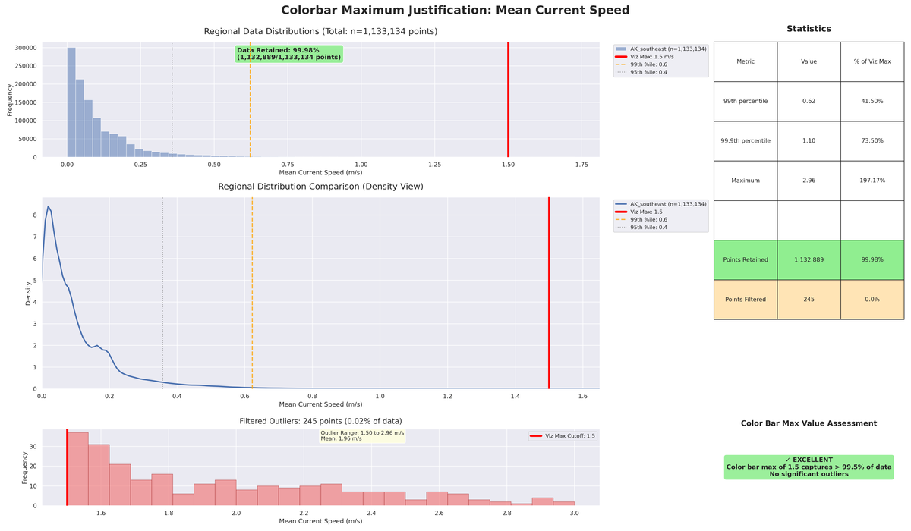
*Figure: Comprehensive validation of visualization maximum for mean current speed. Shows full data distribution, regional comparisons within bounds, key statistics, and outlier assessment. Units: m/s. Validates the visualization maximum used for mean current speed analysis, showing data retention rates and outlier filtering effectiveness.*

**95th Percentile Current Speed - Visualization Maximum Validation**

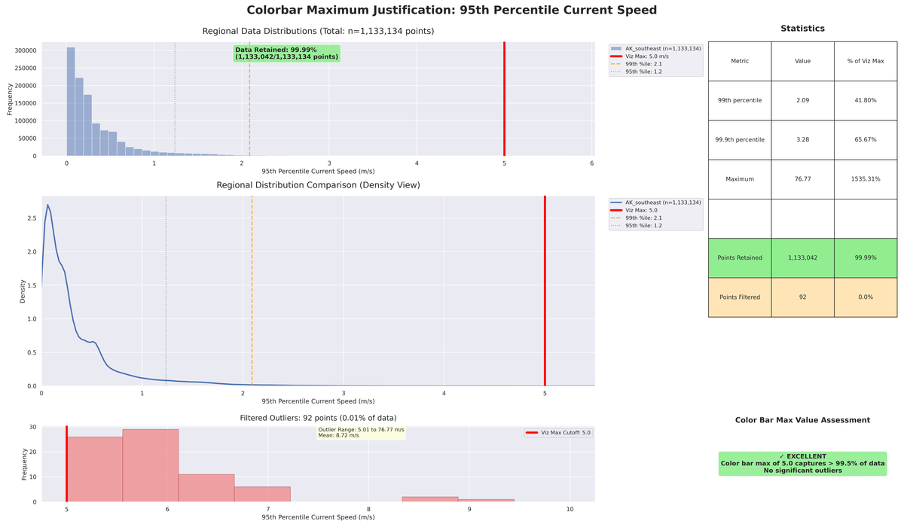
*Figure: Comprehensive validation of visualization maximum for 95th percentile current speed. Shows full data distribution, regional comparisons within bounds, key statistics, and outlier assessment. Units: m/s. Validates the visualization maximum used for 95th percentile current speed analysis, showing data retention rates and outlier filtering effectiveness.*

**Mean Power Density - Visualization Maximum Validation**

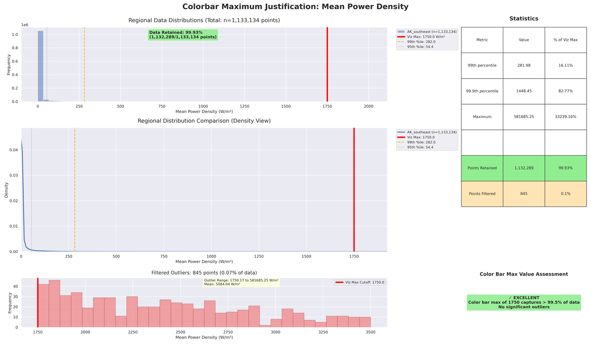
*Figure: Comprehensive validation of visualization maximum for mean power density. Shows full data distribution, regional comparisons within bounds, key statistics, and outlier assessment. Units: W/m². Validates the visualization maximum used for mean power density analysis, showing data retention rates and outlier filtering effectiveness.*

**Minimum Water Depth - Visualization Maximum Validation**


*Figure: Comprehensive validation of visualization maximum for minimum water depth. Shows full data distribution, regional comparisons within bounds, key statistics, and outlier assessment. Units: m. Validates the visualization maximum used for minimum water depth analysis, showing data retention rates and outlier filtering effectiveness.*

**Maximum Water Depth - Visualization Maximum Validation**

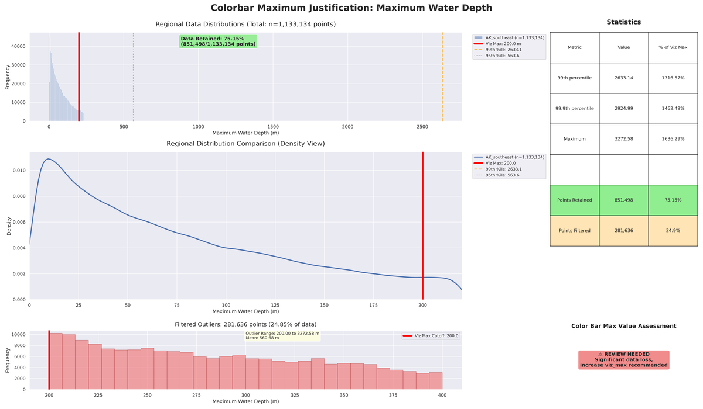
*Figure: Comprehensive validation of visualization maximum for maximum water depth. Shows full data distribution, regional comparisons within bounds, key statistics, and outlier assessment. Units: m. Validates the visualization maximum used for maximum water depth analysis, showing data retention rates and outlier filtering effectiveness.*

**Grid Resolution - Visualization Maximum Validation**

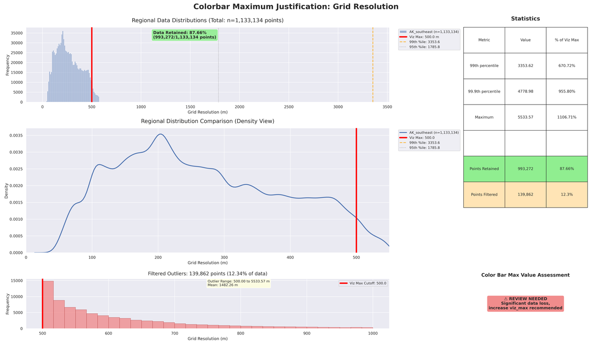
*Figure: Comprehensive validation of visualization maximum for grid resolution. Shows full data distribution, regional comparisons within bounds, key statistics, and outlier assessment. Units: m. Validates the visualization maximum used for grid resolution analysis, showing data retention rates and outlier filtering effectiveness.*

### Regional Distribution Comparisons

These kernel density estimation (KDE) plots provide clean statistical comparisons of variable distributions across all processed regions, focused within the validated visualization ranges.

**Mean Current Speed Distribution Comparison**

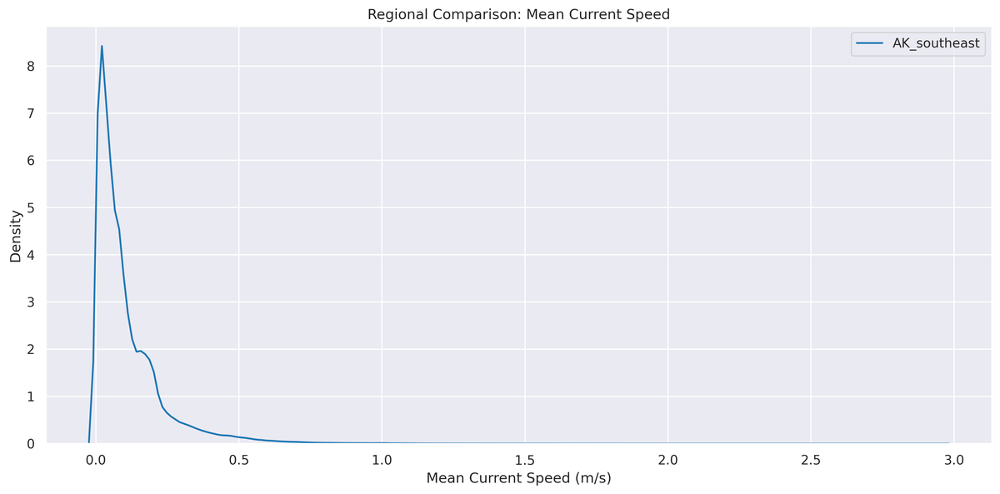
*Figure: Kernel density estimation comparison of mean current speed across all processed regions. Units: m/s. Mean Current Speed distribution comparison across regions. Distributions are shown within validated visualization bounds for optimal clarity.*

**95th Percentile Current Speed Distribution Comparison**

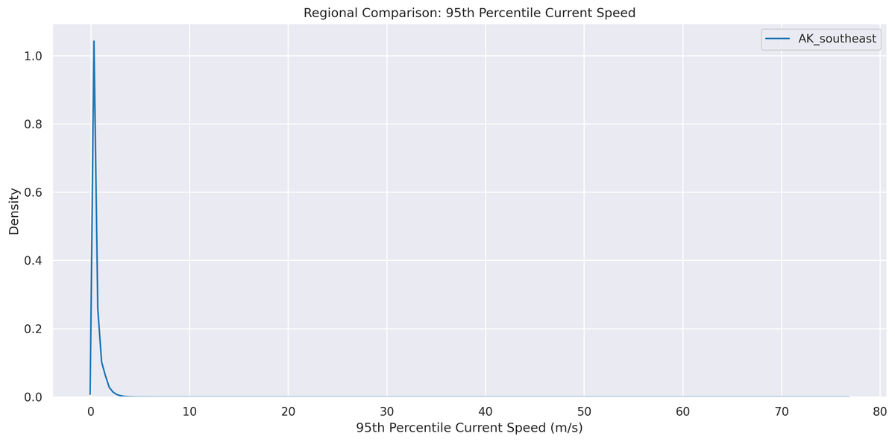
*Figure: Kernel density estimation comparison of 95th percentile current speed across all processed regions. Units: m/s. 95th Percentile Current Speed distribution comparison across regions. Distributions are shown within validated visualization bounds for optimal clarity.*

**Mean Power Density Distribution Comparison**

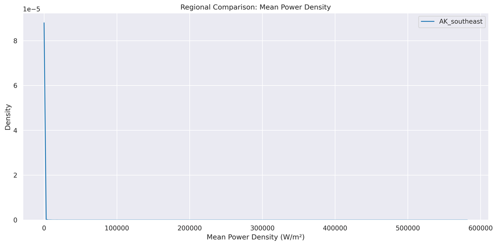
*Figure: Kernel density estimation comparison of mean power density across all processed regions. Units: W/m². Mean Power Density distribution comparison across regions. Distributions are shown within validated visualization bounds for optimal clarity.*

**Minimum Water Depth Distribution Comparison**

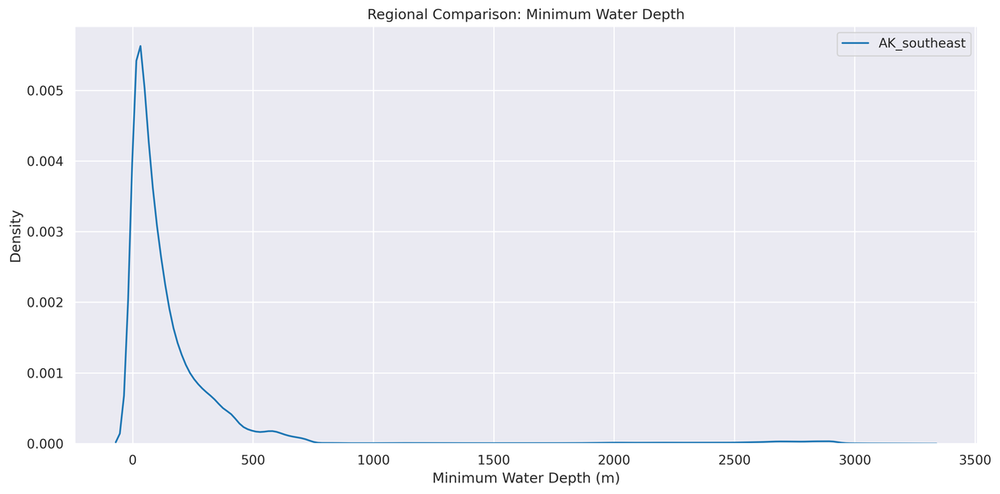
*Figure: Kernel density estimation comparison of minimum water depth across all processed regions. Units: m. Minimum Water Depth distribution comparison across regions. Distributions are shown within validated visualization bounds for optimal clarity.*

**Maximum Water Depth Distribution Comparison**

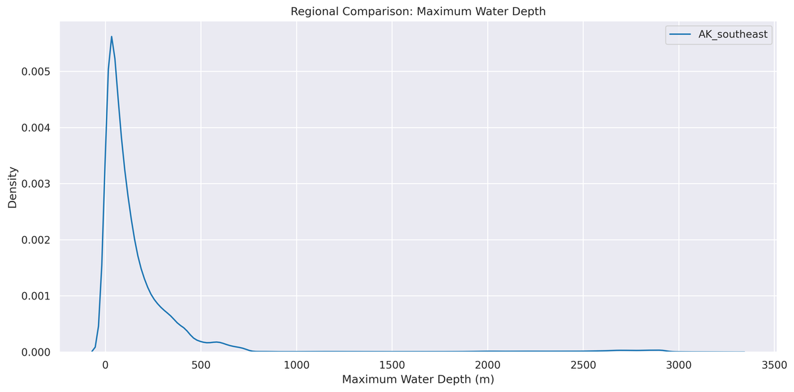
*Figure: Kernel density estimation comparison of maximum water depth across all processed regions. Units: m. Maximum Water Depth distribution comparison across regions. Distributions are shown within validated visualization bounds for optimal clarity.*

**Grid Resolution Distribution Comparison**

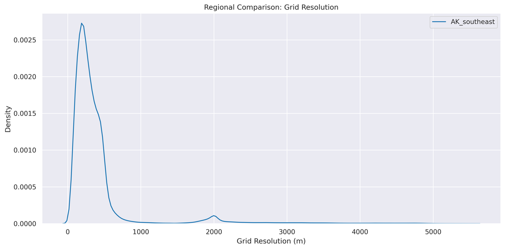
*Figure: Kernel density estimation comparison of grid resolution across all processed regions. Units: m. Grid Resolution distribution comparison across regions. Distributions are shown within validated visualization bounds for optimal clarity.*

---

## Document Information

- **Generated:** 2026-04-16 16:10:45 UTC
- **Regions Processed:** AK_aleutian_islands, AK_cook_inlet, ME_western_passage, NH_piscataqua_river, WA_puget_sound

*This specification was auto-generated from the tidal data visualization pipeline.*
*All color codes, ranges, and technical specifications are programmatically derived.*